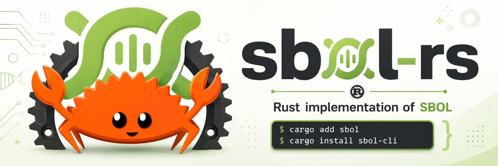

`sbol-rs` is a Rust implementation of the Synthetic Biology Open Language
(SBOL 3.1.0). SBOL is the community standard for the exchange of
synthetic biology designs across registries, design-automation tools,
and laboratory automation pipelines. `sbol-rs` exposes a typed API for
reading, building, and rewriting SBOL documents, plus a validator that
covers the 109 machine-checkable rules from SBOL 3.1.0 Appendix B.

New to the codebase? Start with the [**crate guide**](docs/crate-guide.md).

## Installation

Add the library to your `Cargo.toml`:

```toml
[dependencies]
sbol = "0.2"
```

Or with `cargo add`:

```sh
cargo add sbol
```

The CLI ships as a separate crate. `cargo install sbol-cli` installs a
binary named `sbol`:

```sh
cargo install sbol-cli
sbol validate design.ttl
```

## Example

```rust
use sbol::constants::{EDAM_IUPAC_DNA, SBO_DNA, SO_PROMOTER};
use sbol::prelude::*;

fn main() -> Result<(), Box<dyn std::error::Error>> {
    let namespace = "https://example.org/lab";

    let sequence = Sequence::builder(namespace, "j23119_seq")?
        .elements("ttgacagctagctcagtcctaggtataatgctagc")
        .encoding(EDAM_IUPAC_DNA)
        .build()?;

    let component = Component::builder(namespace, "j23119")?
        .types([SBO_DNA])
        .add_component_role(SO_PROMOTER)
        .add_sequence(sequence.identity.clone())
        .name("J23119 constitutive promoter")
        .build()?;

    let document = Document::from_objects(vec![
        SbolObject::Component(component),
        SbolObject::Sequence(sequence),
    ])?;

    document.check()?;
    println!("{}", document.write_turtle()?);
    Ok(())
}
```

Reading documents, traversing references across documents, expanding
combinatorial derivations, and inspecting validation reports are covered
in [`crates/sbol/examples/`](crates/sbol/examples/). Run any of them with
`cargo run -p sbol --example <name>`.

## Validation

SBOL 3.1.0 [Appendix B](spec/SBOL3.1.0.md#b-validation-rules) defines
149 validation rules; 40 are marked as not-to-be-machine-reported.
`sbol` implements an algorithm for each of the remaining 109, with
configurable scope (offline by default, or resolver-backed for
cross-document references), per-rule severity overrides, and text /
JSON / SARIF output. [`docs/validation.md`](docs/validation.md) covers
what's checked and the trust boundaries;
[`docs/conformance.md`](docs/conformance.md) carries the per-rule
status grid.

## Ontology Extensions

EDAM, SBO, SO, GO, ChEBI, and Cell Ontology ship bundled. NCIT and
lab-specific ontologies install on demand into a local cache; see
[`docs/ontology-extensions.md`](docs/ontology-extensions.md).

## Performance

sbol-rs is a native dual-version implementation, and the benchmark
harness measures both. Parse cost (median microseconds across 100
measured iterations, 20 warmup; lower is better) with every
implementation in its own pinned Docker image so the rows are
apples-to-apples.

**SBOL 3**, `toggle_switch_v2.ttl` (~30 KB), rows sorted by `rdfxml`
p50 ascending:

| Impl              | turtle | rdfxml | jsonld | ntriples |
| ----------------- | -----: | -----: | -----: | -------: |
| sbol-rs           |    373 |    387 |    799 |      404 |
| libSBOLj3 1.0.5.2 |  1,908 |  2,176 |  4,437 |    2,062 |
| sboljs 3.0.2      |    n/a |  2,459 |    n/a |      n/a |
| pySBOL3 1.2       |  7,435 |  9,807 |  6,501 |    6,906 |

**SBOL 2**, `BBa_F2620` SynBioHub export (~79 KB). SBOL 2 is exchanged
as RDF/XML; sbol-rs also reads Turtle, JSON-LD, and N-Triples, and
libSBOLj covers RDF/XML:

| Impl           | turtle | rdfxml | jsonld | ntriples |
| -------------- | -----: | -----: | -----: | -------: |
| sbol-rs        |    955 |    988 |  2,027 |    1,029 |
| libSBOLj 2.4.0 |    n/a |  1,688 |    n/a |      n/a |

Apple M4 Max (12 performance and 4 efficiency cores), 128 GB RAM, macOS
26.6, Docker Desktop 29.4.3. sboljs's underlying `rdfoo` only emits
RDF/XML and its parser stack is too fragile to reach the other format
rows; the [bench README](benches/cross-impl/README.md) documents the
specific failure modes. The [`crates/sbol-bench`](crates/sbol-bench)
crate runs the dual-version comparison end-to-end; see
[`benches/cross-impl/README.md`](benches/cross-impl/README.md) for the
full SBOL 2 and SBOL 3 parse, serialize, convert, and validate tables,
methodology, and per-row caveats.
