# Synthetic Biology Open Language (SBOL) Version 3.1.0

**Editors**

- Lukas Buecherl: *University of Colorado Boulder, USA*
- Thomas Mitchell: *Raytheon BBN Technologies, USA*
- James Scott-Brown: *University of Edinburgh, UK*
- Prashant Vaidyanathan: *Oxford Biomedica, UK*
- Gonzalo Vidal Peña: *Newcastle University, UK*

Contact: <editors@sbolstandard.org>

**Chair**

- Chris Myers: *University of Colorado Boulder, USA*

**Additional Authors**

- Hasan Baig: *University of Connecticut, USA*
- Bryan Bartley: *Raytheon BBN Technologies, USA*
- Jacob Beal: *Raytheon BBN Technologies, USA*
- Matthew Crowther: *Newcastle University, UK*
- Pedro Fontanarrosa: *University of Colorado Boulder, USA*
- Thomas Gorochowski: *University of Bristol, UK*
- Raik Grünberg: *KAUST, SA*
- Vishwesh Kulkarni: *University of Warwick, UK*
- James McLaughlin: *Newcastle University, UK*
- Goksel Misirli: *Keele University, UK*
- Ernst Oberortner: *DOE Joint Genome Institute, USA*
- Anil Wipat: *Newcastle University, UK*

**Publication Details**

- Version: 3.1.0
- Date: October 26, 2022
- Copyright (C) all authors listed on the front page of this document.
- This work is made available under the Creative Commons Attribution 4.0 International Public License.

## Contents

- [1. Purpose](#1-purpose)
- [2. A Brief History of SBOL](#2-a-brief-history-of-sbol)
- [3. Overview of SBOL](#3-overview-of-sbol)
- [4. Conventions](#4-conventions)
  - [4.1. Terminology Conventions](#41-terminology-conventions)
  - [4.2. UML Diagram Conventions](#42-uml-diagram-conventions)
  - [4.3. Naming and Typographic Conventions](#43-naming-and-typographic-conventions)
- [5. Identifiers and Types](#5-identifiers-and-types)
  - [5.1. Internationalized Resource Identifiers](#51-internationalized-resource-identifiers)
  - [5.2. SBOL URLs](#52-sbol-urls)
  - [5.3. Primitive Data Types](#53-primitive-data-types)
  - [5.4. SBOL Types](#54-sbol-types)
  - [5.5. Object Closure and Document Composition](#55-object-closure-and-document-composition)
- [6. SBOL Data Model](#6-sbol-data-model)
  - [6.1. Identified](#61-identified)
  - [6.2. TopLevel](#62-toplevel)
  - [6.3. Sequence](#63-sequence)
  - [6.4. Component](#64-component)
    - [6.4.1. Feature](#641-feature)
      - [6.4.1.1. SubComponent](#6411-subcomponent)
      - [6.4.1.2. ComponentReference](#6412-componentreference)
      - [6.4.1.3. LocalSubComponent](#6413-localsubcomponent)
      - [6.4.1.4. ExternallyDefined](#6414-externallydefined)
      - [6.4.1.5. SequenceFeature](#6415-sequencefeature)
    - [6.4.2. Location](#642-location)
      - [6.4.2.1. Range](#6421-range)
      - [6.4.2.2. Cut](#6422-cut)
      - [6.4.2.3. EntireSequence](#6423-entiresequence)
    - [6.4.3. Constraint](#643-constraint)
    - [6.4.4. Interaction](#644-interaction)
      - [6.4.4.1. Participation](#6441-participation)
    - [6.4.5. Interface](#645-interface)
  - [6.5. CombinatorialDerivation](#65-combinatorialderivation)
    - [6.5.1. VariableFeature](#651-variablefeature)
  - [6.6. Implementation](#66-implementation)
  - [6.7. ExperimentalData](#67-experimentaldata)
  - [6.8. Model](#68-model)
  - [6.9. Collection](#69-collection)
    - [6.9.1. Experiment](#691-experiment)
  - [6.10. Attachment](#610-attachment)
  - [6.11. Annotation and Extension of SBOL](#611-annotation-and-extension-of-sbol)
- [7. Recommended Best Practices](#7-recommended-best-practices)
  - [7.1. SBOL Versions](#71-sbol-versions)
  - [7.2. Compliant SBOL Objects](#72-compliant-sbol-objects)
  - [7.3. Versioning SBOL Objects](#73-versioning-sbol-objects)
  - [7.4. Annotations: Embedded Objects vs. External References](#74-annotations-embedded-objects-vs-external-references)
  - [7.5. Completeness and Validation](#75-completeness-and-validation)
  - [7.6. Recommended Ontologies for External Terms](#76-recommended-ontologies-for-external-terms)
  - [7.7. Annotating Entities with Date & Time](#77-annotating-entities-with-date--time)
  - [7.8. Annotating Entities with Authorship information](#78-annotating-entities-with-authorship-information)
  - [7.9. Host Context / Ontologies for Experiments](#79-host-context--ontologies-for-experiments)
    - [7.9.1. Mixtures via Components](#791-mixtures-via-components)
    - [7.9.2. Media, Inducers, and Other Reagents](#792-media-inducers-and-other-reagents)
    - [7.9.3. Samples](#793-samples)
    - [7.9.4. Other Experimental Parameters](#794-other-experimental-parameters)
  - [7.10. Multicellular System Designs](#710-multicellular-system-designs)
    - [7.10.1. Representing Cell Types](#7101-representing-cell-types)
    - [7.10.2. Multiple Cell Types in a Single Design](#7102-multiple-cell-types-in-a-single-design)
    - [7.10.3. Cell Ratios](#7103-cell-ratios)
- [8. SBOL RDF Serialization](#8-sbol-rdf-serialization)
- [9. SBOL Compliance](#9-sbol-compliance)
- [10. Mapping Between SBOL 1, SBOL 2, and SBOL3](#10-mapping-between-sbol-1-sbol-2-and-sbol3)
  - [10.1. Mapping between SBOL 1 and SBOL 2](#101-mapping-between-sbol-1-and-sbol-2)
  - [10.2. Mapping between SBOL 2 and SBOL 3](#102-mapping-between-sbol-2-and-sbol-3)
- [References](#references)
- [A. Complementary Standards](#a-complementary-standards)
  - [A.1. Adding Provenance with PROV-O](#a1-adding-provenance-with-prov-o)
    - [A.1.1. prov:Activity](#a11-provactivity)
    - [A.1.2. prov:Usage](#a12-provusage)
    - [A.1.3. prov:Association](#a13-provassociation)
    - [A.1.4. prov:Plan](#a14-provplan)
    - [A.1.5. prov:Agent](#a15-provagent)
  - [A.2. Adding Measures/Parameters with OM](#a2-adding-measuresparameters-with-om)
    - [A.2.1. om:Measure](#a21-ommeasure)
    - [A.2.2. om:Unit](#a22-omunit)
    - [A.2.3. om:SingularUnit](#a23-omsingularunit)
    - [A.2.4. om:CompoundUnit](#a24-omcompoundunit)
    - [A.2.5. om:UnitMultiplication](#a25-omunitmultiplication)
    - [A.2.6. om:UnitDivision](#a26-omunitdivision)
    - [A.2.7. om:UnitExponentiation](#a27-omunitexponentiation)
    - [A.2.8. om:PrefixedUnit](#a28-omprefixedunit)
    - [A.2.9. om:Prefix](#a29-omprefix)
    - [A.2.10. om:SIPrefix](#a210-omsiprefix)
    - [A.2.11. om:BinaryPrefix](#a211-ombinaryprefix)
- [B. Validation Rules](#b-validation-rules)

## 1. Purpose

Synthetic biology builds upon genetics, molecular biology, and metabolic engineering by applying
engineering principles to the design of biological systems. When designing a synthetic system,
synthetic biologists need to exchange information about multiple types of molecules, the intended
behavior of the system, and actual experimental measurements. Furthermore, there are often multiple
aspects to a design such as a specified nucleic acid sequence (e.g., a sequence that encodes an
enzyme or transcription factor), the molecular interactions that a designer intends to result from
the introduction of this sequence (e.g., chemical modification of metabolites or regulation of gene
expression), and the experiments and data associated with the system. All these perspectives need to
be connected together to facilitate the engineering of biological systems.

The Synthetic Biology Open Language (SBOL) has been developed as a standard to support the
specification and exchange of biological design information in synthetic biology, following an open
community process involving both “wet” bench scientists and “dry” scientific modelers and software
developers, across academia, industry, and other institutions. Previous nucleic acid sequence
description formats lack key capabilities relative to SBOL, as shown in Figure 1. Simple sequence
encoding formats such as FASTA encode little besides sequence information. More sophisticated
formats such as GenBank and Swiss-Prot provide a flat annotation of sequence features that is well
suited to describing natural systems but unable to represent the functional relations and
multi-layered design structure common to engineered systems. Modeling languages, such as the Systems
Biology Markup Language (SBML) Hucka et al. (2003), can be used to represent biological processes, but
are not sufficient to represent the associated nucleotide or amino acid sequences. SBOL covers both
of these needs, by providing a modular and hierarchical representation of the structure and function
of a genetic design, as well as its relationship to and use within experiment plans, data, models,
etc.

SBOL uses existing Semantic Web practices and resources, such as Uniform Resource Identifiers (IRIs)
and ontologies, to unambiguously identify and define biological system elements, and to provide
serialization formats for encoding this information in electronic data files. The SBOL standard
further describes the rules and best practices on how to use this data model and populate it with
relevant design details. The definition of the data model, the rules on the addition of data within
the format, and the representation of this in electronic data files are intended to make the SBOL
standard a useful means of promoting data exchange between laboratories and between software
programs.

### Differences from Prior Versions of SBOL

SBOL 1 focused on representing the structural aspects of genetic designs: it allowed the exchange of
information about DNA designs and their sequence features, but could not represent molecules other
than DNA or the functional aspects of designs. SBOL 2 enabled the description and exchange of
hierarchical, modular representations of both the intended structure and function of designed
biological systems, as well as providing support for representing provenance, combinatorial designs,
genetic design implementations, external file attachments, experimental data, and numerical
measurements. SBOL 3.0, defined by this document, condenses and simplifies these prior
representations based on experiences in deployment across a variety of scientific and industrial
settings.

Specifically, SBOL 3.0 improves on its predecessor SBOL 2.3 by:

- Separating sequence features from part/sub-part relationships.
- Renaming ComponentDefinition/Component to Component/SubComponent.
- Merging Component and Module classes.
- Ensuring consistency between data model and ontology terms.
- Extending the means to define and reference SubComponents.
- Refining requirements on object IRIs.

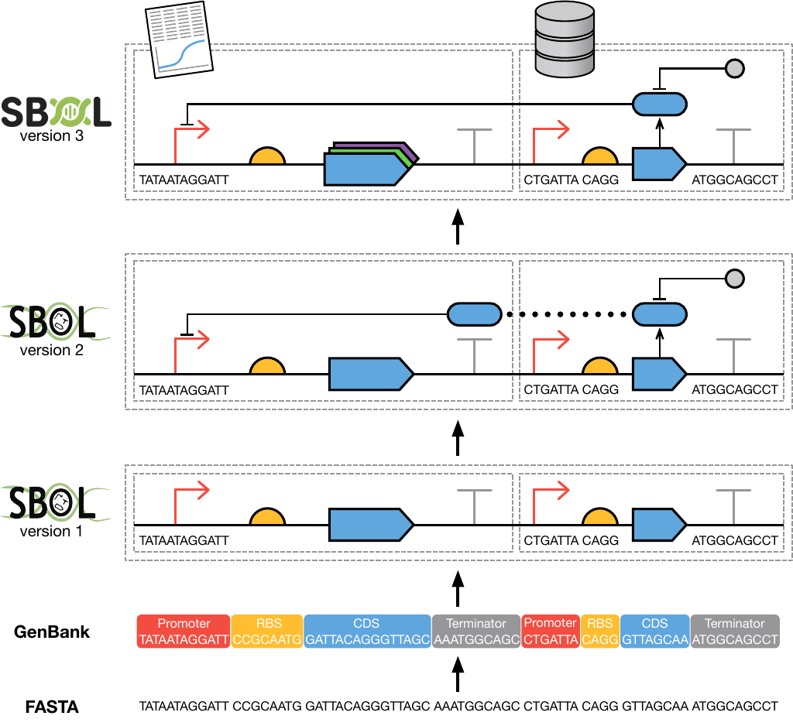

***Figure 1:*** *SBOL extends prior sequence description formats to represent both the structure and function of a genetic design in a modular, hierarchical manner, as well as its relationship to, and use within, experiments, plans, data, models, etc.*

- Enabling graph-based serialization.
- Moving to Systems Biology Ontology (SBO) for Component types.
- Making all sequence associations explicit.
- Making interfaces explicit.
- Generalizing SequenceConstraints into a general structural Constraint class.
- Expanding the set of allowed sequence constraints.

## 2. A Brief History of SBOL

The SBOL effort was started in 2006 with the goal of developing a data exchange standard for genetic
designs. Herbert Sauro (University of Washington) secured a grant from Microsoft in the field of
computational synthetic biology, which was used to fund the initial meeting in Seattle on April
26-27, 2008. This workshop was organized by Herbert Sauro, Sean Sleight, and Deepak Chandran, and
included talks by Raik Gruenberg, Kim de Mora, John Cumbers, Christopher Anderson, Mac Cowell, Jason
Morrison, Jean Peccoud, Ralph Santos, Andrew Milar, Vincent Rouilly, Mike Hucka, Michael Blinov,
Lucian Smith, Sarah Richardson, Guillermo Rodrigo, Jonathan Goler, and Michal Galdzicki.

Michal’s early efforts were instrumental in making SBOL successful. As part of his doctoral work, he
led the development of PoBol (Provisional BioBrick Language), as SBOL was originally known. He
organized annual workshops from 2008 to 2011 and kept the idea of developing a genetic design
standard alive. The original SBOL 1.0 was developed by a small group of dedicated researchers
calling themselves the Synthetic Biology Data Exchange Working Group, meeting at Stanford in 2009
and Anaheim, CA in 2010. During the Anaheim meeting, the community decided to write a letter to
Nature Biotechnology highlighting the issue of reproducibility in synthetic biology Peccoud et al.
(2011). This letter was initiated by Jean Peccoud and submitted by participants of the Anaheim
meeting, including Deepak Chandran, Douglas Densmore, Dmytriv, Michal Galdzicki, Timothy Ham, Cesar
Rodriquez, Jean Peccoud, Herbert Sauro, and Guy-Bart Stan. The overall pace of development quickened
when several new members joined at the next workshop in Blacksburg, Virginia on January 7-10, 2011.
This early work was also supported by an STTR grant from the National Institute of Health (NIH
#1R41LM010745 and #9R42HG006737, from 2010-13) in collaboration with Clark & Parsia, LLC (Co-PIs:
John Gennari and Evren Sirin). New members included Cesar Rodriguez, Mandy Wilson, Guy-Bart Stan,
Chris Myers, and Nicholas Roehner.

The SBOL Developers Group was officially established at a meeting in San Diego in June 2011. Rules
of governance were established, and the first SBOL editors were elected: Mike Galdzicki, Cesar
Rodriguez, and Mandy Wilson. At our next meeting in Seattle in January 2012, Herbert Sauro was
elected the SBOL chair, and two new editors were added: Matthew Pocock and Ernst Oberortner. New
developers joining at these workshops included several representatives from industry, Kevin Clancy,
Jacob Beal, Aaron Adler, and Fusun Yaman Sirin. New members from Newcastle University included Anil
Wipat, Matthew Pocock, and Goksel Misirli.

Development of the first software library (libSBOLj) based on the SBOL standard was initiated by
Allan Kuchinsky, a research scientist from Agilent, at the 2011 meeting. By the time of the 2012
meeting, the first data exchange between software tools using SBOL was conducted when a design was
passed from Newcastle University’s VirtualParts Repository to Boston University’s Eugene tool, and
finally to University of Utah’s iBioSim tool.

SBOL 1.0 was officially released in October 2011. In March 2012, SBOL 1.1 was released, the version
that this document replaces. SBOL 1.1 did not make any major changes, but provided a number of small
adjustments and clarifications, particularly around the annotation of sequences. Multi-institutional
data exchange using SBOL 1.1 was later demonstrated in Nature Biotechnology Galdzicki et al. (2014).

While SBOL 1.1 had a number of significant advantages over the GenBank representation of DNA
sequences, such as representing hierarchical organization of DNA components, it was still limited in
other respects. The major topic of discussion at the 8th SBOL Workshop at Boston University in
November 2012 was how to address these shortcomings through extensions. Several extensions were
discussed at this meeting, such as a means to describe genetic regulation, which later became
important classes in the 2.x specification.

A general framework for SBOL 2.0 emerged at the 9th SBOL workshop at Newcastle University in April
2013. Subsequently, Nicholas Roehner, Matthew Pocock, and Ernst Oberortner drafted a proposal for
SBOL 2.0, and Nicholas presented this proposal at the SEED conference in Los Angeles in July 2014
Roehner et al. (2015). The proposed 2.0 data model was discussed over the course of the 10th, 11th,
and 12th workshops. The SBOL 2.0 specification document was drafted at the 13th workshop in
Wittenberg, Germany. The SBOL 2.x data model presented was essentially the result of these meetings
and ongoing discussions conducted through the SBOL Developers mailing lists, plus minor adjustments
and updates approved by the community through subsequence meetings and mailing list discussions.

From 2014 to 2019, development of SBOL 2.x was funded in large part by a grant from the National
Science Foundation (DBI-1355909 and DBI-1356041). The SBOL 2.x specification documents and the
supporting software libraries are due in no small part to this support. Any opinions, findings, and
conclusions or recommendations expressed in SBOL materials are those of the author(s) and do not
necessarily reflect the views of the National Science Foundation.

The Computational Modeling in Biology Network (COMBINE) holds regular workshops at which synthetic
biologists and systems biologists work toward a common goal of integrating biological knowledge
through interoperable and non-overlapping data standards. Several SBOL Developers proposed that SBOL
join this larger standards community after attended a COMBINE workshop in April 2014. The proposal
passed and SBOL workshops have been co-located with COMBINE meetings since the 11th workshop at the
University of Southern California in August 2014.

In 2019 the SBOL Industrial Consortium was established as a pre-competitive non-profit organization
supporting innovation, dissemination, and integration of SBOL standards, tools and practices for
practical applications in an industrial environment. The SBOL Industrial Consortium meets regularly
to coordinate its activities, and organises an Industrial Advisory Board to give an industrial
perspective on SBOL, as well as providing financial support for projects, activities, and
infrastructure within the SBOL community. Member organsiations include Raytheon BBN Technologies,
Doulix, Integrated DNA Technologies, Twist Bioscience, Amyris, Inscripta, Teselagen, Shipyard
Toolchains, and Zymergen.

Discussions related to SBOL 3 began at the COMBINE meetings and on the mailing list beginning in the
summer of 2018. Over the next year and a half, several SBOL Enhancement Proposals (SEPs) were
written and discussed. During the early months of 2020, these SEPs were voted on and approved by the
SBOL community. The initial version of the SBOL 3 specification was drafted during HARMONY 2020 at
the European Bioinformatics Institute (EBI) in Hinxton, United Kingdom in March 2020.

The authors would also like to thank Michael Hucka for developing the LaTeX style file used to
develop this document (Hucka, 2017).

## 3. Overview of SBOL

Synthetic biology designs can be described using:

- Structural terms, e.g., a set of annotated sequences or information about the chemical makeup of
  components.

- Functional terms, e.g., the way that components might interact with each other.

As an example, consider an expression cassette, such as the one found in the plasmid pUC18 Norrander
et al. (1983). The system is designed to visually indicate whether a gene has been inserted into the
plasmid: in the presence of IPTG, it expresses an enzyme that hydrolyses X-gal to form a blue
product, but successful insertion disrupts the expression cassette and prevents the formation of
this product. Internally, it has a number of parts, including a promoter, the lac repressor binding
site, and the lacZ coding sequence. These parts have specific component-level interactions with IPTG
and X-gal, as well as native host gene products, transcriptional machinery, and translational
machinery that collectively cause the desired system-level behavior.

In SBOL 3, both the structural and functional aspects are described using a class called Component,
as depicted in Figure 2. Namely, to represent structural aspects, a Component can include Features,
some of which may be at some Location within a Sequence. A Component can also include Constraints
between these features. To represent functional aspects, a Component can include Interactions that
can refer to relationships between participating Features. Finally, a Component can have its
behavior described using a Model.

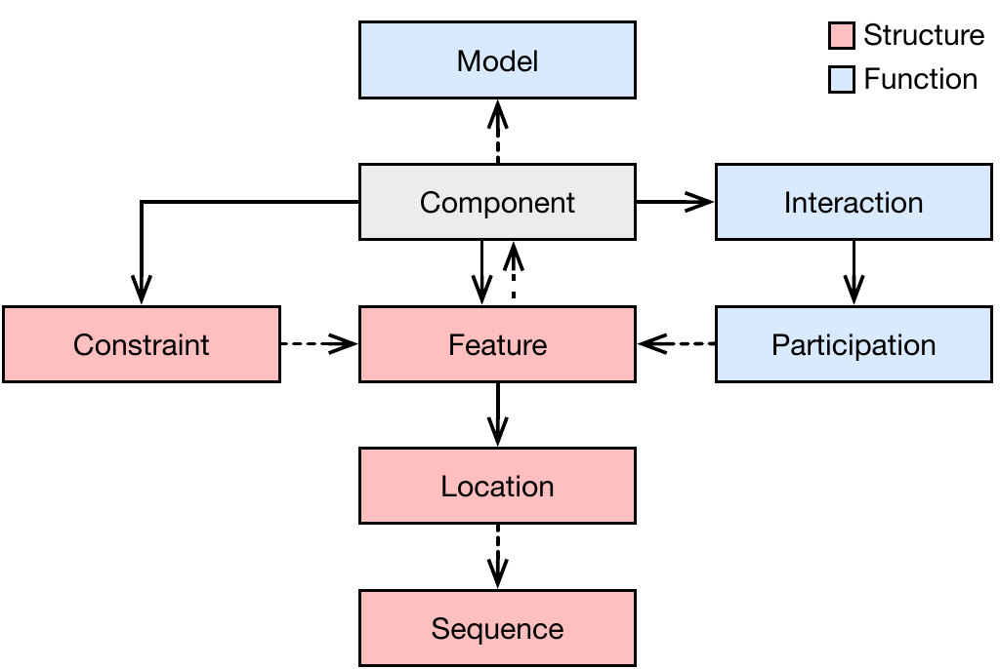

***Figure 2:*** *The SBOL Component object and related objects. Solid arrows indicates ownership, whereas a dashed arrow represents a reference to an object of another class. Red boxes represent structural objects, while blue boxes represent functional objects. To represent structural aspects, a Component can include Features, which may refer to Locations within a Sequence. A Component can also include Constraints between these features. To represent functional aspects, a Component can include Interactions that can refer to relationships between participating Features. Finally, a Component can have its behavior described using a Model.*

To continue with the pUC18 example, the description would begin with a top-level Component that
represents the entire system. This Component specifies the structural elements that make up the
cassette by referencing a number of SubComponent objects. These would include the DNA SubComponent
for the promoter and the simple chemical SubComponent for IPTG, for example. The Component objects
can be organized hierarchically. For example, the plasmid Component might reference SubComponents
for the promoter, coding sequence, etc. Each Component object can also include the actual Sequence
information (if available), as well as SubComponent objects that identify the Locations of the
promoters, coding sequences, etc., on the Sequence. In order to specify functional information, the
Component can also specify Interaction objects that describe any qualitative relationships among
SubComponent Participations, such as how IPTG and X-gal interact with the gene products. Finally, a
Component object can point to a Model object that provides a reference to a complete computational
model expressed in a language such as SBML Hucka et al. (2003), CellML Cuellar et al. (2003), or
MATLAB MathWorks (2015).

Whereas Figure 2 provides an overview of the classes used for describing designs within the SBOL 3
data model, Figure 3 shows the rest of the classes used to describe the usage of a design within
design-build-test-learn workflows in general. In particular, designs can be expressed using
CombinatorialDerivations, Components, and Sequences. These can describe not only genetic designs,
but also designs for strains, multicellular systems, media, samples, etc. A CombinatorialDerivation
allows one to specify a design pattern where individual SubComponents can be selected from a set of
variants. The Implementation class is the build class, and it is used to represent physical
artifacts like an actual sample of a plasmid. The Experiment and ExperimentalData classes are the
test classes, allowing description of a collection of data generated in an experiment. The Model
class, discussed earlier, associates learned information with a design. The prov:Activity class is
taken from the provenance ontology (PROV-O), which is described in
[Section A.1](#a1-adding-provenance-with-prov-o). For example, a build prov:Activity describes how
an Implementation is constructed using a Component description. On the other hand, a test
prov:Activity describes how an Experiment is conducted using an Implementation artifact. The
Collection class has members, which can be of any of these types or Collections
themselves. Finally, all of these objects can refer to objects of the Attachment class, which are
used to link out to external data (images, spreadsheets, textual documents, etc.). The next sections
provide complete definitions and details for all of these classes.

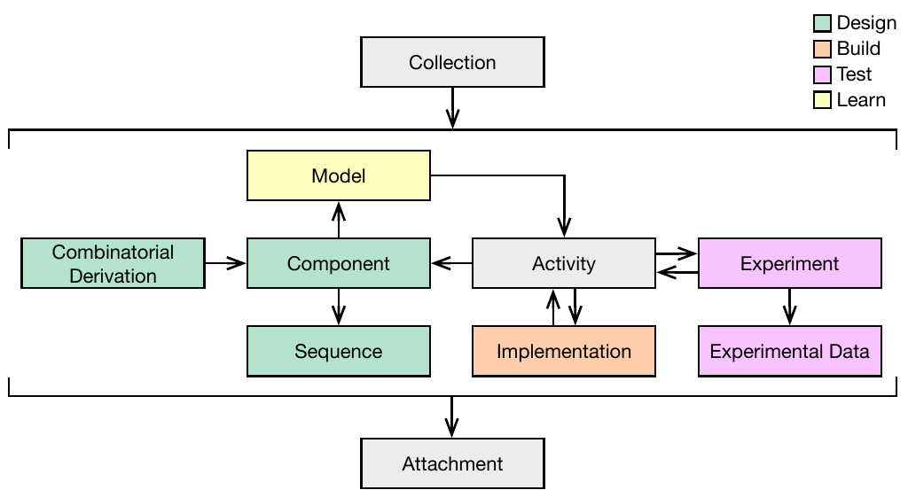

***Figure 3:*** *Main classes of information represented by the SBOL 3 standard, and their relationships. Green boxes represent design classes, orange boxes represent build classes, purple boxes represent test classes, yellow boxes represent learn classes, and the gray boxes represent additional utility classes. Each of these classes will be described in more detail below.*

## 4. Conventions

This section provides some preliminary information to aid in the understanding of the specification.
The SBOL data model is specified using Unified Modeling Language (UML) 2.0 diagrams (OMG 2005). This
section reviews terminology conventions, the basics of UML diagrams, and our naming conventions.

### 4.1. Terminology Conventions

This document indicates requirement levels using the controlled vocabulary specified in IETF RFC
2119. In particular, the key words “MUST”, “MUST NOT”, “REQUIRED”, “SHALL”, “SHALL NOT”, “SHOULD”,
“SHOULD NOT”, “RECOMMENDED”, “MAY”, and “OPTIONAL” in this document are to be interpreted as
described in RFC 2119.

- The words “MUST”, “REQUIRED”, or “SHALL” mean that the item is an absolute requirement.
- The phrases “MUST NOT” or “SHALL NOT” mean that the item is an absolute prohibition.
- The word “SHOULD” or the adjective “RECOMMENDED” mean that there might exist valid reasons in
  particular circumstances to ignore a particular item, but the full implications need to be
  understood and carefully weighed before choosing a different course.

- The phrases “SHOULD NOT” or “NOT RECOMMENDED” mean that there might exist valid reasons in
  particular circumstances when the particular behavior is acceptable or even useful, but the full
  implications need to be understood and the case carefully weighed before implementing any behavior
  described with this label.

- The word “MAY” or the adjective “OPTIONAL” mean that an item is truly optional.

### 4.2. UML Diagram Conventions

The types of biological design data modeled by SBOL are commonly referred to as classes, especially
when discussing the details of software implementation. Each SBOL class can be instantiated by many
SBOL objects. These objects MAY contain data that differ in content, but they MUST agree on the type
and form of their data as dictated by their common class. Classes are represented in UML diagrams as
rectangles labeled at the top with class names (see Figure 4 for examples).

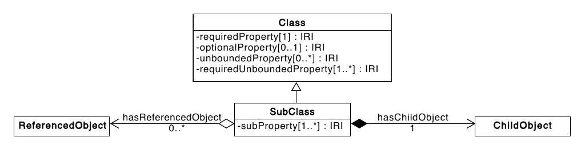

***Figure 4:*** *Examples of UML diagram conventions used in this document*

Classes can be connected to other classes by association properties, which are represented in UML
diagrams as arrows. These arrows are labeled with data cardinalities in order to indicate how many
values a given association property can possess (see below). The remaining (non-association)
properties of a class are listed below its name. Each of the latter properties is labeled with its
data type and cardinality.

In the case of an association property, the class from which the arrow originates is the owner of
the association property. A diamond at the origin of the arrow indicates the type of association.
Open-faced diamonds indicate shared aggregation, also known as a reference, in which the owner of
the association property exists independently of its value.

By contrast, filled diamonds indicate composite aggregation, also known as a part-whole
relationship, in which the value of the association property MUST NOT exist independently of its
owner. In addition, in the SBOL data model, it is REQUIRED that the value of each composite
aggregation property is a unique SBOL object (that is, not the value for more than one such
property). Note that in all cases, composite aggregation is used in such a way that there SHOULD NOT
be duplication of such objects. Such objects are also commonly referred to as “child” objects, and
their owning objects as “parent” objects.

All SBOL properties are labeled with one of several restrictions on data cardinality. These are
defined, per RDF, as:

- `1` - EXACTLY ONE: the property is REQUIRED, and there MUST be exactly one value for this property.
- `0..1` - ZERO OR ONE: the property is optional, such that there MAY be a single value for this
  property, or it MAY be absent.

- `0..*` - ZERO OR MORE: the property is unbounded, such that there MAY be any number of values
  for this property, including none.

- `1..*` - ONE OR MORE: the property is REQUIRED, such that there MAY be any number of values for
  this property, as long as there is at least one.

Finally, classes can inherit the properties of other classes. Inheritance relationships are
represented in UML diagrams as open-faced, triangular arrows that point from the inheriting class to
the inherited class. Some classes in the SBOL data model cannot be instantiated as objects and exist
only to group common properties for inheritance. These classes are known as abstract classes and are
noted as such in their descriptions.

### 4.3. Naming and Typographic Conventions

SBOL classes are named using upper “camel case,” meaning that each word is capitalized and all words
are run together without spaces, e.g., Identified, SequenceFeature. Properties, on the other hand,
are named using lower camel case, meaning that they begin lowercase (e.g., role) but if they consist
of multiple words, all words after the first begin with an uppercase letter (e.g., roleIntegration).

SBOL properties are always given singular names irrespective of their cardinality, e.g., role is
used rather than roles even though a component can have multiple roles. This is because each relation
can potentially stand on its own, irrespective of the existence of others in the set.

Two conventions are used for property names, name and hasName. When a property is pointing to a
class using the same name, it uses the hasName convention (e.g., the Component class uses hasFeature
to point to a Feature object). When the property uses a different name than the class of the object
it points to, it uses the name convention instead (e.g., the Constraint class uses subject to point
to a Feature object).

## 5. Identifiers and Types

### 5.1. Internationalized Resource Identifiers

As SBOL is built upon the Resource Description Framework (RDF), all class instances are identified by
an Internationalized Resource Identifier (IRI), such as a URL or UUID. In the SBOL data model, the
value of an association property MUST be an IRI or set of IRIs that refer to SBOL objects belonging
to the class at the tip of the arrow. Every Identified object's IRI MUST be globally unique among
all other Identified object IRIs. It is also highly RECOMMENDED that the IRI structure follows the
recommended best practices for compliant IRIs specified in [Section 7.2](#72-compliant-sbol-objects).

Whenever a TopLevel object's URI is a URL (e.g., following the conventions of HTTP(S) rather than a
UUID), its structure MUST comply with the following rules:

- A TopLevel URL MUST use the following pattern: `[namespace]/[local]/[displayId]`, where namespace
  and displayId are required fragments, and the local fragment is an optional relative path. For
  example, a Component might have the URL `https://synbiohub.org/public/igem/BBa_J23070`, where
  namespace is `https://synbiohub.org`, local is `public/igem`, and displayId is `BBa_J23070`.

- A TopLevel object's URL MUST NOT be included as prefix for any other TopLevel object.

For example, the BBa_J23070_seq Sequence object cannot have a URL of
`https://synbiohub.org/public/igem/BBa_J23070/BBa_J23070_seq`, since the
`https://synbiohub.org/public/igem/BBa_J23070` prefix is already used as a URL for the BBa_J23070
Component object.

- The URL of any child or nested object MUST use the following pattern: `[parent]/[displayId]`, where
  parent is the URL of its parent object. Multiple layers of child objects are allowed using the same
  `[parent]/[displayId]` pattern recursively. For example, a SequenceFeature object owned by the
  BBa_J23070 Component and having a displayId of SequenceFeature1 will have a URL of
  `https://synbiohub.org/public/igem/BBa_J23070/SequenceFeature1`. Similarly, if the SequenceFeature1
  object has a Location child object with a displayId of Location1, then that object will have the
  URL `https://synbiohub.org/public/igem/BBa_J23070/SequenceFeature1/Location1`.

### 5.2. SBOL URLs

The SBOL namespace, which is `http://sbols.org/v3#`, is used to indicate which entities and properties
in an SBOL document are defined by SBOL. For example, the URL of the type Component is
`http://sbols.org/v3#Component`. This convention is assumed throughout the specification. The SBOL
namespace MUST NOT be used for any entities or properties not defined in this specification.

Other namespaces are also used by SBOL, however. Where possible, we have re-used predicates from
widely-used terminologies (such as Dublin Core DCMI Usage Board (2012)) to expose as much of the
data as practical to such standard RDF tooling. Similarly, existing biological ontologies are used
where applicable for specifying types, roles, etc. Likewise, [Section A](#a-complementary-standards)
details complementary standards that are RECOMMENDED for use in combination with SBOL.

### 5.3. Primitive Data Types

When SBOL uses simple “primitive” data types such as Strings or Integers, these are defined as the
following specific formal types:

- String: `http://www.w3.org/2001/XMLSchema#string` Example: “LacI coding sequence”
- Integer: `http://www.w3.org/2001/XMLSchema#integer` Example: 3
- Long: `http://www.w3.org/2001/XMLSchema#long` Example: 9223372036854775806
- Double: `http://www.w3.org/2001/XMLSchema#double` Example: 3.14159
- Boolean: `http://www.w3.org/2001/XMLSchema#boolean` Example: true

The term literal is used to denote an object that can be any of the five types listed above.

In addition to the simple types listed above, SBOL also uses objects with types Internationalized
Resource Identifier (IRI). It is important to realize that in RDF, an IRI might or might not be a resolvable
URL (web address). An IRI is always a globally unique identifier within a structured namespace. In
some cases, that name is also a reference to (or within) a document, and in some cases that document
can also be retrieved (e.g., using a web browser).

### 5.4. SBOL Types

All SBOL objects are given the most specific rdfType in the SBOL 3 namespace
(“`http://sbols.org/v3#`”) that defines the type of the object. Likewise, properties in the SBOL 3
namespace should only be used by objects with an SBOL 3 rdfType. SBOL does not use multiple
inheritance: all SBOL classes are disjoint except with respect to their abstract parent classes.
Accordingly, an object MUST NOT be given two rdfType properties referring to disjoint classes in the
SBOL 3 namespace. An object MAY have redundant rdfType properties for its parent types, but this is
NOT RECOMMENDED. For example, an object cannot have both the rdfType of Collection and Component. A
Component could also have an rdfType for TopLevel and Identified, but this is discouraged.

### 5.5. Object Closure and Document Composition

In RDF, there is no requirement that all of the information about an object be stored in one
location. Instead, there is a “open world” assumption that additional triples describing the object
may be acquired at any time. Documents are allowed to be fragmented and composed in an arbitrary
manner, down to their underlying atomic triples, with no consideration for object structure.

This limits the ability to reason about properties of objects and validate the correctness of a
model. For example, it would not be possible to validate that an Identified object has no more than
one value for its displayId property, because it would not be possible to determine whether some
other document somewhere in the world holds a second value for the property.

SBOL addresses this by adding an object closure assumption that allows stronger reasoning about
individual objects and their children. For any given SBOL document, if the document contains an
rdfType statement regarding an Identified object X, then it is assumed that the document also
contains all other property statements about object X as well. This enables strong validation rules,
since any statement of the form “X predicate Y” that is not present can be assumed to be false. For
example, if a document has one value for an object’s displayId, then it is valid to conclude that
there are no other displayId values, and thus its "zero or one" cardinality requirement is
satisfied.

We further assume that any document containing an object also contains all of its child objects. In
other words, the fundamental unit of SBOL documents is the TopLevel object, and any document
containing a TopLevel also contains the complete set of information necessary to describe that
TopLevel—but not necessarily any other TopLevel objects that it refers to. For example, a document
containing a Component describing a plasmid is guaranteed to contain every Feature of the plasmid as
well as every Interaction and Constraint that relates those features, but the document might not
contain the Sequence for the plasmid or the definitions for the Component objects linked from its
SubComponent parts.

An SBOL document thus cleaves naturally along the boundaries of TopLevel objects, implying the
following set of rules of fragmentation and composition of documents:

- Any subset of TopLevel objects in a valid SBOL document is also a valid SBOL document.
- Any disjoint set of TopLevel objects from different SBOL documents MAY be composed to form a new
  SBOL document. The result is not guaranteed to be valid, however, since the composition may expose
  problems due to the relationships between TopLevel objects from different documents.

- If two TopLevel objects in different SBOL documents have the same identity and and both they and
  their child objects contain equivalent sets of property assertions, then they MAY be treated as
  identical and freely merged.

- If two TopLevel objects in different SBOL documents have the same identity but different property
  values, then they MUST be considered different (possibly conflicting) versions, and any merger
  managed through some version control process.

## 6. SBOL Data Model

The section describes the SBOL data model in detail. Best practices when using the standard can be
found in [Section 7](#7-recommended-best-practices).

### 6.1. Identified

All SBOL-defined classes are directly or indirectly derived from the Identified abstract class. This
inheritance means that all SBOL objects are uniquely identified using IRIs that uniquely refer to
these objects within an SBOL document or at locations on the World Wide Web.

As shown in Figure 5, the Identified class includes the following properties: displayId, name,
description, prov:wasDerivedFrom, and prov:wasGeneratedBy.

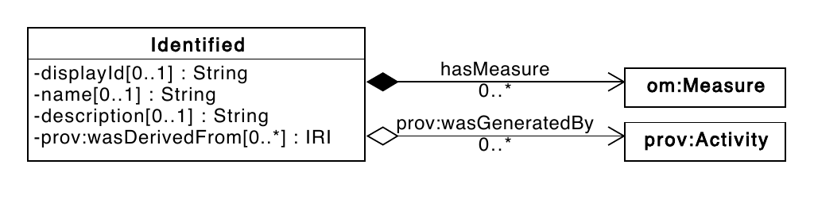

***Figure 5:*** *Diagram of the Identified abstract class and its associated properties*

#### The displayId property

The displayId property is an OPTIONAL identifier with a data type of String. This property is
intended to be an intermediate between an IRI and the name property that is machine-readable, but
more human-readable than the full IRI of an object.

If the displayId property is used, then its String value MUST be composed of only alphanumeric or
underscore characters and MUST NOT begin with a digit.

Note that for objects whose IRI is a URL, the requirements on URL structure in
[Section 5.1](#51-internationalized-resource-identifiers) imply that the displayId MUST be set.

#### The name property

The name property is OPTIONAL and has a data type of String. This property is intended to be
displayed to a human when visualizing an Identified object.

If an Identified object lacks a name, then software tools SHOULD instead display the object’s
displayId or IRI. It is RECOMMENDED that software tools give users the ability to switch
perspectives between name properties that are human-readable and displayId properties that are less
human-readable, but are more likely to be unique.

#### The description property

The description property is OPTIONAL and has a data type of String. This property is intended to
contain a more thorough text description of an Identified object.

#### The prov:wasDerivedFrom property

An Identified object MAY have zero or more prov:wasDerivedFrom properties, each of type IRI. This
property is defined by the PROV-O ontology and is located in the `https://www.w3.org/ns/prov#`
namespace (Reference: [Section A.1](#a1-adding-provenance-with-prov-o)). An Identified object with
this property refers to one or more non-SBOL resources or SBOL Identified objects from which this
object was derived. An Identified object MUST NOT refer to itself via its own prov:wasDerivedFrom
property or form a cyclical chain of references via its prov:wasDerivedFrom property and those of
other Identified objects. For example, the reference chain “A was derived from B and B was derived
from A” is cyclical.

#### The prov:wasGeneratedBy property

An Identified object MAY have zero or more prov:wasGeneratedBy properties, each of type IRI. This
property is defined by the PROV-O ontology and is located in the `https://www.w3.org/ns/prov#`
namespace (Reference: [Section A.1](#a1-adding-provenance-with-prov-o)).

An Identified object with this property refers to one or more prov:Activity objects that describe
how this object was generated. Provenance history formed by prov:wasGeneratedBy properties of
Identified objects and entity references in prov:Usage objects MUST NOT form circular reference
chains.

#### The hasMeasure property

An Identified object MAY have zero or more hasMeasure properties, each of which refers to a
om:Measure object that describe measured parameters for this object. om:Measure objects are defined
by the OM ontology and is located in the `http://www.ontology-of-units-of-measure.org/resource/om-2/`
namespace (Reference: [Section A.2](#a2-adding-measuresparameters-with-om)).

### 6.2. TopLevel

TopLevel is an abstract class that is extended by any Identified class that can be found at the top
level of an SBOL document or file. In other words, TopLevel objects are not nested inside any other
object via composite aggregation (represented by a filled diamond arrowhead on the UML diagrams).
Instead of nesting, composite TopLevel objects refer to subordinate TopLevel objects by their IRIs
using shared aggregation (represented by an open-faced/non-filled diamond arrowhead on the UML
diagrams). The TopLevel classes defined in this specification are Sequence, Component, Model,
Collection, CombinatorialDerivation, Implementation, Attachment, ExperimentalData, prov:Activity,
prov:Agent, prov:Plan (see Figure 6). Each of these classes is described in more detail below,
except for the classes from the provenance ontology (PROV-O), which are described in
[Section A.1](#a1-adding-provenance-with-prov-o).

#### The hasNamespace property

A TopLevel object MUST have precisely one hasNamespace property, which contains a URL that defines
the namespace portion of URLs for this object and any child objects. If the IRI for the TopLevel
object is a URL, then the URL of the hasNamespace property MUST prefix match that URL.

Note that the requirement for a hasNamespace property holds even for objects with IRIs that are not
URLs, in order to allow them to be copied into datastores that use URLs. In this case, however,
there is no prefix requirement.

#### The hasAttachment property

A TopLevel object can have zero or more hasAttachment properties, each of type IRI specifying an
Attachment object. The Attachment class is described in more detail in [Section 6.10](#610-attachment).

### 6.3. Sequence

The purpose of the Sequence class is to represent the primary structure of a Component object and
the manner in which it is encoded. This representation is accomplished by means of the elements
property and encoding property (Figure 7).

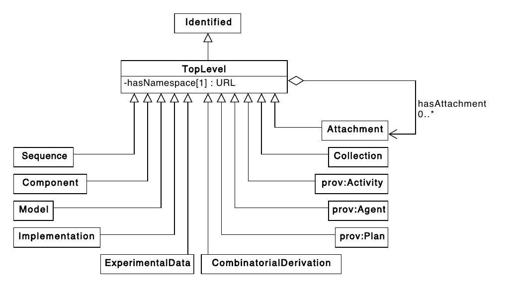

***Figure 6:*** *Classes that inherit from the TopLevel abstract class.*

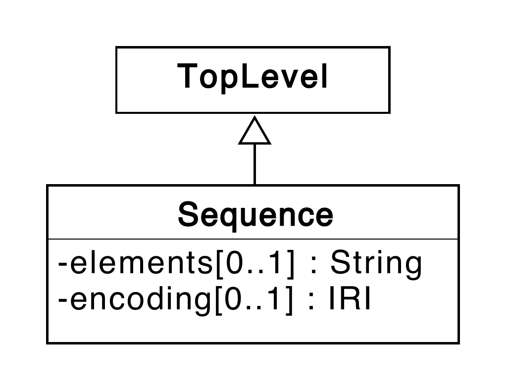

***Figure 7:*** *Diagram of the Sequence class and its associated properties.*

#### The elements property

The elements property is an OPTIONAL String of characters that represents the constituents of a
biological or chemical molecule. For example, these characters could represent the nucleotide bases
of a molecule of DNA, the amino acid residues of a protein, or the atoms and chemical bonds of a
small molecule.

If the elements property is not set, then it means the particulars of this Sequence have not yet
been determined.

#### The encoding property

The encoding property has a data type of IRI, and is OPTIONAL unless elements is set, in which case
it is REQUIRED. This property MUST indicate how the elements property of a Sequence are formed and
interpreted. The encoding property SHOULD respectively contain an IRI identifying from the textual
format (`https://identifiers.org/edam:format_2330`) branch of the EDAM ontology. For example, the
elements property of a Sequence with an IUPAC DNA encoding property MUST contain characters that
represent nucleotide bases, such as a, t, c, and g. The elements property of a Sequence with a
Simplified Molecular-Input Line-Entry System (SMILES) encoding, on the other hand, MUST contain
characters that represent atoms and chemical bonds, such as C, N, O, and =.

Table 1 contains a partial list of possible IRI values for the encoding property. These terms are
organized by the type of Component (see Table 2) that typically refer to a Sequence with such an
encoding. It is RECOMMENDED that the encoding property of a Sequence contains an IRI from Table 1.
When the encoding of a Sequence is well described by one of the IRIs in Table 1, it MUST contain
that IRI.

| Encoding | URL | Component Type |
| --- | --- | --- |
| IUPAC DNA, RNA | https://identifiers.org/edam:format_1207 | DNA, RNA |
| IUPAC Protein | https://identifiers.org/edam:format_1208 | Protein |
| InChI | https://identifiers.org/edam:format_1197 | Simple Chemical |
| SMILES | https://identifiers.org/edam:format_1196 | Simple Chemical |

***Table 1:*** *URLs for specifying the encoding property of a Sequence, organized by the type of Component (see Table 2) that typically refer to a Sequence with such an encoding.*

### 6.4. Component

The Component class represents the structural and/or functional entities of a biological design. The
primary usage of this class is to represent entities with designed sequences, such as DNA, RNA, and
proteins, but it can also be used to represent any other entity that is part of a design, such as
simple chemicals, molecular complexes, strains, media, light, and abstract functional groupings of
other entities.

As shown in Figure 8, the Component class describes a design entity using the following properties:
type, role, hasSequence, hasFeature, hasConstraint, hasInteraction, hasInterface, and hasModel. The
hasSequence, hasFeature, and hasConstraint properties are used to represent structural information,
while the hasInteraction, hasInterface, and hasModel are used to represent functional information.

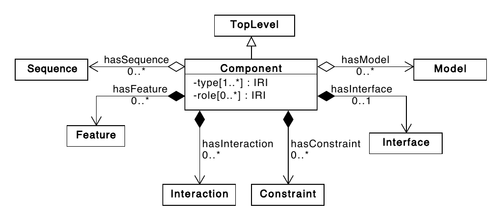

***Figure 8:*** *Diagram of the Component class and its associated properties.*

#### The type property

A Component MUST have one or more type properties, each of type IRI specifying the category of
biochemical or physical entity (for example DNA, protein, or simple chemical) that a Component
object abstracts for the purpose of engineering design. For DNA or RNA entities, additional type
properties MAY be used to describe nucleic acid topology (circular / linear) and strandedness
(double- or single-stranded).

The type properties of every Component MUST include one or more IRIs that MUST identify terms from
appropriate ontologies, such as the physical entity representation branch of the Systems Biology
Ontology Courtot et al. (2011) or the ontology of Chemical Entities of Biological Interest (ChEBI)
Degtyarenko et al. (2008). In order to maximize the compatibility of designs, the type property of a
Component SHOULD contain a URL from the physical entity representation branch of the Systems Biology
Ontology Courtot et al. (2011). Table 2 provides a partial list of ontology terms and their IRIs,
and any Component that can be well-described by one of the terms in Table 2 MUST use the IRI for
that term as a type. Finally, if the type property contains multiple IRIs, then they MUST identify
non-conflicting terms (otherwise, it might not be clear how to interpret them). For example, the SBO
terms provided by Table 2 would conflict because they specify classes of biochemical entities with
different molecular structures.

| Component Type | URL for SBO Term |
| --- | --- |
| DNA (Deoxyribonucleic acid) | https://identifiers.org/SBO:0000251 |
| RNA (Ribonucleic acid) | https://identifiers.org/SBO:0000250 |
| Protein (Polypeptide chain) | https://identifiers.org/SBO:0000252 |
| Simple Chemical | https://identifiers.org/SBO:0000247 |
| Non-covalent complex | https://identifiers.org/SBO:0000253 |
| Functional Entity | https://identifiers.org/SBO:0000241 |

***Table 2:*** *Partial list of the most common SBO terms to specify the molecule type using the type property of a Component. Systems of multiple interacting molecules (e.g., a plasmid expressing a protein) should use the functional entity type.*

#### Nucleic Acid Topology types

Any Component classified as DNA (see Table 2) is RECOMMENDED to encode circular/linear topology
information in an additional type field. This (topology) type field SHOULD specify a URL from the
Topology Attribute branch of the Sequence Ontology (SO): this is currently just ‘linear’ or
‘circular’ as given in Table 3. Topology information SHOULD be specified for DNA Component records
with a fully specified sequence, except in three scenarios: if the DNA record does not have sequence
information, or if the DNA record has incomplete sequence information, or if topology is genuinely
unknown. For any Component classified as RNA (see Table 2), a topology type field is OPTIONAL. The
default assumption in this case is linear topology. In any case, conflicting topologies MUST NOT be
specified.

Any Component classified as DNA or RNA MAY also have strand information encoded in an additional
(third) type field using a URL from the Strand Attribute branch of the SO (currently there are only
two possible terms for single or double-stranded nucleic acids, given in Table 3). In absence of
this field, the default strand information assumed for DNA is ‘double-stranded’ and for RNA is
‘single-stranded’.

Any other type of Component record (protein, simple chemical, etc.) SHOULD NOT have any type field
pointing to SO terms from the topology or strand attribute branches of SO.

Note that a circular topology instructs software to interpret the beginning / end position of a
given sequence (be it DNA or RNA) as arbitrary, meaning that sequence features MAY be mapped or
identified across this junction. Double stranded instructs software to apply sequence searches to
both strands (i.e., sequence and reverse complement of sequence).

| Nucleic Acid Topology | URL for Nucleic Acid Topology Term in SO |
| --- | --- |
| linear | http://identifiers.org/SO:0000987 |
| circular | http://identifiers.org/SO:0000988 |
| single-stranded | http://identifiers.org/SO:0000984 |
| double-stranded | http://identifiers.org/SO:0000985 |

***Table 3:*** *Sequence Ontology (SO) terms to encode DNA or RNA topology information in the type properties of a Component.*

#### The role property

A Component MAY have any number of role properties, each of type IRI, that MUST identify terms from
ontologies that are consistent with the type property of the Component. For example, the role
property of a DNA or RNA Component could contain IRIs identifying terms from the Sequence Ontology
(SO). As a best practice, a DNA or RNA Component SHOULD contain exactly one IRI that refers to a
term from the sequence feature branch of the SO.

Similarly, the role properties of a protein and simple chemical Component SHOULD respectively
contain IRIs identifying terms from the MolecularFunction (GO:0003674) branch of the Gene Ontology
(GO) and the role (CHEBI:50906) branch of the CHEBI ontology. Table 4 contains a partial list of
possible ontology terms for the role properties and their IRIs. These terms are organized by the
type of Component to which they SHOULD apply (see Table 2). Any Component that can be well-described
by one of the terms in Table 4 MUST use the IRI for that term as a role.

These IRIs might identify descriptive biological roles, such as “metabolic pathway” and “signaling
cascade,” but they can also identify identify “logical” roles, such as “inverter” or “AND gate”, or
other abstract roles for describing the function of design. Interpretation of the meaning of such
roles currently depends on the software tools that read and write them.

| Component Role | URL for Ontology Term | Component Type |
| --- | --- | --- |
| Promoter | http://identifiers.org/SO:0000167 | DNA |
| RBS | http://identifiers.org/SO:0000139 | DNA |
| CDS | http://identifiers.org/SO:0000316 | DNA |
| Terminator | http://identifiers.org/SO:0000141 | DNA |
| Gene | http://identifiers.org/SO:0000704 | DNA |
| Operator | http://identifiers.org/SO:0000057 | DNA |
| Engineered Region | http://identifiers.org/SO:0000804 | DNA |
| mRNA | http://identifiers.org/SO:0000234 | RNA |
| Effector | http://identifiers.org/CHEBI:35224 | Small Molecule |
| Transcription Factor | http://identifiers.org/GO:0003700 | Protein |

***Table 4:*** *Partial list of ontology terms to specify the role property of a Component, organized by the type of Component to which they are intended to apply (see Table 2).*

#### The hasSequence property

A Component MAY have any number of hasSequence properties, each of type IRI, that MUST reference a
Sequence object (see [Section 6.3](#63-sequence)). These objects define the primary structure or structures of the
Component.

If a Feature of a Component refers to a Location, and this Location refers to a Sequence, then the
Component MUST also include a hasSequence property that refers to this Sequence.

Many Component objects will have exactly one hasSequence property that refers to a Sequence object.
In this case, if its has a type from Table 2 and there is an encoding that is cross-listed with this
term in Table 1, then the Sequence objects MUST have this encoding (e.g., a Component of type DNA
must have a Sequence with an IUPAC DNA encoding). This Sequence is implicitly the entire sequence
for this Component (In other words, it is equivalent to a SequenceFeature with an EntireSequence
Location that refers to this Sequence).

#### The hasFeature property

A Component MAY have any number of hasFeature properties, each of type IRI that MUST reference a
Feature object (see [Section 6.4.1](#641-feature)). The set of relations between Feature and Component objects MUST
be strictly acyclic.

Taking the Component class as analogous to a blueprint or specification sheet for a biological part
or a system of interacting biological elements, the Feature class represents the specific occurrence
of a part, subsystem, or other notable aspect within that design. This mechanism also allows a
biological design to include multiple instances of a particular part (defined by reference to the
same Component). For example, the Component of a polycistronic gene could contain two SubComponent
objects that refer to the same Component of a CDS. As another example, consider the Component for a
network of two-input repressor devices in which the particular repressors have not yet been chosen.
This Component could contain multiple SubComponent objects that refer to the same Component of an
abstract two-input repressor device.

The hasFeature properties of Component objects can be used to construct a hierarchy of SubComponent
and Component objects. If a Component in such a hierarchy refers to a Location object, and there
exists a Component object lower in the hierarchy that refers to a Location object that refers to the
same Sequence with the same encoding, then the elements properties of these Sequence objects SHOULD
be consistent with each other, such that well-defined mappings exist from the “lower level” elements
to the “higher level” elements in accordance with their shared encoding properties. This mapping is
also subject to any restrictions on the positions of the Feature objects in the hierarchy that are
imposed by the SubComponent, SequenceFeature, or Constraint objects contained by the Component
objects in the hierarchy.

For example, in a plasmid Component with a promoter SubComponent, the sequence at the promoter’s
Location within the plasmid should be the sequence for the promoter. More concretely, consider DNA
Component that refers to a Sequence with an IUPAC DNA encoding and an elements String of “gattaca.”
In turn, this Component could contain a SubComponent that refers to a “lower level” Component that
also refers to a Sequence with an IUPAC DNA encoding. Consequently, a consistent elements String of
this “lower level” Sequence could be “gatta,” or perhaps “tgta” if the SubComponent is positioned
by a Location with an orientation of “reverse complement” (see [Section 6.4.2](#642-location)).

#### The hasConstraint property

A Component MAY have any number of hasConstraint properties, each of type IRI, that MUST reference a
Constraint object (see [Section 6.4.3](#643-constraint)). These objects describe, among other things, any restrictions
on the relative, sequence-based positions and/or orientations of the Feature objects contained by
the Component, as well as spatial relations such as containment and identity relations. For example,
the Component of a gene might specify that the position of its promoter SubComponent precedes that
of its CDS SubComponent. This is particularly useful when a Component lacks a Sequence and therefore
cannot specify the precise, sequence-based positions of its SubComponent objects using Location
objects.

#### The hasInteraction property

A Component MAY have any number of hasInteraction properties, each of type IRI, that MUST reference
an Interaction object (see [Section 6.4.4](#644-interaction)).

The Interaction class provides an abstract, machine-readable representation of behavior within a
Component (whereas a more detailed model of the system might not be suited to machine reasoning,
depending on its implementation). Each Interaction contains Participation objects that indicate the
roles of the Feature objects involved in the Interaction.

#### The hasInterface property

A Component MAY have zero or one hasInterface property of type IRI that MUST reference an Interface
object (see [Section 6.4.5](#645-interface)).

An Interface object indicates the inputs, outputs, and non-directional points of connection to a
Component.

#### The hasModel property

A Component MAY have any number of hasModel properties, each of type IRI, that MUST reference a
Model object (see [Section 6.8](#68-model)). Model objects are placeholders that link Component objects to
computational models of any format. A Component object can link to more than one Model since each
might encode system behavior in a different way or at a different level of detail.

#### 6.4.1. Feature

The Feature class, as shown in Figure 9 is used to compose Component objects into a structural or
functional hierarchy. Feature is an abstract class; only its child classes are actually
instantiated.

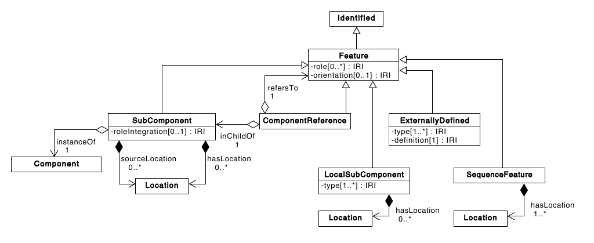

***Figure 9:*** *Diagram of the Feature class, its children, and associated properties.*

##### The role property

Each Feature can have zero or more role property IRIs describing the purpose or potential function
of this Feature in the context of its parent Component. If the role for a SubComponent is left
unspecified, then the role is determined by the role property of the Component that it is an
instanceOf. If provided, these role property IRIs MUST identify terms from appropriate ontologies.
Roles are not restricted to describing biological function; they may annotate a Feature’s function
in any domain for which an ontology exists. A table of recommended ontology terms for role is given
in Table 4.

It is RECOMMENDED that these role property IRIs identify terms that are compatible with the type
properties of the Feature’s parent Component. For example, a role of a Feature which belongs to a
Component of type DNA might refer to terms from the Sequence Ontology. Likewise, for any feature
that is a SubComponent, the role SHOULD be compatible with the type of the Component that it links
to through its instanceOf property.

##### The orientation property

The orientation property is OPTIONAL and has a data type of IRI. This can be used to indicate how
any associated double-stranded Feature is oriented on the elements of a Sequence from their parent
Component. If a Feature object has an orientation, then it is RECOMMENDED that it come from Table 5;
for reasons of backwards compatability it MAY instead come from Table 6.

| Orientation URL | Description |
| --- | --- |
| https://identifiers.org/SO:0001030 | The region specified by this Feature or Location is on the elements of a Sequence. |
| https://identifiers.org/SO:0001031 | The region specified by this Feature or Location is on the reverse-complement mapping of the elements of a Sequence. The exact nature of this mapping depends on the encoding of the Sequence. |

***Table 5:*** *RECOMMENDED URLs for the orientation property*

| Orientation URL | Description |
| --- | --- |
| http://sbols.org/v3#inline | The region specified by this Feature or Location is on the elements of a Sequence. |
| http://sbols.org/v3#reverseComplement | The region specified by this Feature or Location is on the reverse-complement mapping of the elements of a Sequence. The exact nature of this mapping depends on the encoding of the Sequence. |

***Table 6:*** *Permitted alternative URLs for the orientation property. The URLs listed in Table 5 are preferred and SHOULD be used instead where possible.*

##### 6.4.1.1. SubComponent

The SubComponent class is a subclass of the Feature class that can be used to specify structural
hierarchy. For example, the Component of a gene might contain four SubComponent objects: a promoter,
RBS, CDS, and terminator, each linked to a Component that provides the complete definition. In turn,
the Component of the promoter SubComponent might itself contain SubComponent objects defining
various operator sites, etc.

###### The roleIntegration property

A roleIntegration specifies the relationship between a SubComponent instance’s own set of role
properties and the set of role properties on the included Component. The roleIntegration property
has a data type of IRI. A SubComponent instance with zero role properties MAY OPTIONALLY specify a
roleIntegration. A SubComponent instance with one or more role properties MUST specify a
roleIntegration from Table 7. If zero SubComponent role properties are given and no SubComponent
roleIntegration is given, then `http://sbols.org/v3#mergeRoles` is assumed. It is RECOMMENDED to
specify SubComponent role values only if the result would differ from the role values belonging to
this SubComponent’s included Component.

| roleIntegration URL | Description |
| --- | --- |
| http://sbols.org/v3#overrideRoles | In the context of this SubComponent, ignore any role given for the included Component. Instead use only the set of zero or more role properties given for this SubComponent. |
| http://sbols.org/v3#mergeRoles | Use the union of the two sets: both the set of zero or more role properties given for this SubComponent as well as the set of zero or more role properties given for the included Component. |

***Table 7:*** *Each roleIntegration mode is associated with a rule governing how a SubComponent's role values are to be combined with the included Component's role values.*

###### The instanceOf property

The instanceOf property is a REQUIRED IRI that refers to the Component providing the definition for
this SubComponent. Among other things, as described in the previous section, this Component
effectively provides information about the type and role of the SubComponent.

The instanceOf property MUST NOT refer to the same Component as the one that contains the
SubComponent. Furthermore, SubComponent objects MUST NOT form a cyclical chain of references via
their instanceOf properties and the Component objects that contain them. For example, consider the
SubComponent objects A and B and the Component objects X and Y. The reference chain “X has feature
A, A is an instance of Y, Y has feature B, and B is an instance of X” is cyclical.

###### The hasLocation property

A SubComponent MAY have any number of hasLocation properties, each of type IRI, that MUST refer to
Location objects that indicates the location of the Sequence from the instanceOf Component in a
Sequence of the parent Component.

If any hasLocation is defined, then there MUST BE precisely one Sequence in the instanceOf
Component, as otherwise this relationship is ill-defined.

If no hasLocation is defined, this indicates a part / sub-part relationship for which sequence
details have not (yet) been determined or involving types for which sequence relationships are not
relevant (e.g., inclusion of a reaction chain within a larger metabolic network).

Allowing multiple Location objects on a single SubComponent is intended to enable representation of
discontinuous regions (for example, a coding sequence encoded across a set of exons with
interspersed introns). As such, the Location objects of a single SubComponent MUST NOT specify
overlapping regions, since it is not clear what this would mean. There is no such concern with
different objects, however, which can freely overlap in Location (for example, specifying
overlapping linkers for sequence assembly).

###### The sourceLocation property

The sourceLocation property allows for only a portion of a Component’s Sequence to be included,
rather than its entirety. For example, when composing parts with certain assembly methods, some
bases on the boundary may be removed or replaced. Another example is describing a deletion or
replacement of a portion of a sequence. A SubComponent MAY have any number of sourceLocation
properties, each of type IRI, that MUST refer to Location objects that indicate which elements of
the instanceOf Component’s Sequence are used in defining the parent of the SubComponent. If there
are no sourceLocation properties, then the whole Sequence is assumed to be included.

##### 6.4.1.2. ComponentReference

The ComponentReference class is a subclass of Feature that can be used to reference Features within
SubComponents.

###### The inChildOf property

The inChildOf property is a REQUIRED IRI that refers to a SubComponent. The inChildOf property MUST
refer to a SubComponent pointed directly to by the parent of the ComponentReference. Specifically:

- If the parent of the ComponentReference is a Component, then inChildOf MUST be one of its
  SubComponents.

- If the parent of the ComponentReference is another ComponentReference, then inChildOf MUST be a
  SubComponent of the Component linked as instanceOf the parent’s inChildOf SubComponent.

###### The refersTo property

The refersTo property is a REQUIRED IRI that refers to a Feature.

This can be used to either link to the Feature being referenced or to chain hierarchically through
additional layers of SubComponent.

- If the Feature is a ComponentReference, then that ComponentReference acts as a hierarchical link
  in a chain of references, and MUST be either a child of the ComponentReference linking to it via
  refersTo or a child of the Component linked as instanceOf the ComponentReference’s inChildOf
  SubComponent.

- Otherwise, if the refersTo refers to any other type of Feature, that Feature MUST be a child of
  the Component linked as instanceOf the ComponentReference’s inChildOf SubComponent.

For example, ComponentReference R1 looking into a SubComponent for a plasmid might link with
refersTo to its own child ComponentReference R2, which in turn looks within the Component defining
the plasmid to the plasmid’s CDS SubComponent, in turn using refersTo to reference a SequenceFeature
within the Component that defines that CDS.

##### 6.4.1.3. LocalSubComponent

The LocalSubComponent class is a subclass of Feature. This class serves as a way to create a
placeholder in more complex Components, such as a variable to be filled in later or a composite that
exists only within the context of the parent Component.

###### The type property

The type property is REQUIRED and contains one or more IRIs. The type property is identical to its
use in Component.

###### The hasLocation property

A LocalSubComponent MAY have any number of hasLocation properties, each of type IRI, that MUST refer
to Location objects. These follow the same restrictions as for the hasLocation of a SubComponent,
notably that the Locations of hasLocation properties attached to the same LocalSubComponent MUST NOT
overlap.

##### 6.4.1.4. ExternallyDefined

The ExternallyDefined class has been introduced so that external definitions in databases like ChEBI
or UniProt can be referenced.

###### The type property

The type property is REQUIRED and contains one or more IRIs. The type property is identical to its
use in Component.

###### The definition property

The definition property is REQUIRED and is of type IRI that links to a canonical definition external
to SBOL. When possible, such definitions SHOULD use the recommended external resources in Section
7.6. For example, an ExternallyDefined simple chemical might link to ChEBI and a protein might link
to UniProt.

##### 6.4.1.5. SequenceFeature

The SequenceFeature class describes one or more regions of interest on the Sequence objects referred
to by its parent Component.

###### The hasLocation property

The hasLocation is REQUIRED and contains one or more IRIs, which MUST refer to Location objects.
These follow the same restrictions as for the hasLocation of a SubComponent, notably that the
Locations of hasLocation properties attached to the same SequenceFeature MUST NOT overlap.

#### 6.4.2. Location

The Location class (as shown in Figure 10) is used to represent the location of Features within
Sequences. This class is extended by the Range, Cut, and EntireSequence classes Location is an
abstract class; only its child classes are actually instantiated.

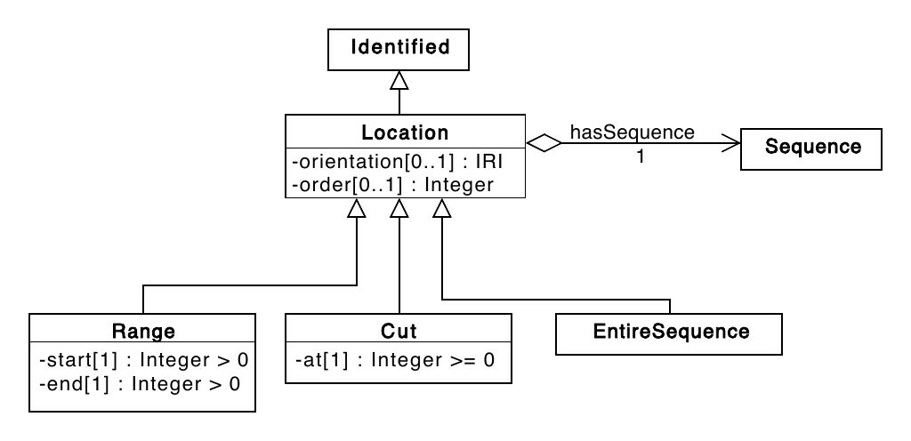

***Figure 10:*** *Diagram of the Location class and its associated properties.*

##### The orientation property

The orientation property is OPTIONAL and has a data type of IRI. All subclasses of Location share
this property, which can be used to indicate how any associated double-stranded Feature is oriented
on the elements of a Sequence from their parent Component. If a Location object has an orientation,
then it is RECOMMENDED that it come from Table 5; for reasons of backwards compatability it MAY
instead come from Table 6.

As is typical practice in biology, any change in orientation is applied after indices are
interpreted. Thus, for example, in a DNA Sequence with elements AAAAACCCCCTTTTTGGGGGTTTTTGGGGG,
indices 1-6 with a reverse orientation will select AAAAAC, which would then be reverse complemented
to obtain GTTTTT.

##### The order property

The order property is OPTIONAL and has a data type of Integer. If there are multiple Location
objects associated with a Feature, the order property is used to specify the order (in increasing
value) in which the specified Locations are to be joined to form the sequence of the Feature. Note
that order values MAY be non-sequential and non-positive, if desired.

##### The hasSequence property

The hasSequence property is REQUIRED and MUST contain the IRI of a Sequence object. All subclasses
of Location share this property, which indicates which Sequence object referenced by the containing
Component is referenced by the Location.

##### 6.4.2.1. Range

A Range object specifies a region via discrete, inclusive start and end positions that correspond to
indices for characters in the elements String of a Sequence.

Note that the index of the first location is 1, as is typical practice in biology, rather than 0, as
is typical practice in computer science.

###### The start property

The start property specifies the inclusive starting position of the Range. This property is REQUIRED
and MUST contain an Integer value greater than zero.

###### The end property

The end property specifies the inclusive ending position of the Range. This property is REQUIRED and
MUST contain an Integer value greater than zero. In addition, this Integer value MUST be greater
than or equal to that of the start property.

##### 6.4.2.2. Cut

The Cut class has been introduced to enable the specification of a region between two discrete
positions. This specification is accomplished using the at property, which specifies a discrete
position that corresponds to the index of a character in the elements String of a Sequence (except
in the case when at is equal to zero—see below).

###### The at property

The at property is REQUIRED and MUST contain an Integer value greater than or equal to zero. The
region specified by the Cut is between the position specified by this property and the position that
immediately follows it. When the at property is equal to zero, the specified region is immediately
before the first discrete position or character in the elements String of a Sequence.

##### 6.4.2.3. EntireSequence

The EntireSequence class does not have any additional properties. Use of this class indicates that
the linked Sequence describes the entirety of the Component or Feature parent of this Location
object.

#### 6.4.3. Constraint

The Constraint class can be used to assert restrictions on the relationships of pairs of Feature
objects contained by the same parent Component. Uses of this class include expressing containment
(e.g., a plasmid transformed into a chassis strain), identity mappings (e.g., replacing a
placeholder value with a complete definition), and expressing relative, sequence-based positions
(e.g., the ordering of features within a template). Each Constraint includes the subject, object,
and restriction properties.

##### The subject property

The subject property is REQUIRED and MUST contain an IRI that refers to a Feature contained by the
same parent Component that contains the Constraint.

##### The object property

The object property is REQUIRED and MUST contain an IRI that refers to a Feature contained by the
same parent Component that contains the Constraint. This Feature MUST NOT be the same Feature that
the Constraint refers to via its subject property.

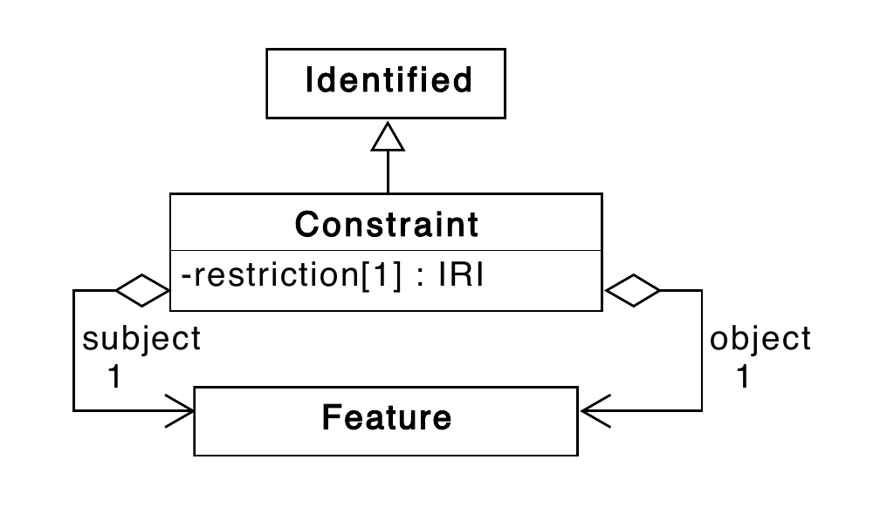

***Figure 11:*** *Diagram of the Constraint class and its associated properties.*

##### The restriction property

The restriction property is REQUIRED and has a data type of IRI. This property MUST indicate the
type of restriction on the locations, orientations, or identities of the subject and object Feature
objects in relation to each other. The IRI value of this property SHOULD come from the RECOMMENDED
URLs in Table 8, Table 9, and Table 10.

| Restriction URL | Description |
| --- | --- |
| http://sbols.org/v3#verifyIdentical | The subject and object, after tracing through any layers of ComponentReference, MUST both refer to SubComponent objects with the same instanceOf value or both refer to ExternallyDefined objects with the same definition. Example: a promoter included via two different subsystems must be the identical. |
| http://sbols.org/v3#differentFrom | The subject and object, after tracing through any layers of ComponentReference, MUST NOT both refer to SubComponent objects with the same instanceOf value or both refer to ExternallyDefined objects with the same definition. Example: two fluorescent reporters must be different. |
| http://sbols.org/v3#replaces | In the context of the parent object of the Constraint, information about the subject should be used in place of all instances of the object. Example: the J23101 promoter replaces a generic promoter. |
| http://sbols.org/v3#sameOrientationAs | The subject and object Component objects MUST have the same orientation. Example: a promoter has the same orientation as the coding sequence it controls. |
| http://sbols.org/v3#oppositeOrientationAs | The subject and object Component objects MUST have opposite orientations. Example: a promoter has the opposite orientation as an invertase-activated coding sequence it controls. |

***Table 8:*** *RECOMMENDED URLs for expressing identity and orientation with the restriction property.*

| Restriction URL | Description |
| --- | --- |
| http://sbols.org/v3#isDisjointFrom | The subject and object do not overlap in space. Example: a plasmid is disjoint from a chromosome. |
| http://sbols.org/v3#strictlyContains | The subject entirely contains the object: they do not share a boundary. Example: a cell contains a plasmid. |
| http://sbols.org/v3#contains | The subject contains the object and they might or might not share a boundary (i.e., union of strictlyContains, equals, and covers). Example: a cell contains a protein that may or may not bind to its membrane. |
| http://sbols.org/v3#equals | The subject and object occupy the same location in space. Example: a small molecule is distributed throughout an entire sample. |
| http://sbols.org/v3#meets | The subject and object are connected at a shared boundary. Example: two strains of adherent cells meet at their membranes. |
| http://sbols.org/v3#covers | The subject contains the object but also shares a boundary. Example: a cell covers its transmembrane proteins. |
| http://sbols.org/v3#overlaps | The subject and object overlap in space, but portions of each are outside of the other. Example: a transmembrane protein overlaps the cell membrane. |

***Table 9:*** *RECOMMENDED URLs for expressing topological relations with the restriction property.*

| Restriction URL | Description |
| --- | --- |
| http://sbols.org/v3#precedes | The start of the location for subject is less than the start of the location for object (i.e., union of strictlyPrecedes, meets, and overlaps). Example: a promoter precedes a ribosome entry site, but the exact boundary between the two will be determined by sequence optimization and assembly planning. |
| http://sbols.org/v3#strictlyPrecedes | The end of the location for subject is less than the start of the location for object. Example: a promoter strictly precedes a terminator (with a CDS between them). |
| http://sbols.org/v3#meets | The end of the location for subject is equal to the start of the location for object. Note: this is a stronger interpretation of meets from Table 9 in the context of a linear sequence. Example: the 3’ region adjacent to a blunt restriction site meets the 5’ region adjacent to the site. |
| http://sbols.org/v3#overlaps | The start of the location for subject is before the start of the location for object and the end of the location for subject is before the end of the location for object. Note: this is a stronger interpretation of overlaps from Table 9 in the context of a linear sequence. Example: two adjacent oligos overlap in a Gibson assembly plan. |
| http://sbols.org/v3#contains | The start of the location for subject is less than or equal to the start of the location for object and the end of the location for subject is greater than or equal to the end of the location for object (i.e., union of strictlyContains, equals, finishes, and starts). Note: this is a stronger interpretation of contains from Table 9 in the context of a linear sequence. Example: a composite part contains a promoter. |
| http://sbols.org/v3#strictlyContains | The start of the location for subject is before the start of the location for object and the end of the location for subject is after the end of the location for object. Note: this is a stronger interpretation of strictlyContains from Table 9 in the context of a linear sequence. Example: an RNA transcript strictly contains an intron. |
| http://sbols.org/v3#equals | The start and end of the location for subject are equal to the start and end of the location for object. Note: this is a stronger interpretation of equals from Table 9 in the context of a linear sequence. Example: the transcribed region of a CDS part equals the entire part. |
| http://sbols.org/v3#finishes | The start of the location for subject is after the start of the location for object and the end of the location for subject is equal to the end of the location for object. Example: a terminator finishes an expression cassette. |
| http://sbols.org/v3#starts | The start of the location for subject is equal to the start of the location for object and the end of the location for subject is before the end of the location for object. Example: a promoter starts an expression cassette. |

***Table 10:*** *RECOMMENDED URLs for expressing sequential relations with the restriction property. Note that these relations are only well-defined when the subject and object can be located on the same Sequence (though this may be something that is inferred rather than known a priori). In interpreting these relations, it is important to remember that for Range objects, the start and end indices refer to whole bases/residues such that a Range with end equal to 9 meets a Range with start equal to 10, while it strictlyPrecedes a Cut with at equal to 10.*

#### 6.4.4. Interaction

The Interaction class (as shown in Figure 12) provides more detailed description of how the Feature
objects of a Component are intended to work together. For example, this class can be used to
represent different forms of genetic regulation (e.g., transcriptional activation or repression),
processes from the central dogma of biology (e.g. transcription and translation), and other basic
molecular interactions (e.g., non-covalent binding or enzymatic phosphorylation). Each Interaction
includes type properties that refer to descriptive ontology terms and hasParticipation properties
that describe which Feature objects participate in which ways in the Interaction.

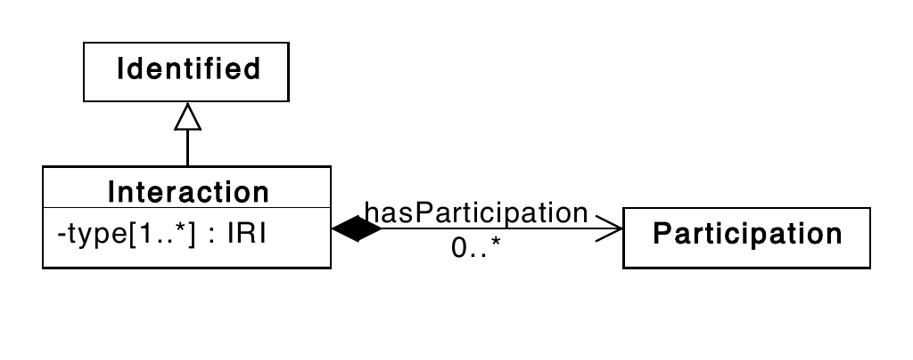

***Figure 12:*** *Diagram of the Interaction class and its associated properties.*

##### The type property

An Interaction is REQUIRED to have one or more type properties, each of type IRI, that describes the
behavior represented by an Interaction.

Each type property MUST identify terms from appropriate ontologies. It is RECOMMENDED that exactly
one IRI specified by a type property refer to a term from the occurring entity branch of the Systems
Biology Ontology (SBO). Table 11 provides a partial list of possible SBO terms for the type property
and their corresponding IRIs.

If an Interaction is well described by one of the terms from Table 11, then a type property MUST
refer to the IRI that identifies this term. Lastly, if there are multiple type properties for an
Interaction, then they MUST identify non-conflicting terms. For example, the SBO terms “stimulation”
and “inhibition” would conflict.

##### The hasParticipation property

An Interaction MAY have any number of hasParticipation properties, each of type IRI, that MUST
reference a Participation object, each of which identifies the role that its referenced Feature
plays in the Interaction. Even though an Interaction generally contains at least one Participation,
the case of zero Participation objects is allowed because it is plausible that a designer might want
to specify that an Interaction will exist, even if its participants have not yet been determined.

| Interaction Type | URL for SBO Term |
| --- | --- |
| Inhibition | http://identifiers.org/SBO:0000169 |
| Stimulation | http://identifiers.org/SBO:0000170 |
| Biochemical Reaction | http://identifiers.org/SBO:0000176 |
| Non-Covalent Binding | http://identifiers.org/SBO:0000177 |
| Degradation | http://identifiers.org/SBO:0000179 |
| Genetic Production | http://identifiers.org/SBO:0000589 |
| Control | http://identifiers.org/SBO:0000168 |

***Table 11:*** *Partial list of SBO terms to specify the type property of an Interaction.*

##### 6.4.4.1. Participation

Each Participation (see Figure 13) represents how a particular Feature behaves in its parent
Interaction.

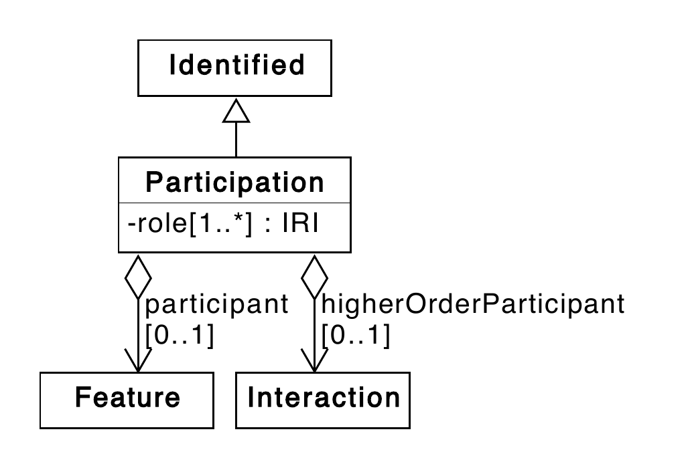

***Figure 13:*** *Diagram of the Participation class and its associated properties.*

###### The role property

A Participation is REQUIRED to have one or more role properties, each of type IRI, that describes
the behavior of a Participation (and by extension its referenced Feature) in the context of its
parent Interaction.

Each role property MUST identify terms from appropriate ontologies. It is RECOMMENDED that exactly
one IRI specified by a role property refer to a term from the participant role branch of the SBO.
Table 12 provides a partial list of possible SBO terms for the role properties and their
corresponding IRIs.

If a Participation is well described by one of the terms from Table 12, then a role property MUST
refer to the IRI that identifies this term. Also, if a Participation belongs to an Interaction that
has a type listed in Table 11, then the Participation SHOULD have a role that is cross-listed with
this type in Table 12. Lastly, if there are multiple role properties for a Participation, then they
MUST identify non-conflicting terms. For example, the SBO terms “stimulator” and “inhibitor” would
conflict.

###### The participant property

The participant property indicates a Feature object that plays the designated role in its parent
Interaction object. Precisely one value MUST be specified for precisely one of participant or
higherOrderParticipant.

###### The higherOrderParticipant property

The higherOrderParticipant property indicates an Interaction object that plays the designated role
in its parent Interaction object. Precisely one value MUST be specified for precisely one of
participant or higherOrderParticipant.

| Participation Role | URL for SBO Term | Interaction Types |
| --- | --- | --- |
| Inhibitor | http://identifiers.org/SBO:0000020 | Inhibition |
| Inhibited | http://identifiers.org/SBO:0000642 | Inhibition |
| Stimulator | http://identifiers.org/SBO:0000459 | Stimulation |
| Stimulated | http://identifiers.org/SBO:0000643 | Stimulation |
| Reactant | http://identifiers.org/SBO:0000010 | Non-Covalent Binding, Degradation, Biochemical Reaction |
| Product | http://identifiers.org/SBO:0000011 | Non-Covalent Binding, Genetic Production, Biochemical Reaction |
| Promoter | http://identifiers.org/SBO:0000598 | Inhibition, Stimulation, Genetic Production |
| Modifier | http://identifiers.org/SBO:0000019 | Biochemical Reaction, Control |
| Modified | http://identifiers.org/SBO:0000644 | Biochemical Reaction, Control |
| Template | http://identifiers.org/SBO:0000645 | Genetic Production |

***Table 12:*** *Partial list of SBO terms to specify the role properties of a Participation.*

#### 6.4.5. Interface

The Interface class (shown in Figure 14) is a way of explicitly specifying the interface of a
Component.

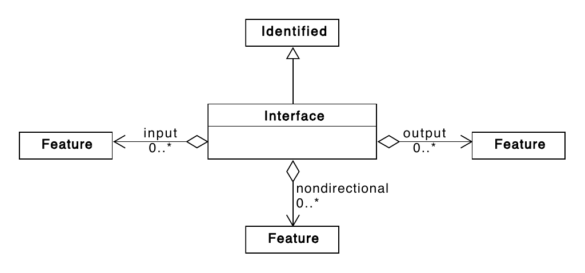

***Figure 14:*** *Diagram of the Interface class and its associated properties.*

##### The input property

An Interface MAY have any number of input properties, each of type IRI, that MUST reference a
Feature object in the same Component.

##### The output property

An Interface MAY have any number of output properties, each of type IRI, that MUST reference a
Feature object in the same Component.

##### The nondirectional property

An Interface MAY have any number of nondirectional properties, each of type IRI, that MUST reference
a Feature object in the same Component. Note that nondirectional can imply both bidirectional as
well as situations where there are no flows (for instance – a physical interface).

### 6.5. CombinatorialDerivation

The purpose of the CombinatorialDerivation class is to specify combinatorial biological designs
without having to specify every possible design variant. For example, a CombinatorialDerivation can
be used to specify a library of reporter gene variants that include different promoters and RBSs
without having to specify a Component for every possible combination of promoter, RBS, and CDS in
the library. Component objects that realize a CombinatorialDerivation can be derived in accordance
with the class properties template, hasVariableFeature, and strategy (see Figure 15).

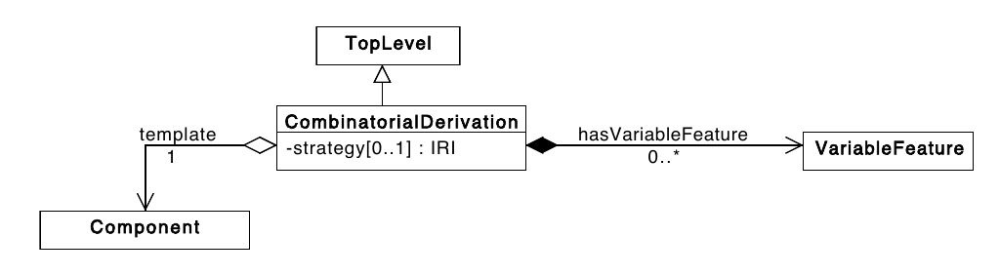

***Figure 15:*** *Diagram of the CombinatorialDerivation class and its associated properties.*

#### The template property

The template property is REQUIRED and MUST contain an IRI that refers to a Component. This Component
is expected to serve as a template for the derivation of new Component objects. Consequently, its
hasFeature properties SHOULD contain one or more Feature objects that will serve as the variables
whose values are set during derivation (referred to hereafter as template Feature objects). Its
other property values describe aspects of the template that will not change based on the values that
may be varied.

#### The hasVariableFeature property

Each VariableFeature child of a CombinatorialDerivation defines the set of possible values for one
of the variables in the template. A CombinatorialDerivation object can have zero or more
hasVariableFeature properties, each of type IRI, specifying a VariableFeature. The set of
hasVariableFeature properties MUST NOT contain two or more VariableFeature objects that refer to the
same template sbolFeature via their variable properties (i.e., do not define the same variable
twice).

The variable properties of VariableFeature objects determined which Feature objects in the template
are modified in a derived Component, and which ones will not be changed. In particular, we will
refer to a Feature in the template Component that is referred to by some variable property as a
variable Feature, and one that is not referred to by any as a static Feature.

#### The strategy property

The strategy property is OPTIONAL and has a data type of IRI. Table 13 provides a list of REQUIRED
strategy URLs. If the strategy property is not empty, then it MUST contain a URL from Table 13. This
property recommends how many Component objects SHOULD be derived from the template Component.

#### Executing a derivation

When a CombinatorialDerivation is evaluated to produce a set of derived Component objects, the
relationship between the two SHOULD be recorded by means of prov:wasDerivedFrom properties. In
particular:

| Strategy URL | Description |
| --- | --- |
| http://sbols.org/v3#enumerate | Derivation SHOULD produce all possible Component objects specified by the CombinatorialDerivation. |
| http://sbols.org/v3#sample | Derivation SHOULD produce a subset of possible Component objects specified by CombinatorialDerivation. The manner in which this subset is chosen is left unspecified. |

***Table 13:*** *REQUIRED URLs for the strategy property.*

- Any derived Component SHOULD have a prov:wasDerivedFrom property that refers to the
  CombinatorialDerivation.

- Any Feature in a derived Component SHOULD have a prov:wasDerivedFrom property that refers to its
  corresponding Feature in the template Component.

- Any Collection produced by the derivation process and containing only derived Component objects
  SHOULD also have a prov:wasDerivedFrom property that refers to the CombinatorialDerivation.

All derived objects MUST be consistent with the specification provided in the
CombinatorialDerivation. In particular:

- Every value of the type and role properties of the template Component SHOULD be contained in the
  values of the corresponding properties in each derived Component.

- Any static Feature in the template Component SHOULD correspond to a Feature with identical
  properties in each derived Component.

- Any variable Feature in the template Component SHOULD be replaced in each derived Component by a
  number of Feature objects constrained by the number specified by the cardinality property of the
  VariableFeature (see Table 14).

- Each property of a Feature object in the derived Component that replaces a variable Feature in the
  template Component MUST be derived from the values of the associated VariableFeature.

- All derived Feature object MUST follow the restriction properties of any Constraint objects that
  refer to their corresponding template Feature. This will typically be used to rule out illegal
  combinations of variable values.

- The role property of a derived Feature SHOULD contain the same values as the role property did in
  the template Feature.

- The type property of a derived Feature or its type-determining referent (instanceOf for
  SubComponent, or that determined for the Feature referred to by a ComponentReference) SHOULD
  contain the same values as the type property did in the template Feature or its type-determining
  referent.

#### 6.5.1. VariableFeature

As described above, the VariableFeature class specifies a variable and set of values that will
replace one of the Feature objects in the template of a CombinatorialDerivation. The variable is
specified by the variable property, and the set of values is defined by the union of Component
objects referred to by the variant, variantCollection, and variantDerivation properties.

Note that this union is intended to be a set and not a multi-set. For example, if the variant
property contains a Component A and the variantCollection property has a Collection containing both
Component A and Component B, then A SHOULD NOT be selected twice during enumeration, and it SHOULD
NOT be selected twice as much as B during sampling.

Given a set of values linked from a VariableFeature, it SHOULD be the case that all value are of
type om:Measure or else all values are of type Feature. At present, it is explicitly left undefined
how derivation of new components ought to handle mixtures of om:Measure and Feature values.

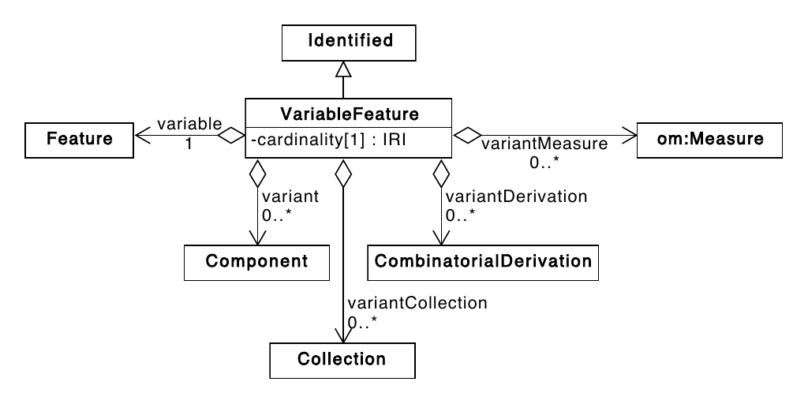

***Figure 16:*** *Diagram of the VariableFeature class and its associated properties.*

##### The variable property

The variable property is REQUIRED and MUST contain an IRI that refers to a template Feature in the
template Component referred to by this VariableFeature’s parent CombinatorialDerivation

##### The variantMeasure property

A VariableFeature object can have zero or more variantMeasure properties, each of type IRI,
specifying a om:Measure object. This property specifies numerical values that are options to be
applied to the variable Feature from the template when deriving a new Component. Note that because a
om:Measure is not a TopLevel, the vlaues of variantMeasure must be child objects of the
VariableFeature.

##### The variant property

A VariableFeature object can have zero or more variant properties, each of type IRI, specifying a
Component object. This property specifies individual Component objects to serve as options when
deriving a new Feature for the variable Feature from the template.

##### The variantCollection property

A VariableFeature object can have zero or more variantCollection properties, each of type IRI,
specifying a Collection object. Such a Collection MUST NOT contain any objects besides Component
objects or Collection objects that themselves contain only Component or Collection objects. This
property enables the specification of existing groups of Component objects to serve as options.

##### The variantDerivation property

A VariableFeature object can have zero or more variantDerivation properties, each of type IRI,
specifying a CombinatorialDerivation object. This property enables the specification of Component
objects derived in accordance with another CombinatorialDerivation to serve as options when deriving
a new Feature for the variable

Feature from the template. The variantDerivation properties of a VariableFeature MUST NOT refer to
the CombinatorialDerivation that contains this VariableFeature. Furthermore, such VariableFeature
objects MUST NOT form a cyclical chain of references via their variantDerivation properties and the
CombinatorialDerivation objects that contain them.

##### The cardinality property

The cardinality property is REQUIRED and has type of IRI. This property specifies how many Feature
objects SHOULD be derived from the template Feature during the derivation of a new Component. The
IRI value of this property MUST come from the URLs provided in Table 14.

| Cardinality URL | Description |
| --- | --- |
| http://sbols.org/v3#zeroOrOne | No more than one Feature in the derived Component SHOULD have a prov:wasDerivedFrom property that refers to the template Feature. |
| http://sbols.org/v3#one | Exactly one Feature in the derived Component SHOULD have a prov:wasDerivedFrom property that refers to the template Feature. |
| http://sbols.org/v3#zeroOrMore | Any number of Feature objects in the derived Component MAY have prov:wasDerivedFrom properties that refer to the template Feature. |
| http://sbols.org/v3#oneOrMore | At least one Feature in the derived Component SHOULD have a prov:wasDerivedFrom property that refers to the template Feature. |

***Table 14:*** *REQUIRED URLs for the cardinality property.*

### 6.6. Implementation

An Implementation represents a realized instance of a Component, such a sample of DNA resulting from
fabricating a genetic design or an aliquot of a specified reagent. Importantly, an Implementation
can be associated with a laboratory sample that was already built, or that is planned to be built in
the future. An Implementation can also represent virtual and simulated instances. An Implementation
may be linked back to its original design using the prov:wasDerivedFrom property inherited from the
Identified superclass. An Implementation may also link to a Component that specifies its realized
structure and/or function.

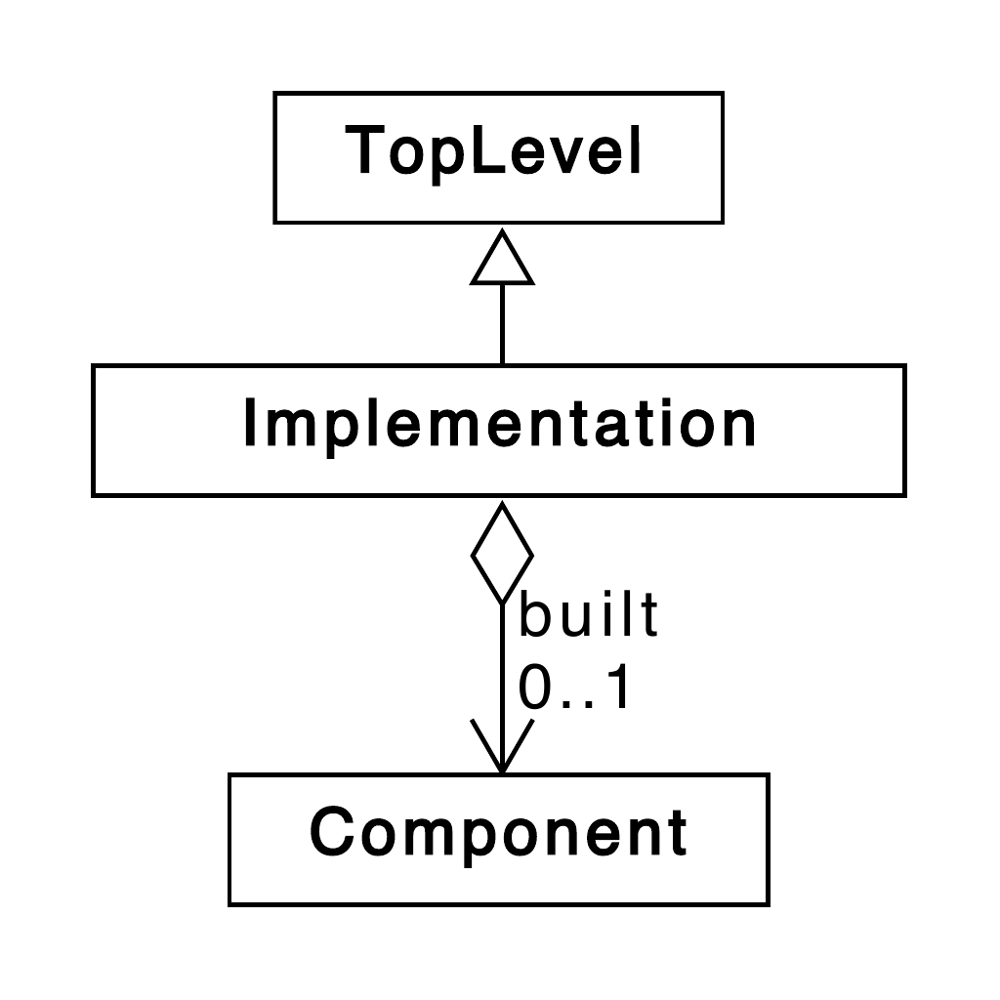

***Figure 17:*** *Diagram of the Implementation class and its associated properties.*

#### The built property

The built property is OPTIONAL and MAY contain an IRI that MUST refer to a Component. This Component
is intended to describe the actual physical structure and/or functional behavior of the
Implementation. When the built property refers to a Component that is also linked to the
Implementation via PROV-O properties such as prov:wasDerivedFrom (see
[Section A.1](#a1-adding-provenance-with-prov-o)), it can be inferred that the actual structure
and/or function of the Implementation matches its original design. When the built property refers to
a different Component, it can be inferred that the Implementation has deviated from the original
design. For example, the latter could be used to document when the DNA sequencing results
for an assembled construct do not match the original target sequence.

### 6.7. ExperimentalData

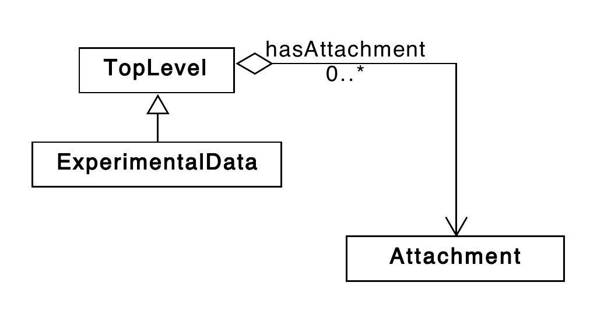

***Figure 18:*** *Diagram of the ExperimentalData class and its associated properties.*

The purpose of the ExperimentalData class is to aggregate links to experimental data files. An
ExperimentalData is typically associated with a single sample, lab instrument, or experimental
condition and can be used to describe the output of the test phase of a design-build-test-learn
workflow. For an example of the latter, see Figure 28.

As shown in Figure 18, the ExperimentalData class aggregates links to experimental data files using
the OPTIONAL hasAttachment property that it inherits from the TopLevel class.

### 6.8. Model

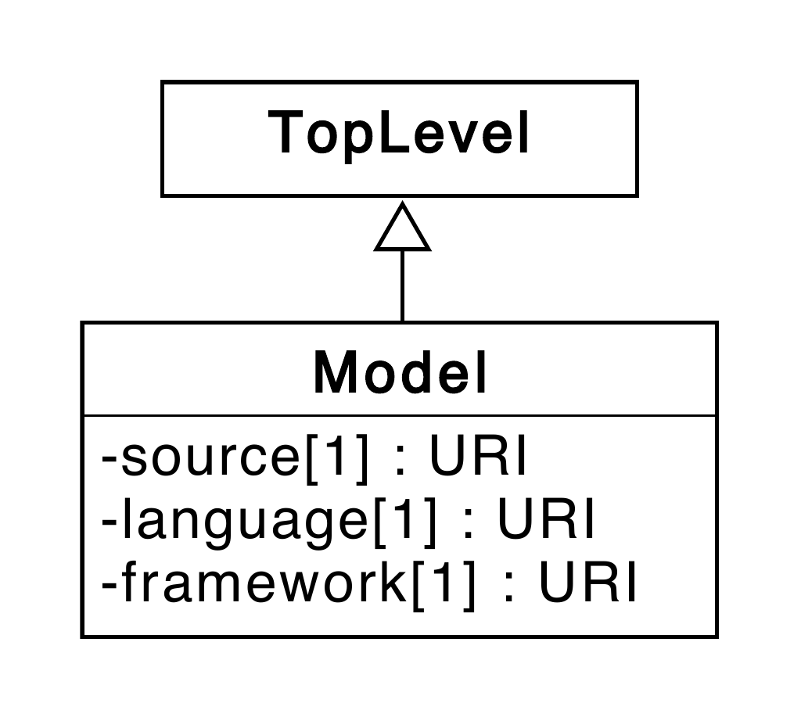

***Figure 19:*** *Diagram of the Model class and its associated properties.*

The purpose of the Model class is to serve as a placeholder for an external computational model and
provide additional meta-data to enable better reasoning about the contents of this model. In this
way, there is minimal duplication of standardization efforts and users of SBOL can elaborate
descriptions of Component function in the language of their choice.

The meta-data provided by the Model class include the following properties: the source or location
of the actual content of the model, the language in which the model is implemented, and the model’s
framework.

#### The source property

The source property is REQUIRED and MUST contain an IRI reference to the source file for a model.

#### The language property

The language property is REQUIRED and MUST contain an IRI that specifies the language in which the
model is implemented. It is RECOMMENDED that this IRI refer to a term from the EMBRACE Data and
Methods (EDAM) ontology. Table 15 provides a list of a few suggested languages from this ontology
and their IRIs. If the language property of a Model is well-described by one these terms, then it
MUST contain the IRI for this term as its value.

| Model Language | URL for EDAM Term |
| --- | --- |
| SBML | http://identifiers.org/EDAM:format_2585 |
| CellML | http://identifiers.org/EDAM:format_3240 |
| BioPAX | http://identifiers.org/EDAM:format_3156 |

***Table 15:*** *Terms from the EDAM ontology to specify the language property of a Model.*

#### The framework property

The framework property is REQUIRED and MUST contain an IRI that specifies the framework in which the
model is implemented. It is RECOMMENDED this IRI refer to a term from the modeling framework branch
of the SBO when possible. A few suggested modeling frameworks and their corresponding IRIs are shown
in Table 16. If the framework property of a Model is well-described by one these terms, then it MUST
contain the IRI for this term as its value.

| Framework | URL for SBO Term |
| --- | --- |
| Continuous | http://identifiers.org/SBO:0000062 |
| Discrete | http://identifiers.org/SBO:0000063 |

***Table 16:*** *SBO terms to specify the framework property of a Model.*

### 6.9. Collection

The Collection class is a class that groups together a set of TopLevel objects that have something
in common. Some examples of Collection objects:

- Results of a query to find all Component objects in a repository that function as promoters.
- A set of Component objects representing a library of genetic logic gates.
- A “parts list” for Component with a complex design, containing both that component and all of the
  Component, Sequence, and Model objects used to provide its full specification.

#### The member property

A Collection object can have zero or more member properties, each of type IRI specifying a TopLevel
object.

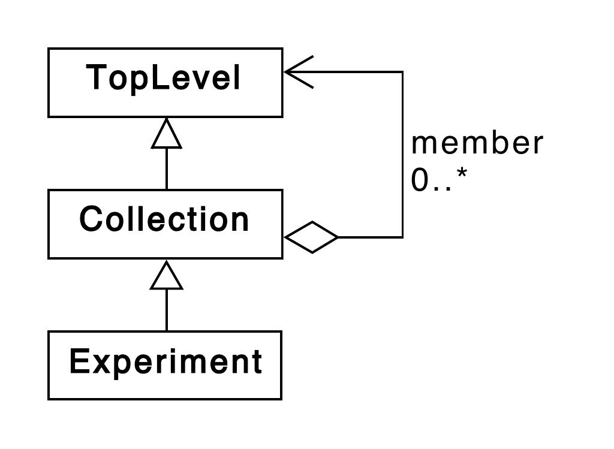

***Figure 20:*** *Diagram of the Collection class and its associated properties.*

#### 6.9.1. Experiment

The purpose of the Experiment class is to aggregate ExperimentalData objects for subsequent
analysis, usually in accordance with an experimental design. Namely, the member properties of an
Experiment MUST refer to ExperimentalData objects.

### 6.10. Attachment

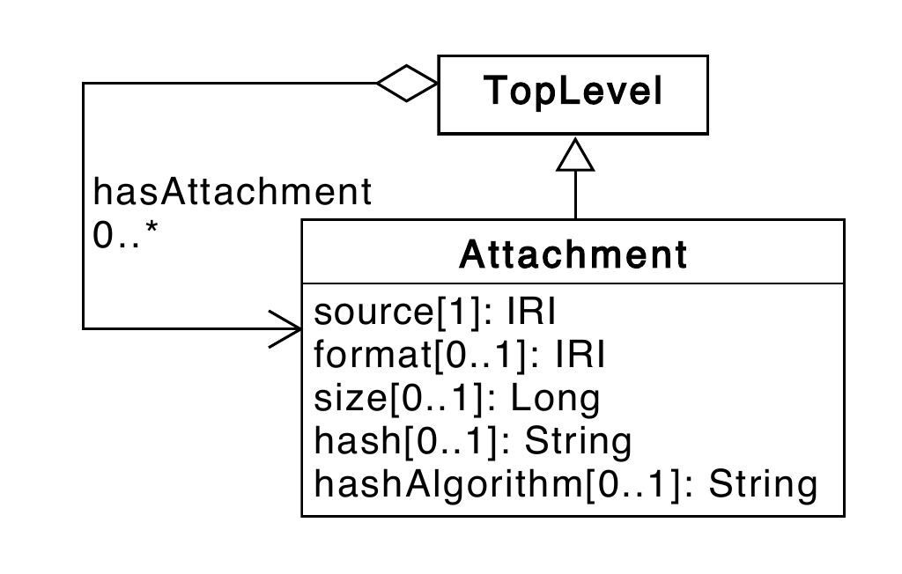

***Figure 21:*** *Diagram of the Attachment class and its associated properties.*

The purpose of the Attachment class is to serve as a general container for data files, especially
experimental data files. It provides a means for linking files and metadata to SBOL designs.

The meta-data provided by the Attachment class include the following properties: the source or
location of the actual file of the attachment, the format of the file, the size of the file, and the
hash for the file.

#### The source property

The source property is REQUIRED and MUST contain an IRI reference to the source file.

#### The format property

The format property is OPTIONAL and MAY contain an IRI that specifies the format of the attached
file. It is RECOMMENDED that this IRI refer to a term from the EMBRACE Data and Methods (EDAM)
ontology.

#### The size property

The size property is OPTIONAL and MAY contain a long indicating the file size in bytes.

#### The hash property

The hash property is OPTIONAL and MAY contain a hash value for the file contents represented as a
hexadecimal digest.

#### The hashAlgorithm property

The hashAlgorithm property is OPTIONAL and MAY contain the name of the hash algorithm used to
generate the value of the hash property. The value of this property SHOULD be a hash name string
from the IANA Named Information Hash Algorithm Registry, of which sha3-256 is currently RECOMMENDED.
If the hash property is set, then hashAlgorithm MUST be set as well.

### 6.11. Annotation and Extension of SBOL

SBOL intentionally does not attempt to describe how all types of biological design data should be
captured, since many of these data types (e.g., biological context and design performance metrics)
are already covered by other standards, or lack a clear consensus on their proper representation, or
are outside of the scope of SBOL.

SBOL is built upon the Resource Description Framework (RDF), and therefore can be used in
conjunction with complementary standards as described in [Section A](#a-complementary-standards).
For example, use of the PROV-O ontology is recommended to capture provenance (see
[Section A.1](#a1-adding-provenance-with-prov-o)). Additionally, user-defined RDF can be used in
conjunction with SBOL objects to capture custom application-specific information that does not yet
have a standardized representation. This annotation and extension mechanism is designed
to enable new types of data to be easily incorporated into the SBOL standard once there is community
consensus on their proper representation.

Several methods are supported for connecting the SBOL data model with other types of
application-specific data:

- Custom data can be added to an SBOL object by annotating that object with non-conflicting
  properties. These properties could contain literal data types such as Strings or IRIs that require
  a resolution mechanism to obtain external data. An example is annotating a Component with a
  property that contains a String description and IRI for the parts registry from which its source
  data was originally imported.

- SBOL object classes can be extended to custom classes that add additional information. This works
  just like adding custom data via non-conflicting properties, except that the object receives both
  an rdf:type for the SBOL class that has been extended and also an rdf:type specifying the
  extension class.

- Custom data in the form of independent objects can participate in the SBOL data model if they are
  assigned one of the SBOL types Identified or TopLevel. An example is an RDF object that is
  annotated such that it represents a data sheet that describes the performance of a Component in a
  particular context.

- Finally, just as custom objects can be embedded in an SBOL document, external documents can embed
  or refer to SBOL objects. Support for this last case is not explicitly provided in this
  specification. Rather, this case depends on the external non-SBOL system managing its relationship
  to SBOL and data serialized in RDF, and is included here for completeness.

Each Identified object MAY be annotated with application-specific properties, which MUST be labelled
using RDF predicates outside of the SBOL namespace. Additionally, application-specific types may be
used in conjunction with the SBOL data model. These application-specific types MUST have at least
two rdf:type properties: one type outside of the SBOL namespace AND an additional SBOL type of
either:

- TopLevel, if the object is to be considered an SBOL top level (i.e., not owned by another object)
- Identified, if the object is not to be considered an SBOL top level (i.e., is owned by another
  object)

- The most specific applicable SBOL type, if the object is an instance of a custom class extending
  an SBOL class.

As with SBOL Identified objects, custom Identified objects (and thus also all other custom objects)
MAY also include the properties displayId, name, description, etc.

## 7. Recommended Best Practices

### 7.1. SBOL Versions

To differentiate between major versions of SBOL, different namespaces are used. For example, SBOL3
has the namespace `http://sbols.org/v3#`, while SBOL2 has the namespace `http://sbols.org/v2#`. These
different versions of SBOL SHOULD NOT be semantically mixed. For example, an SBOL 3.x SubComponent
SHOULD NOT refer to an SBOL 2.x ComponentInstance, and, likewise, an SBOL 2.x ComponentInstance
SHOULD NOT refer to an SBOL 1.x DnaComponent.

### 7.2. Compliant SBOL Objects

Maintaining unique IRIs for all SBOL objects can be challenging. To reduce this burden, users of
SBOL 3.x are encouraged to follow a few simple rules when constructing URLs and related properties
for SBOL objects. When these rules are followed in constructing an SBOL object, we say
that this object is compliant. These rules are as follows:

Compliant URLs for TopLevel objects MUST conform to the following pattern:

`〈namespace〉/〈collection_structure〉/〈displayId〉`

The 〈namespace〉 token MAY further decompose into 〈domain〉/〈root〉 tokens. The 〈root〉 and
〈collection_structure〉 tokens may optionally be omitted; alternatively, they may consist of an
arbitrary number of delimiter-separated layers. Note that this pattern means that SBOL-compliant
URLs can be automatically decomposed with the aid of a TopLevel object’s hasNamespace property.
SBOL-compliant objects can be easily remapped into new namespaces by changing only the 〈namespace〉.

Consider, for example, the SBOL-compliant URL:

`https://synbiohub.org/igem/2017_distribution/promoters/constitutive/BBa_J23101`

for a Component with a hasNamespace value `https://synbiohub.org/igem/2017_distribution`. This URL
can be decomposed as follows:

| Token | Value |
| --- | --- |
| namespace | `https://synbiohub.org/igem/2017_distribution` |
| domain | `https://synbiohub.org` |
| root | `igem/2017_distribution` |
| collection | `promoters/constitutive` |
| displayId | `BBa_J23101` |

SBOL-compliant URLs also facilitate auto-construction of child objects with unique URLs. Child
objects of TopLevel objects with compliant URLs MUST conform to the following pattern:
“〈parent_url〉/〈child_type〉〈child_type_counter〉” where the 〈parent_url〉 refers to the URL of the
parent object, the 〈child_type〉 refers to the SBOL class of the child object, and
〈child_type_counter〉 is a unique index for the child object. The 〈child_type_counter〉 of a new
object SHOULD be calculated at time of object creation as 1 + the maximum 〈child_type_counter〉 for
each 〈child_type〉 object in the parent (e.g., “〈parent_url〉/SequenceAnnotation37”). Note that
numbering is independent for each type, so a Component can have children “SubComponent37” and
“Constraint37”.

All examples in this specification use compliant URLs.

### 7.3. Versioning SBOL Objects

SBOL 3.x does not specify an explicit versioning scheme. Rather it is left for experimentation
across different tools. This allows version information to be included in the root (e.g., GitHub
style: “igem/HEAD/”), collection structure (e.g., “promoters/constitutive/2/”), in tool-specific
conventions on displayId (e.g., “BBa_J23101_v2”) or in information outside of the IRI (e.g., by
attaching prov:wasRevisionOf properties).

### 7.4. Annotations: Embedded Objects vs. External References

When annotating an SBOL document with additional information, there are two general methods that can
be used:

- Embed the information in the SBOL document using properties outside of the SBOL namespace.
- Store the information separately and annotate the SBOL document with IRIs that point to it.

In theory, either method can be used in any case. (Note that a third case not discussed here is to
annotate external objects with links to SBOL documents, rather than annotating SBOL documents with
links to external objects.)

In practice, embedding large amounts of non-SBOL data into SBOL documents is likely to cause
problems for people and software tools trying to manage and exchange such documents. Therefore, it
is RECOMMENDED that small amounts of information (e.g., design notes or preferred graphical layout)
be embedded in the SBOL model, while large amounts of information (e.g., the contents of the
scientific publication from which a model was derived or flow cytometry data that characterizes
performance) be linked with IRIs pointing to external resources. The boundary between “small” and
“large” is left deliberately vague, recognizing that it will likely depend on the particulars of a
given SBOL application.

### 7.5. Completeness and Validation

RDF documents containing serialized SBOL objects might or might not be entirely self-contained. A
SBOL document is self-contained or “complete” if every SBOL object referred to in the document is
contained in the document. It is RECOMMENDED that serializations be complete whenever practical. In
order words, when serializing an SBOL object, serialize all of the other objects that it points to,
then serialize all of the other objects that these objects point to, etc., until the document is
complete.

It is important to note that there is no guarantee that an RDF document contains valid SBOL. When
SBOL objects are read from an RDF document, the program doing so SHOULD verify that all of the
property values encoded therein have the correct data type (e.g., that the object pointed to by the
Sequence property of a Component is really a Sequence). For complete files, this validation can be
carried out entirely locally. For files that are not complete, an implementation either needs to
have a means of validating those external references (e.g., by retrieving them from a repository),
or it needs to mark them as unverified and not depend on their correctness.

### 7.6. Recommended Ontologies for External Terms

External ontologies and controlled vocabularies are an integral part of SBOL. SBOL uses IRIs
(typically URLs) to access existing biological information through these resources. New SBOL-specific terms are defined
only when necessary. For example, Component types, such as DNA or protein, are described using
Systems Biology Ontology (SBO) terms. Similarly, the roles of a DNA or RNA Component are described
via Sequence Ontology (SO) terms. Although RECOMMENDED ontologies have been indicated in relevant
sections where possible, other resources providing similar terms can also be used. A summary of
these external sources can be found in Table 17.

The IRIs for ontological terms SHOULD be URLs from identifiers.org. However, it is acceptable to use
terms from purl.org as an alternative, for example when RDF tooling requires URLs to be represented
as compliant QNames. SBOL software may convert between these forms as required.

| SBOL Entity | Property | Preferred External Resource | More Information |
| --- | --- | --- | --- |
| Component | type | SBO (physical entity branch) | http://www.ebi.ac.uk/sbo/main/ |
| Component | type | SO (nucleic acid topology) | http://www.sequenceontology.org |
| Component | role | SO (DNA or RNA) | http://www.sequenceontology.org |
| Component | role | CHEBI (small molecule) | https://www.ebi.ac.uk/chebi/ |
| Component | role | PubChem (small molecule) | https://pubchem.ncbi.nlm.nih.gov/ |
| Component | role | UniProt (protein) | https://www.uniprot.org/ |
| Component | role | NCIT (samples) | https://ncithesaurus.nci.nih.gov/ |
| Interaction | type | SBO (occurring entity branch) | http://www.ebi.ac.uk/sbo/main/ |
| Participation | role | SBO (participant roles branch) | http://www.ebi.ac.uk/sbo/main/ |
| Model | language | EDAM | http://bioportal.bioontology.org/ontologies/EDAM |
| Model | framework | SBO (modeling framework branch) | http://www.ebi.ac.uk/sbo/main/ |
| om:Measure | type | SBO (systems description parameters) | http://www.ebi.ac.uk/sbo/main/ |

***Table 17:*** *Preferred external resources from which to draw values for various SBOL properties.*

### 7.7. Annotating Entities with Date & Time

Entities in an SBOL document can be annotated with creation and modification dates. It is
RECOMMENDED that predicates, or properties, from DCMI Metadata Terms SHOULD be used to include date
and time information. The created and modified terms SHOULD respectively be used to annotate SBOL
entities with creation and modification dates. Date and time values SHOULD be expressed using the
XML Schema DateTime datatype (Biron et al., 2004). For example, “2016-03-16T20:12:00Z” specifies
that the day is 16 March 2016 and the time is 20:12pm in UTC (Coordinated Universal Time).

### 7.8. Annotating Entities with Authorship information

Authorship information should ideally be added to TopLevel entities where possible. It is
RECOMMENDED that the creator DCMI Metadata term SHOULD be used to annotate SBOL entities with
authorship information using free text. This property can be repeated for each author.

### 7.9. Host Context / Ontologies for Experiments

#### 7.9.1. Mixtures via Components

Any Component can be interpreted as specifying a mixture of the material entity (SBO:0000240)
Features that it includes. The amount of each such instance included in the mixture SHOULD be
specified by attaching a om:Measure with a type set to the appropriate SBO term. The SBO terms that
are RECOMMENDED as appropriate are members of the Systems Description Parameter (SBO:0000545) branch
of SBO. Examples include:

- SBO:0000540: fraction of an entity pool (e.g., 1/3 CHO cells, 2/3 HEK cells)
- SBO:0000472: molar concentration of an entity (e.g., 1 mM arabinose)
- SBO:0000361: amount of an entity pool (e.g., 200 uL M9 media)

Mixtures MAY be defined recursively, as mixtures of mixtures of mixtures, etc.

#### 7.9.2. Media, Inducers, and Other Reagents

Each reagent, whether “atomic” (e.g., rainbow bead control) or mixture (e.g., M9 media), SHOULD be
represented as a Component and/or as a Feature of a Component in which the reagent is used. For
example, a custom media mixture might be defined as a Component and used as a SubComponent, while a
commercially supplied reagent might be used as an ExternallyDefined feature linking to its PubChem
identifiers.

The roles of reagents may vary in context: for example, arabinose may serve as an inducer or as a
media carbon source. As such, contextual role SHOULD be indicated by an NCI Thesaurus (NCIT) term in
a role property of the Feature. Examples include:

- NCIT:C64356: Positive Control
- NCIT:C12508: Cell
- NCIT:C85504: Growth Medium
- NCIT:C14419: Organism Strain
- NCIT:C120268: Inducer

For more information on representing cells, strains, plasmids, and genomes, see
[Section 7.10.1](#7101-representing-cell-types)

#### 7.9.3. Samples

A complete specification of a sample SHOULD be a Component that includes at least:

- A Feature instantiating each strain in the sample
- A Feature for the media or buffer
- A Feature for each additional reagent added to the media (e.g., inducers, antibiotics)
- om:Measures on each of these specifying the amount in the sample
- om:Measures on the Component for each environmental parameter (e.g., temperature, pH, culturing
  time)

#### 7.9.4. Other Experimental Parameters

In order to deal with parameters associated with the context in general but not specific instances,
e.g., temperature, pH, total sample volume, the hasMeasure property of Identified can be used. The
hasMeasure of a Component provides context-free information (e.g., the pH of M9 media, the
GC-content of a GFP coding sequence), while the hasMeasure of a material entity (SBO:0000240)
Feature provides a measurement in context (e.g., the dosage of arabinose in a sample).

Values of these parameters SHOULD be specified by attaching a om:Measure with a type set to the
appropriate SBO term. The SBO terms that are RECOMMENDED as appropriate are members of the Systems
Description Parameter (SBO:0000545) branch of SBO. Examples include:

- SBO:0000147: thermodynamic temperature (e.g., culturing at 27 C)
- SBO:0000332: half-life of an exponential decay (e.g., decay rate of a gRNA)
- SBO:0000304: pH (e.g., pH of M9 media)

### 7.10. Multicellular System Designs

SBOL has been used extensively to represent designs in homogeneous systems, where the same design is
implemented in every cell. However, in recent years there has been increasing interest in
multicellular systems, where biological designs are split across multiple cells to optimize the
system behavior and function. Therefore, there is a need to define a set of best practices so that
multicellular systems can be captured using SBOL in a standard way.

#### 7.10.1. Representing Cell Types

To represent multicellular systems using SBOL, it is first necessary to represent cells. When doing
so, it is important to be able to capture the following information: (i) taxonomy of the strain
used, (ii) interactions occurring within cells of this type, and (iii) components inside the type of
cell (e.g. genomes, plasmids). The approach RECOMMENDED in this section is capable of capturing this
information, as shown in the example in Figure 22. It uses a Component to represent a system that
contains cells of the given type. The cells themselves are represented by a Feature inside the
Component, in this case a SubComponent that is an instanceOf a Component capturing information about
the species and strain of the cell in the design. This Component has a type of “cell” from the Cell
Ontology (CL:0000000), and a role of “physical compartment” (SBO:0000290). Taxonomic information is
captured by annotating the class instance with an IRI for an entry in the NCBI Taxonomy Database.

As usual, other entities besides the cell that are relevant to the design are also captured as
Features. When these are contained within the cell, they are captured using a Constraint with
restriction contains with the cell as subject and contained object as object. Interactions which
occur in this system are captured using the Interaction and Participation classes. Interactions
which occur within the cell are specified by Interaction classes which contain the Feature instance
representing the cell as a participant with a role of “physical compartment” (SBO:0000290).

#### 7.10.2. Multiple Cell Types in a Single Design

The same approach can be extended to represent systems with multiple types of cells. The
multicellular system can be represented as a Component that includes each strain of cell as a
Feature, in this example a SubComponent that is an instanceOf a Component defining its strain.
Interactions and constraints, such as a molecule that both strains interact with, are implemented
using ComponentReferences to link to the definitions within each cell system description. An example
is shown in Figure 23.

#### 7.10.3. Cell Ratios

The proportion of cell types present in a multicellular system can be captured using om:Measure on
the representations of cells in the design. As a best practice, the value of these measure classes
is a percentage less than or equal to 100%, representing the amount of a cell type present in the
system compared to all other cell types present. Therefore, the sum of all these values specified in
the system will typically be equal to 100%, though this may not be the case if the system is not
completely defined. An example is shown in Figure 24.

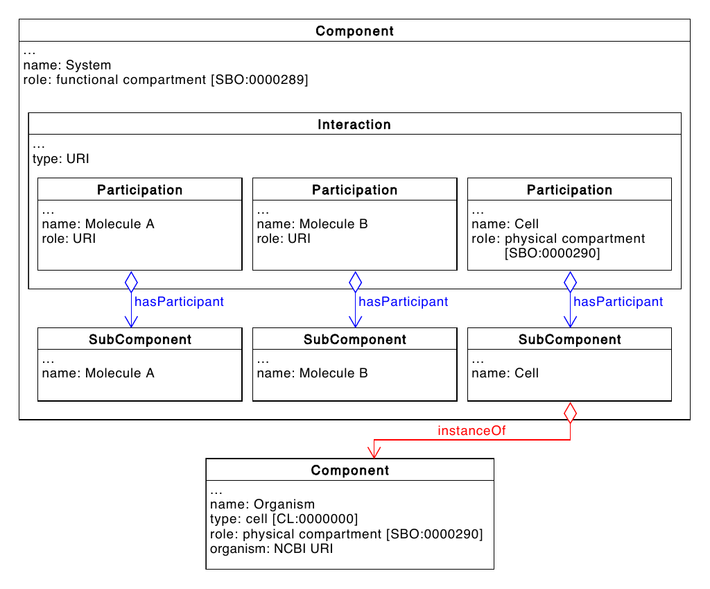

***Figure 22:*** *This is a proposed approach for capturing cell designs in SBOL. A Component annotated with an IRI pointing to an entry in the NCBI Taxonomy Database is used to capture information about the cell's strain/species. The Component has a type of “Cell” from the Gene Ontology (GO), and a role of “physical compartment”. Another Component is used to represent a system in which the cell is implemented. Entities, including the cell, are instantiated as Features, and processes are captured using the Interaction class. Processes that are contained within the cell are represented by including the cell as a participant with a role of “physical compartment”.*

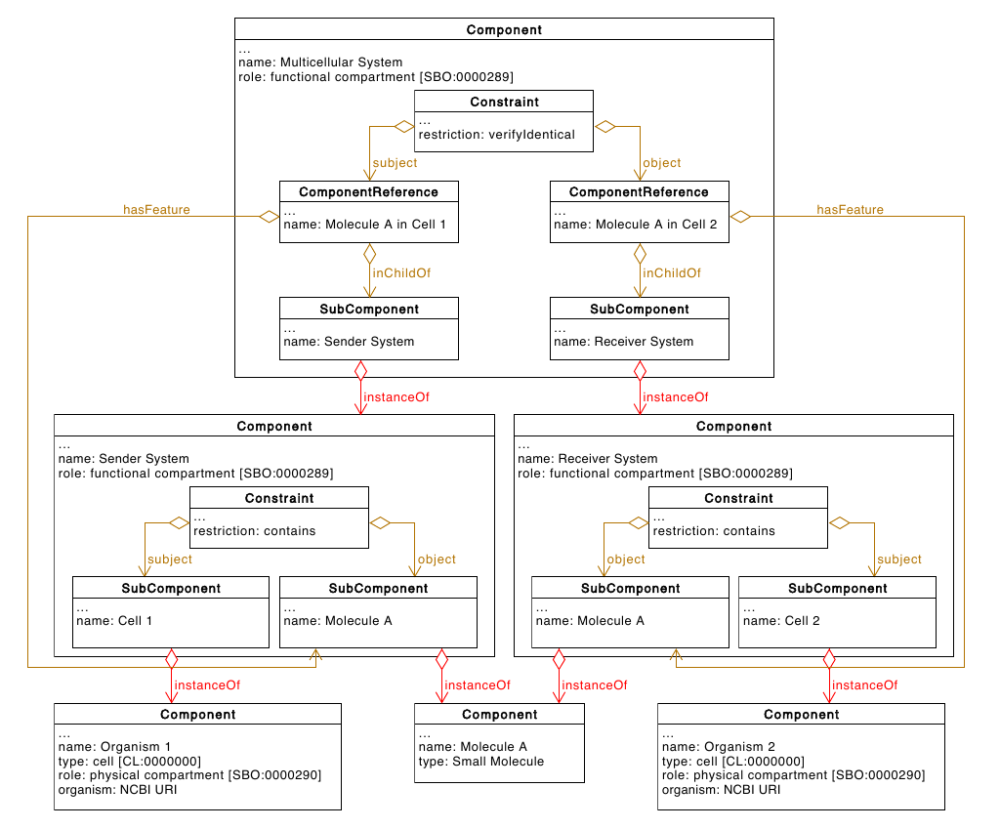

***Figure 23:*** *Captured here is a design involving two cells which both interact with the small molecule “Molecule A”. Designs for the sender and receiver systems are captured using constraint to show that each of these cells interacts with the Molecule A contained within it. The overall multicellular system is represented by a Component with a role of “functional compartment”, which is an SBO term. The two systems are included in this multicellular design as Features, and the fact that Molecule A is shared between systems is indicated with a constraint.*

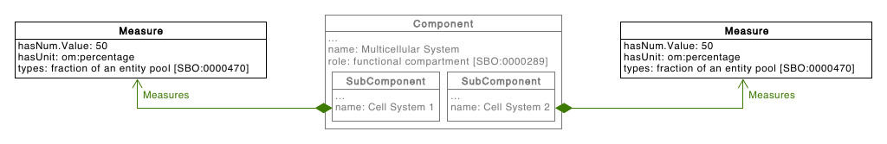

***Figure 24:*** *Annotating class instances with cellular proportions. Instances of the Measure class are used to capture the percentage of each cell type present in the multicellular system design.*

## 8. SBOL RDF Serialization

In order for SBOL objects to be readily stored and exchanged, it is important that they are able to
be serialized, i.e., converted to a sequence of bytes that can be stored in a file or exchanged over
a network. The serialization format for SBOL is designed to meet several competing requirements.
First, SBOL needs to support ad-hoc annotations and extensions. Second, SBOL needs to support
processing by general database and semantic web software tools that have little or no knowledge of
the SBOL data model. Finally, it ought to be relatively simple to write a new software
implementation, so that SBOL can be readily used even in software environments where
community-maintained implementations are not available.

To meet these goals, SBOL builds upon the Resource Description Framework (RDF). RDF is an abstract
language for describing conceptual graph-oriented data models, and therefore does not mandate any
specific serialization format. Instead, a number of different serialization formats are provided as
separate specifications, such as RDF/XML, N-Triples, JSON-LD, and Turtle. These serialization
formats are widely supported by RDF libraries such as rdflib for Python and Apache Jena for Java.
For example, a simple SBOL definition of pLac can be serialized in RDF/XML as follows:

```xml
<?xml version="1.0" encoding="utf-8"?>
<rdf:RDF xmlns:rdf="http://www.w3.org/1999/02/22-rdf-syntax-ns#" xmlns:sbol="http://sbols.org/v3#">
  <sbol:Component rdf:about="http://example.com#pLac">
    <sbol:name>pLac</sbol:name>
    <sbol:description>lactose inducible promoter</sbol:description>
    <sbol:sequence rdf:resource="http://example.com#sequence"/>
  </sbol:Component>
  <sbol:Sequence rdf:about="http://example.com#sequence">
    <sbol:encoding rdf:resource="http://sbols.org/v3#iupacNucleicAcid"/>
    <sbol:elements>caatacgcaaaccgcctctccccgcgc</sbol:elements>
  </sbol:Sequence>
</rdf:RDF>
```

Alternatively, the same example can be serialized in Turtle as follows:

```turtle
@prefix sbol: <http://sbols.org/v3#> .
@base <http://example.com#> .
@prefix : <http://example.com#> .

:pLac a sbol:Component ;
    sbol:name "pLac" ;
    sbol:description "lactose inducible promoter" ;
    sbol:sequence :sequence .

:sequence a sbol:Sequence ;
    sbol:encoding <http://sbols.org/v3#iupacNucleicAcid> ;
    sbol:elements "caatacgcaaaccgcctctccccgcgc" .
```

All SBOL libraries SHOULD support at least RDF/XML, N-Triples, JSON-LD, and Turtle. Other SBOL tools
SHOULD support at least one of these four formats.

## 9. SBOL Compliance

There are different types of software compliance with respect to the SBOL specification. First, a
software tool can either support all classes of the SBOL 3 data model or only its structural subset.
The structural subset includes the following classes:

- Sequence
- Component
  - SubComponent
  - ComponentReference
  - LocalSubComponent
  - SequenceFeature
  - Location
  - Constraint
- Collection

Second, an SBOL-compliant software tool can support import of SBOL, export of SBOL, or both. If it
supports both import and export, it can do so in either a lossy or lossless fashion.

In order to test import compliance, developers are encouraged to use the SBOL test files found here:
[SBOLTestSuite](https://github.com/SynBioDex/SBOLTestSuite)

Examples of every meaningful subset of objects are provided, including both structural-only SBOL
(that is, annotated DNA sequence data) and complete tests.

In order to test export compliance, developers are encouraged to validate SBOL files generated by
their software with the SBOL Validator found here:
[SBOL Validator](https://validator.sbolstandard.org)

This validator can also be used to check lossless import/export support, since it can compare the
data content of files imported and exported by a software tool.

Finally, developers of SBOL-compliant tools are encouraged to notify the SBOL editors
(sbol-editors@googlegroups.com) when they have determined that their tool is SBOL compliant, so
their tool can be publicly categorized as such on the SBOL website.

## 10. Mapping Between SBOL 1, SBOL 2, and SBOL3

In broad strokes, the SBOL 1 standard focused on conveying physical, structural information, whereas
SBOL 2 expanded the scope to include functional aspects as well. The physical information about a
designed genetic construct includes the order of its constituents and their descriptions. Specifying
the exact locations of these constituents and their sequences allows genetic constructs to be
defined unambiguously and reused in other designs. SBOL 2 extended SBOL 1 in several ways: it
extends physical descriptions to include entities beyond DNA sequences, and it added support for
functional descriptions of designs. SBOL 3 refines the SBOL 2 data model to simplify the
representation of common use cases.

### 10.1. Mapping between SBOL 1 and SBOL 2

Figure 25 depicts the mapping of SBOL 1.1 classes to SBOL 2.x classes, indicating corresponding
classes/properties by color. The SBOL 2.x Model and ModuleDefinition classes have no SBOL 1.1
equivalent, and thus are not shown. The mapping from SBOL 1.1 to SBOL 2.x proceeds as follows:

- SBOL 1.1 Collection objects containing DnaComponent objects map to SBOL 2.x Collection objects
  that contain ComponentDefinition objects with DNA type properties.

- SBOL 1.1 DnaComponent objects map to SBOL 2.x ComponentDefinition objects with DNA type
  properties.

- SBOL 1.1 DnaSequence objects map to an SBOL 2.x Sequence objects with IUPAC DNA encoding
  properties.

- SBOL 1.1 SequenceAnnotation objects with bioStart and bioEnd properties map to SBOL 2.x
  SequenceAnnotation objects that contain Range objects.

- SBOL 1.1 SequenceAnnotation objects that lack bioStart and bioEnd properties map to an SBOL 2.x
  SequenceFeature objects that contain GenericLocation objects.

- Each SBOL 1.1 SequenceAnnotation also maps to an SBOL 2.x Component, which represents the
  instantiation or usage of the appropriate ComponentDefinition.

- Each SBOL 1.1 precedes property maps to an SBOL 2.x SequenceConstraint that specifies a precedes
  restriction property.

### 10.2. Mapping between SBOL 2 and SBOL 3

The base classes of Identified and TopLevel vary in the following ways between SBOL 2.x and SBOL 3.x:

- SBOL 3.x uses IRIs while SBOL 2.x uses URIs, which are a strict subset of IRIs. In practice,
  however, many existing SBOL 2 tools actually provide support for IRIs and not just URIs.
  Accordingly, conversion from SBOL 3.x to SBOL 2.x SHOULD map all IRIs to URIs and conversion from
  SBOL 2.x to SBOL 3.x MAY convert escaped unicode characters into non-escaped characters in an IRI.

- The SBOL 2.x Identified property persistentIdentity maps to the SBOL 3.x identity property. The
  version property does not exist in SBOL 3.x, but SHOULD be retained through conversion to support
  conversion back to SBOL 2.x.

- When SBOL 3.x Identified object is converted to SBOL 2.x, if its identity is a URL, then the
  identity of the SBOL 2.x object SHOULD be constructed as `[SBOL3 identity]/[SBOL2 version]`. If the
  object does not have an SBOL2 version property, then its version SHOULD default to 1.

- The SBOL 3.x TopLevel property hasNamespace does not exist in SBOL 2, and cannot be inferred from
  an SBOL 2 URI. When converting from SBOL 3.x to SBOL 2.x, the hasNamespace property SHOULD be
  retained to support conversion back to SBOL 3.x.

Figure 26 depicts the mapping of SBOL 2.3 classes to SBOL 3.x classes, indicating corresponding
classes/properties by color. The SBOL 2.x Attachment, CombinatorialDerivation, ExperimentalData,
Experiment, Implementation, Model, Participation, Sequence, and VariableFeature classes are omitted
or abstracted, since they are essentially unchanged in SBOL 3.x except for the following minor
changes:

- In Sequence, the encoding property values map according to Table 18.
- The SBOL 2.x VariableComponent class has been renamed VariableFeature.
- In VariableComponent, the SBOL 2.x operator property maps to the SBOL 3.x cardinality property.
- In VariableComponent, the variantMeasure property has been added, which does not exist in SBOL
  2.x.

- In Experiment, the SBOL 2.x experimentalData property maps to the SBOL 3.x member property.

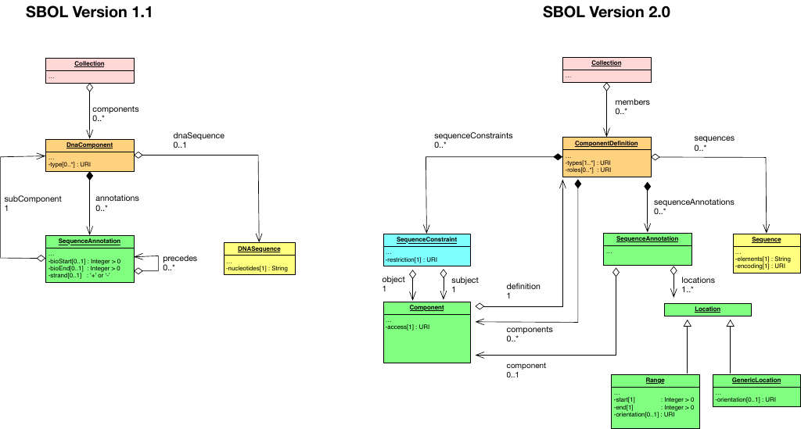

***Figure 25:*** *The mapping from the SBOL 1.1 data model to the SBOL 2.x data model, indicating corresponding classes/properties by color.*

- In Location, the SBOL 2.x sequence property maps to an SBOL 3.x hasSequence property. If there
  sequence property was not set, then the hasSequence property is set to one of the values of the
  sequences property of the ComponentDefinition that contained the SBOL 2.x Location. If there is
  more than one value for sequences, behavior is left deliberately unspecified, and is allowed to be
  considered an error condition.

The mapping from SBOL 2.x to SBOL 3.x proceeds as follows:

- SBOL 2.x ComponentDefinition objects map to SBOL 3.x Component objects. The type property is
  mapped according to Table 19.

- SBOL 2.x ModuleDefinition objects map to SBOL 3.x Component objects with a type of SBO:0000241
  (functional entity)

- Every FunctionalComponent in an SBOL 2.x ModuleDefinition with a "direction" property that is not
  "none" is listed in the Interface of its SBOL 3.x Component. The mapping from direction to
  interface properties is: "in"–>"inputs", "out"–>"outputs", "inout" –> "nondirectional". Finally,
  every Component with "access"="public" and "direction"="none" is listed as "nondirectional" in the
  Interface.

- Every Component in an SBOL 2.x ComponentDefinition with "access"="public" is listed as
  "nondirectional" in the Interface of its SBOL 3.x Component.

- SBOL 2.x Component, Module, and FunctionalComponent objects map to SBOL 3.x SubComponent objects
- SBOL 2.x SequenceAnnotation objects map to SBOL 3.x SequenceFeature objects if they do not have a
  component. If they do have a component, their locations are added to the corresponding SBOL3
  SubComponent.

- SBOL 2.x SequenceConstraint objects map to SBOL 3.x Constraint objects
- SBOL 2.x MapsTo objects are converted by transforming each MapsTo into two SBOL 3.x objects: a
  ComponentReference and a Constraint.

  - For the ComponentReference, the inChildOf attribute of this ComponentReference attribute
    references the object that has the MapsTo as a child, and the refersTo attribute references the
    object referred by the remote attribute from the MapsTo object.

  - The Constraint links this ComponentReference and the SubComponent referred to be the local
    attribute from the MapsTo object. The property values of the Constraint depend on the value of
    the refinement value for the MapsTo object:

    - If the refinement is useRemote, then the restriction is replaces, the subject is the
      ComponentReference and the object is the SubComponent.

    - If the refinement is useLocal, then the restriction is replaces, the subject is the
      SubComponent and the object is the ComponentReference.

    - If the refinement is verifyIdentical, then the restriction is verifyIdentical, the subject is
      the ComponentReference and the object is the SubComponent.

    - The merge refinement was never well defined and rarely if ever used, so it has been removed
      from SBOL 3.x. If a merge is encountered, it SHOULD be handled as a useRemote.

  - As an OPTIONAL optimization, if the SubComponent referred to by the local property of the MapsTo
    is a “placeholder” with no significant content apart from its MapsTo relationships, then it may
    be eliminated, all objects that pointed to it can point directly to the new ComponentReference
    instead, and all transitive constraints using it as a bridge reduced to link the endpoints
    directly.

| SBOL 2.x Type | SBOL 3.x Type |
| --- | --- |
| http://www.chem.qmul.ac.uk/iubmb/misc/naseq.html | https://identifiers.org/edam:format_1207 |
| http://www.chem.qmul.ac.uk/iupac/AminoAcid/ | https://identifiers.org/edam:format_1208 |
| http://www.opensmiles.org/opensmiles.html | https://identifiers.org/edam:format_1196 |

***Table 18:*** *Mapping of Sequence encoding values from SBOL2 to SBOL3*

| SBOL 2.x Type | SBOL 3.x Type |
| --- | --- |
| http://www.biopax.org/release/biopax-level3.owl#Dna | https://identifiers.org/SBO:0000251 (DNA) |
| http://www.biopax.org/release/biopax-level3.owl#DnaRegion | https://identifiers.org/SBO:0000251 (DNA) |
| http://www.biopax.org/release/biopax-level3.owl#Rna | https://identifiers.org/SBO:0000250 (RNA) |
| http://www.biopax.org/release/biopax-level3.owl#RnaRegion | https://identifiers.org/SBO:0000250 (RNA) |
| http://www.biopax.org/release/biopax-level3.owl#Protein | https://identifiers.org/SBO:0000252 (Protein) |
| http://www.biopax.org/release/biopax-level3.owl#SmallMolecule | https://identifiers.org/SBO:0000247 (Simple Chemical) |
| http://www.biopax.org/release/biopax-level3.owl#Complex | https://identifiers.org/SBO:0000253 (Non-covalent Complex) |

***Table 19:*** *Mapping of SBOL2 ComponentDefinition types to SBOL3 Component types*

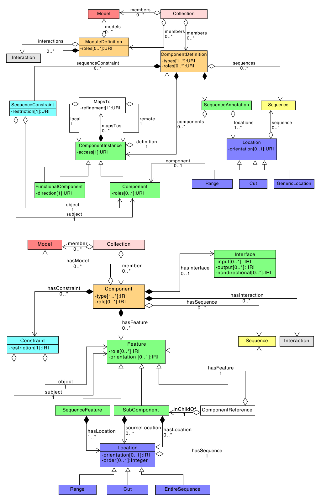

***Figure 26:*** *The mapping from the SBOL 2.3 data model to the SBOL 3.x data model, indicating corresponding classes/properties by color.*

## References

Biron, P. V., Permanente, K., and Malhotra, A. (2004). XML schema part 2: Datatypes second edition.

Courtot, M., Juty, N., Knüpfer, C., Waltemath, D., Zhukova, A., Dräger, A., Dumontier, M., Finney,
A., Golebiewski, M., Hastings, J., et al. (2011). Controlled vocabularies and semantics in systems
biology. Molecular systems biology, 7(1):543.

Cuellar, A. A., Lloyd, C. M., Nielsen, P. F., Bullivant, D. P., Nickerson, D. P., and Hunter, P. J.
(2003). An overview of CellML 1.1, a biological model description language. SIMULATION,
79(12):740–747.

DCMI Usage Board (2012). DCMI metadata terms. DCMI recommendation, Dublin Core Metadata Initiative.

Degtyarenko, K., de Matos, P., Ennis, M., Hastings, J., Zbinden, M., McNaught, A., Alcántara, R.,
Darsow, M., Guedj, M., and Ashburner, M. (2008). ChEBI: a database and ontology for chemical
entities of biological interest. Nucleic Acids Research, 36:D344–D350.

Galdzicki, M., Clancy, K. P., Oberortner, E., Pocock, M., Quinn, J. Y., Rodriguez, C. A., Roehner,
N., Wilson, M. L., Adam, L., Anderson, J. C., et al. (2014). The synthetic biology open language
(SBOL) provides a community standard for communicating designs in synthetic biology. Nature
Biotechnology, 32(6):545–550.

Hucka, M. (2017). SBMLPkgSpec: a LATEX style file for SBML package specification documents. BMC
Research Notes, 10(1):451.

Hucka, M., Finney, A., Sauro, H. M., Bolouri, H., Doyle, J. C., Kitano, H., Arkin, A. P., Bornstein,
B. J., Bray, D., Cornish- Bowden, A., Cuellar, A. A., Dronov, S., Gilles, E. D., Ginkel, M., Gor,
V., Goryanin, I. I., Hedley, W. J., Hodgman, T. C., Hofmeyr, J.-H., Hunter, P. J., Juty, N. S.,
Kasberger, J. L., Kremling, A., Kummer, U., Novere, N. L., Loew, L. M., Lucio, D., Mendes, P.,
Minch, E., Mjolsness, E. D., Nakayama, Y., Nelson, M. R., Nielsen, P. F., Sakurada, T., Schaff, J.
C., Shapiro, B. E., Shimizu, T. S., Spence, H. D., Stelling, J., Takahashi, K., Tomita, M., Wagner,
J., Wang, J., and the rest of the SBML Forum (2003). The systems biology markup language (SBML): a
medium for representation and exchange of biochemical network models. volume 19, pages 524–531.
Oxford University Press (OUP).

MathWorks (2015). MATLAB.

Norrander, J., Kempe, T., and Messing, J. (1983). Construction of improved M13 vectors using
oligodeoxynucleotidedirected mutagenesis. Gene, 26:101–106.

Peccoud, J., Anderson, J. C., Chandran, D., Densmore, D., Galdzicki, M., Lux, M. W., Rodriguez, C.
A., Stan, G.-B., and Sauro, H. M. (2011). Essential information for synthetic DNA sequences. Nature
Biotechnology, 29(1):22–22.

Roehner, N., Oberortner, E., Pocock, M., Beal, J., Clancy, K., Madsen, C., Misirli, G., Wipat, A.,
Sauro, H., and Myers, C. J. (2015). Proposed data model for the next version of the synthetic
biology open language. ACS Synthetic Biology, 4(1):57–71.

## A. Complementary Standards

Here we discuss two complementary standards that have been adapted for use as part of SBOL
representation, following the pattern for extension of SBOL described in
[Section 6.11](#611-annotation-and-extension-of-sbol). In both cases, the extension uses the pattern
in which object from another ontology are also assigned to either the SBOL Identified or TopLevel
types. Note that this means that the object receives both an rdf:type for the SBOL class and also an
rdf:type in their own namespace.

### A.1. Adding Provenance with PROV-O

The PROV-O ontology (`https://www.w3.org/ns/prov#`) defines a complementary data model that is
leveraged by SBOL to describe provenance. Provenance is central to a range of workflow management,
quality control, and attribution tasks within the Synthetic Biology design process. Tracking
attribution and derivation of one resource from another is paramount for managing intellectual
property purposes. Source designs are often modified in systematic ways to generate derived designs,
for example, by applying codon optimization or systematically removing all of a class of restriction
enzyme sites. Documenting the transformation used, and any associated parameters, makes this
explicit and potentially allows the process to be reproduced systematically. If a design has been
used within other designs, and is later found to be defective, it is paramount that all uses of it,
including uses of edited versions of the design, can be identified, and ideally replaced with a
non-defective alternative. When importing data from external sources, it is important not only to
attribute the original source (for example, GenBank), but also the tool used to perform the import,
as this may have made arbitrary choices as to how to represent the source knowledge as SBOL. All
these activities have in common that it is necessary to track what resource, and what transformation
process was applied by whom to derive an SBOL design.

This section describes a minimal subset of PROV-O terms and classes that may be used by SBOL tools
to support representation of provenance[^prov-o-note], and how it has been adapted for use with SBOL
by assigning PROV-O classes to SBOL Identified or TopLevel types per
[Section 6.11](#611-annotation-and-extension-of-sbol). Although the full-set of PROV-O terms can be
used in SBOL documents, a subset of PROV-O is adopted as a best practice. It is advised that SBOL
tools should at least understand this subset, defined in Figure 27. Providers of provenance
information are free to make use of more of PROV-O than is described here. It is
acceptable for tools that understand more than this subset to use as much as they are able. Tools
that only understand this subset must treat any additional data as annotations. Tools that are not
aware of SBOL provenance at all MUST maintain and provide access to this information as annotations.
This specification does not state what the newly added properties must point to. As long as they are
resources that are consistent with the PROV-O property domains, they are legal. For example, a
Component may be derived from another Component, but it would probably not make sense for it to be
derived from a Collection.

The most basic and general type of provenance relationship can be represented using the
prov:wasDerivedFrom property. This relationship describes derivation of an SBOL entity from another.
Any Identified object may be annotated with this property. More specific provenance relationships
can also be defined using PROV-O, such as prov:wasGeneratedBy. Generation of a new object is defined
by the W3C PROV-O specification as follows:

...the completion of production of a new entity by an activity. This entity did not exist before
generation and becomes available for usage after this generation.

These relationships are leveraged in SBOL tooling for describing multi-stage synthetic biology
workflows.

Synthetic biology workflows may involve multiple stages, multiple users, multiple organizations, and
interdisciplinary collaborations. These workflows can be described using four core PROV-O classes:
prov:Entity, prov:Activity, prov:Agent, and prov:Plan. Any SBOL Identified object can implicitly act
as an instance of PROV-O’s prov:Entity class. Workflow histories (retrospective provenance) and
workflow specifications (prospective provenance) can be described in SBOL using prov:Activity
objects to link Identified objects into workflows. An prov:Agent (for example a software or a
person) runs an prov:Activity according to a prov:Plan to generate new entities. Resources
representing prov:Agent, prov:Activity and prov:Plan classes should be handled as TopLevel, whilst
prov:Usage and prov:Association resources should be treated as child Identified objects within
their parent prov:Activity objects.

A design-build-test-learn SBOL ontology has been adopted for use with PROV-O classes (see Table 20).
The terms design, build, test, and learn provide a high level workflow abstraction that allows
tool-builders to quickly search for and isolate provenance histories relevant to their domain, while
keeping track of the flow of data between different users working in different domains of synthetic
biology. These terms SHOULD BE used on the type property of the prov:Activity class. (Note that this
property is a special property added by the SBOL specification, and is not part of the original
PROV-O specification.) Additionally, these terms SHOULD BE used in the prov:hadRole properties on
prov:Usage to qualify how the referenced prov:entity is used by the parent prov:Activity.

| Activity Type | URL | Description |
| --- | --- | --- |
| Design | http://sbols.org/v3#design | Design describes the process by which a conceptual representation of an engineer’s imagined and intended design for a biological system is created or derived. |
| Build | http://sbols.org/v3#build | Build describes the process by which a biological construct, sample, or clone is implemented in the laboratory. |
| Test | http://sbols.org/v3#test | Test describes the process of performing experimental measurements to characterize a synthetic biological construct. |
| Learn | http://sbols.org/v3#learn | Learn describes the process of analyzing experimental measurements to produce a new entity that represents biological knowledge. |

***Table 20:*** *Synthetic biology workflow ontology*

Logical constraints are placed on the order in which different types of prov:Activitys are chained
into design-build-test-learn workflows. These rules additionally place constraints on the types of
objects that may be used as inputs for a particular type of prov:Activity. For example, a design
prov:Usage may be used as an input for either a design or build prov:Activity but SHOULD NOT be used
as an input for a test prov:Activity. An example of how these terms are used is provided in Figure
28. The ordering of stages and constraints on referred object type are given in Table 21.

| Stage | Preceding Stage | Referred Object Type |
| --- | --- | --- |
| http://sbols.org/v3#design | http://sbols.org/v3#learn | TopLevel other than Implementation |
| http://sbols.org/v3#build | http://sbols.org/v3#design | Implementation |
| http://sbols.org/v3#test | http://sbols.org/v3#build | ExperimentalData |
| http://sbols.org/v3#learn | http://sbols.org/v3#test | Identified other than Implementation |

***Table 21:*** *Ordering of design-build-test-learn stages, and the types of objects RECOMMENDED to be associated with them.*

In addition to the design-build-test-learn terms, users may also wish to include more specific terms
to specify how SBOL objects are used in-house in their own recipes, protocols, or computational
analyses. In fact, it is expected that the SBOL workflow ontology will be expanded over time, as
users experiment with and develop their own custom ontologies. For now, however, it is RECOMMENDED
that SBOL tools also include the high-level terms in Table 20 to support data exchange across
interdisciplinary boundaries.

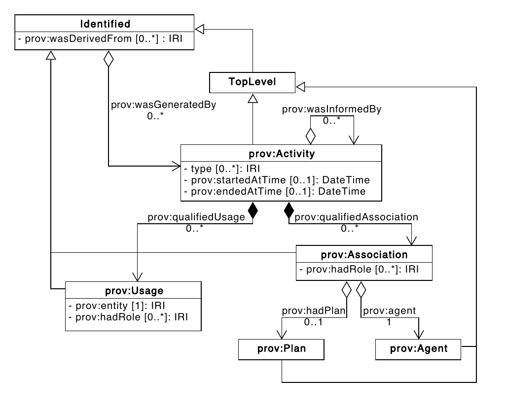

***Figure 27:*** *Relationships between SBOL and PROV-O classes. The PROV-O classes prov:Activity, prov:Plan, and prov:Agent all derive from TopLevel in the context of the SBOL data model.*

[^prov-o-note]: We thank Dr Paolo Missier from the School of Computing Science, Newcastle University
    for discussions regarding the use of PROV-O.

#### A.1.1. prov:Activity

A generated prov:Entity is linked through a prov:wasGeneratedBy relationship to an prov:Activity,
which is used to describe how different prov:Agents and other entities were used. An prov:Activity
is linked through a prov:qualifiedAssociation to prov:Associations, to describe the role of agents,
and is linked through prov:qualifiedUsage to prov:Usages to describe the role of other entities used
as part of the activity. Moreover, each prov:Activity includes optional prov:startedAtTime and
prov:endedAtTime properties. When using prov:Activity to capture how an entity was derived, it is
expected that any additional information needed will be attached as annotations. This may include
software settings or textual notes. Activities can also be linked together using the
prov:wasInformedBy relationship to provide dependency without explicitly specifying start and end
times.

##### The type property

An prov:Activity MAY have one or more type properties, each of type IRI that explicitly specifies
the type of the provenance prov:Activity in more detail. If specified, it is RECOMMENDED that at
least one type property refers to a URL from Table 20.

##### The prov:startedAtTime property

The prov:startedAtTime property is OPTIONAL and contains a DateTime (see
[Section 7.7](#77-annotating-entities-with-date--time)) value, indicating when the activity started.
If this property is present, then the prov:endedAtTime property is REQUIRED.

##### The prov:endedAtTime property

The prov:endedAtTime property is OPTIONAL and contains a DateTime (see
[Section 7.7](#77-annotating-entities-with-date--time)) value, indicating when the activity ended.

##### The prov:qualifiedAssociation property

An prov:Activity MAY have one or more prov:qualifiedAssociation properties, each of type IRI that
refers to an prov:Association object.

##### The prov:qualifiedUsage property

An prov:Activity MAY have one or more prov:qualifiedUsage properties, each of type IRI that refers
to an prov:Usage object.

##### The prov:wasInformedBy property

An prov:Activity MAY have one or more prov:wasInformedBy properties, each of type IRI that refers to
another prov:Activity object.

#### A.1.2. prov:Usage

How different entities are used in an prov:Activity is specified with the prov:Usage class, which is
linked from an prov:Activity through the prov:Usage relationship. A prov:Usage is then linked to an
prov:Entity through the prov:entity property IRI and the prov:hadRole property species how the
prov:Entity is used. When the prov:wasDerivedFrom property is used together with the full provenance
described here, the entity pointed at by the prov:wasDerivedFrom property MUST be included in a
prov:Usage.

##### The prov:entity property

The prov:entity property is REQUIRED and MUST contain an IRI which MAY refer to an Identified object.

##### The prov:hadRole property

An prov:Usage MAY have one or more prov:hadRole properties, each of type IRI that refers to
particular term(s) describing the usage of an prov:Entity referenced by the prov:entity property.
Recommended terms that are defined in Table 20 can be used to indicate how the referenced
prov:Entity is being used in this prov:Activity.

#### A.1.3. prov:Association

An prov:Association is linked to an prov:Agent through the prov:agent relationship. The
prov:Association includes the prov:hadRole property to qualify the role of the prov:Agent in the
prov:Activity.

##### The prov:agent property

The prov:agent property is REQUIRED and MUST contain an IRI that refers to an prov:Agent object.

##### The prov:hadRole property

An prov:Association MAY have one or more prov:hadRole properties, each of type IRI that refers to
particular term(s) that describes the role of the prov:Agent in the parent prov:Activity.

##### The prov:hadPlan property

The prov:hadPlan property is OPTIONAL and contains an IRI that refers to a prov:Plan.

#### A.1.4. prov:Plan

The prov:Plan entity can be used as a place holder to describe the steps (for example scripts or lab
protocols) taken when an prov:Agent is used in a particular prov:Activity.

#### A.1.5. prov:Agent

Examples of agents are a person, organization, or software tool. These agents should be annotated
with additional information, such as software version, needed to be able to run the same
prov:Activity again.

Example - Codon optimization

Codon optimization is an example of where provenance properties can be applied. The relationship
between an original CDS and the codon-optimized version could simply be represented using the
prov:wasDerivedFrom predicate, in a light-weight form. With more comprehensive use of the PROV
ontology, the codon optimization can be represented as an prov:Activity. This prov:Activity can then
include additional information, such as the prov:Agent responsible (in this case, codon-optimizing
software), and additional parameters.

Example - Deriving strains

Bacterial strains are often derived from other strains through modifications such as gene knockouts
or mutations. For example, the Bacillus subtilis 168 strain was derived from the NCIMB3610 strain in
the 1940s through x-radiation. B. subtilis 168 is a laboratory strain and has several advantages as
a model organism in synthetic biology. The relationship between the original strain and the 168
strain can be represented using the prov:wasDerivedFrom predicate or, more comprehensively, with an
prov:Activity describing the protocols used.

Example - Design-build-test-learn Workflow

Figure 28 illustrates one complete iteration through a design-build-test-learn cycle. The workflow
begins with a Model which describes the hypothesized behavior of a biological device. Using a
computational tool, a new Design (Component) is composed from biological parts, which links back to
its Model. A genetic construct is then produced in the laboratory via an assembly protocol, and this
biological sample is represented by a Build (Implementation). Once constructed, the Build is then
characterized in the laboratory using an automated measurement protocol on a Tecan plate reader,
thus generating Test data (represented by an ExperimentalData). Finally, a new Model is derived from
these data using a fitting algorithm implemented in the Python programming language. The final Model
may not match the beginning Model, as the observed behavior may not match the prediction.

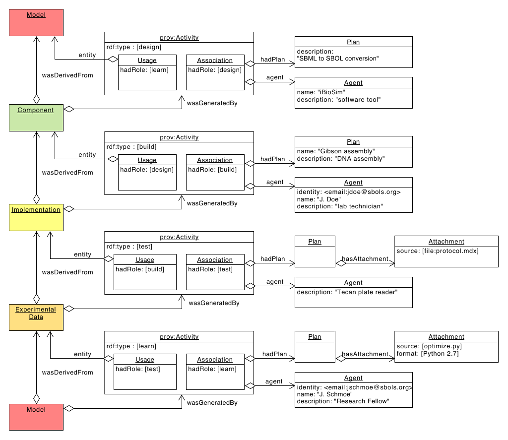

***Figure 28:*** *An example data structure representing an idealized workflow for model-based design.*

Example - Combinatorial Derivation

As specified in the description of CombinatorialDerivation, provenance can be used to link each
generated Component (or Collection thereof) back to the source form which it was derived. In
particular, each derived design links with prov:wasDerivedFrom to the CombinatorialDerivation that
it was derived from. Also, each SubComponent has a prov:wasDerivedFrom linking it to the
SubComponent within the template that it is derived from. The advantage of these provenance links is
that they provide sufficient information to validate that this derived design has been properly
derived from the specified CombinatorialDerivations.

### A.2. Adding Measures/Parameters with OM

There are at least two well-established cases for including measures/parameters and their associated
units in SBOL design specifications. These use cases are the specification of genetic circuit
designs and their associated parameters (such as rates of transcription) and the specification of
environmental conditions for biological system designs (such as growth media concentrations and
temperatures). In the first use case, parameters are necessary to enable the generation of
quantitive models of circuit behavior from circuit design specifications. In the second use case,
measures are necessary to define experimental conditions and enable the analysis of system behavior
or characterization with respect to environmental context.

The Ontology of Units of Measure (OM)
(`http://www.ontology-of-units-of-measure.org/resource/om-2`) already defines a data model for
representing measures and their associated units. Here, a subset of OM is adopted by SBOL to
describe these concepts for biological design specifications, by assigning PROV-O classes to SBOL
Identified or TopLevel types per [Section 6.11](#611-annotation-and-extension-of-sbol). As shown in
Figure 29, SBOL leverages three of the base classes defined by the OM: om:Measure, om:Unit and
om:Prefix. A om:Measure links a numerical
value to a om:Unit, which may or may not have a om:Prefix (e.g. centi, milli, micro, etc.). As these
classes are adopted by SBOL, om:Measure is treated as a subclass of Identified, while om:Unit and
om:Prefix are treated as subclasses of TopLevel. In addition, SBOL adopts the following OM om:Unit
subclasses: om:SingularUnit, om:CompoundUnit, om:UnitMultiplication, om:UnitDivision,
om:UnitExponentiation, and om:PrefixedUnit. Lastly, SBOL adopts the following om:Prefix subclasses
from OM: om:SIPrefix and om:BinaryPrefix.

OM also provides a large number of predefined om:Unit instances, so in most cases there is no need
to create anything other than om:Measure objects that refer to pre-existing instances. This can
simplify the comparison and interpretation of units, so for this reason, a pre-existing om:Unit
instance SHOULD be used whenever one is applicable. If a unit does not already exist in the
ontology, however, then the om:Unit subclasses MAY be used to create new units.

SBOL-compliant tools are allowed to read, write, and modify data belonging to OM classes other than
those described here, but this specification does not provide any guidance for the interpretation or
use of these data in the context of SBOL.

#### A.2.1. om:Measure

The purpose of the om:Measure class is to link a numerical value to a om:Unit.

##### The om:hasNumericalValue property

The om:hasNumericalValue property is REQUIRED and MUST contain a single xsd:float.

##### The om:hasUnit property

The om:hasUnit property is REQUIRED and MUST contain an IRI that refers to a om:Unit. The OM provides
IRIs for many existing instances of the om:Unit class for reference (for example,
`http://www.ontology-of-units-of-measure.org/resource/om-2/gramPerLitre`).

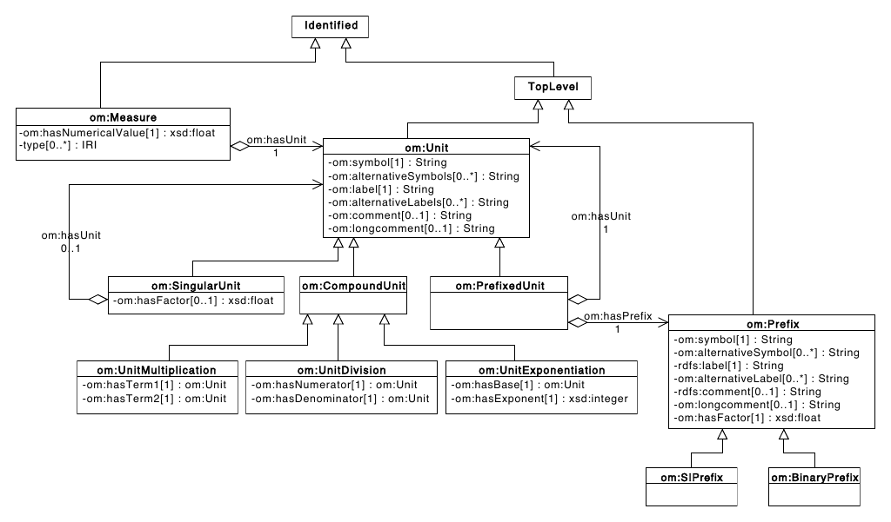

***Figure 29:*** *OM classes adopted by SBOL and their subclass relationships to Identified and TopLevel*

##### The type property

A om:Measure MAY have one or more type properties, each is of type IRI. It is RECOMMENDED that one
of these IRIs identify a term from the Systems Description Parameter branch of the Systems Biology
Ontology (SBO) (`http://www.ebi.ac.uk/sbo/main/`). This type property of the om:Measure class is not
specified in the OM and is added by SBOL to describe different types of parameters (for example,
rate of reaction is identified by the SBO term `http://identifiers.org/SBO:0000612`).

#### A.2.2. om:Unit

As adopted by SBOL, om:Unit is an abstract class that is extended by other classes to describe units
of measure using a shared set of properties.

##### The om:symbol property

The om:symbol property is REQUIRED and MUST contain a String. This String is commonly used to
abbreviate the unit of measure’s name. For example, the unit of measure named “gram per liter” is
commonly abbreviated using the String “g/l”.

##### The om:alternativeSymbols property

The om:alternativeSymbols property is OPTIONAL and MAY contain a set of Strings. This property can
be used to specify alternative abbreviations other than that specified using the om:symbol property.

##### The om:label property

The om:label property is REQUIRED and MUST contain a String. This String is a common name for the
unit of measure and SHOULD be identical to any String contained by the name property inherited from
Identified.

##### The om:alternativeLabels property

The om:alternativeLabels property is OPTIONAL and MAY contain a set of Strings. This property can be
used to specify alternative common names other than that specified using the om:label property.

##### The om:comment property

The om:comment property is OPTIONAL and MAY contain a String. This String is a description of the
unit of measure and SHOULD be identical to any String contained by the description property
inherited from Identified.

##### The om:longcomment property

The om:longcomment property is OPTIONAL and MAY contain a String. This String is a long description
of the unit of measure and SHOULD be longer than any String contained by the om:comment property.

#### A.2.3. om:SingularUnit

The purpose of the om:SingularUnit class is to describe a unit of measure that is not explicitly
represented as a combination of multiple units, but could be equivalent to such a representation.
For example, a joule is considered to be a om:SingularUnit, but it is equivalent to the
multiplication of a newton and a meter.

##### The om:hasUnit property

The om:hasUnit is OPTIONAL and MAY contain an IRI. This IRI MUST refer to another om:Unit. The
om:hasUnit propery can be used in conjunction with the om:hasFactor property to specify whether a
om:SingularUnit is equivalent to another om:Unit multiplied by a factor. For example, an angstrom is
equivalent to 10−10 meters.

##### The om:hasFactor property

The om:hasFactor property is OPTIONAL and MAY contain a xsd:float. If the om:hasFactor property of a
om:SingularUnit is non-empty, then its om:hasUnit property SHOULD also be non-empty.

#### A.2.4. om:CompoundUnit

As adopted by SBOL, om:CompoundUnit is an abstract class that is extended by other classes to
describe units of measure that can be represented as combinations of multiple other units of
measure.

#### A.2.5. om:UnitMultiplication

The purpose of the om:UnitMultiplication class is to describe a unit of measure that is the
multiplication of two other units of measure.

##### The om:hasTerm1 property

The om:hasTerm1 property is REQUIRED and MUST contain an IRI that refers to another om:Unit. This
om:Unit is the first multiplication term.

##### The om:hasTerm2 property

The om:hasTerm2 property is REQUIRED and MUST contain an IRI that refers to another om:Unit. This
om:Unit is the second multiplication term. It is okay if the om:Unit referred to by om:hasTerm1 is
the same as that referred to by om:hasTerm2.

#### A.2.6. om:UnitDivision

The purpose of the om:UnitDivision class is to describe a unit of measure that is the division of
one unit of measure by another.

##### The om:hasNumerator property

The om:hasNumerator property is REQUIRED and MUST contain an IRI that refers to another om:Unit.

##### The om:hasDenominator property

The om:hasDenominator property is REQUIRED and MUST contain an IRI that refers to another om:Unit.

#### A.2.7. om:UnitExponentiation

The purpose of the om:UnitExponentiation class is to describe a unit of measure that is raised to an
integer power.

##### The om:hasBase property

The om:hasBase property is REQUIRED and MUST contain an IRI that refers to another om:Unit.

##### The om:hasExponent property

The om:hasExponent property is REQUIRED and MUST contain an xsd:integer.

#### A.2.8. om:PrefixedUnit

The purpose of the om:PrefixedUnit class is to describe a unit of measure that is the multiplication
of another unit of measure and a factor represented by a standard prefix such as “milli,” “centi,”
“kilo,” etc.

##### The om:hasUnit property

The om:hasUnit property is REQUIRED and MUST contain an IRI that refers to another om:Unit.

##### The om:hasPrefix property

The om:hasPrefix property is REQUIRED and MUST contain an IRI that refers to a om:Prefix.

#### A.2.9. om:Prefix

As adopted by SBOL, om:Prefix is an abstract class that is extended by other classes to describe
factors that are commonly represented by standard unit prefixes. For example, the factor 10−3 is
represented by the standard unit prefix “milli.”

##### The om:symbol property

The om:symbol property is REQUIRED and MUST contain a String. This String is commonly used to
abbreviate the name of the unit prefix. For example, the String “m” is commonly used to abbreviate
the name “milli.”

##### The om:alternativeSymbols property

The om:alternativeSymbols property is OPTIONAL and MAY contain a set of Strings. This property can
be used to specify alternative abbreviations other than that specified using the om:symbol property.

##### The om:label property

The om:label property is REQUIRED and MUST contain a String. This String is a common name for the
unit prefix and SHOULD be identical to any String contained by the name property inherited from
Identified.

##### The om:alternativeLabels property

The om:alternativeLabels property is OPTIONAL and MAY contain a set of Strings. This property can be
used to specify alternative common names other than that specified using the om:label property.

##### The om:comment property

The om:comment property is OPTIONAL and MAY contain a String. This String is a description of the
unit prefix and SHOULD be identical to any String contained by the description property inherited
from Identified.

##### The om:longcomment property

The om:longcomment property is OPTIONAL and MAY contain a String. This String is a long description
of the unit of measure and SHOULD be longer than any String contained by the om:comment property.

##### The om:hasFactor property

The om:hasFactor property is REQUIRED and MUST contain an xsd:float.

#### A.2.10. om:SIPrefix

The purpose of the om:SIPrefix class is to describe standard SI prefixes such as “milli,” “centi,”
“kilo,” etc.

#### A.2.11. om:BinaryPrefix

The purpose of the om:BinaryPrefix class is to describe standard binary prefixes such as “kibi,”
“mebi,” “gibi,” etc. These prefixes commonly precede units of information such as “bit” and “byte.”

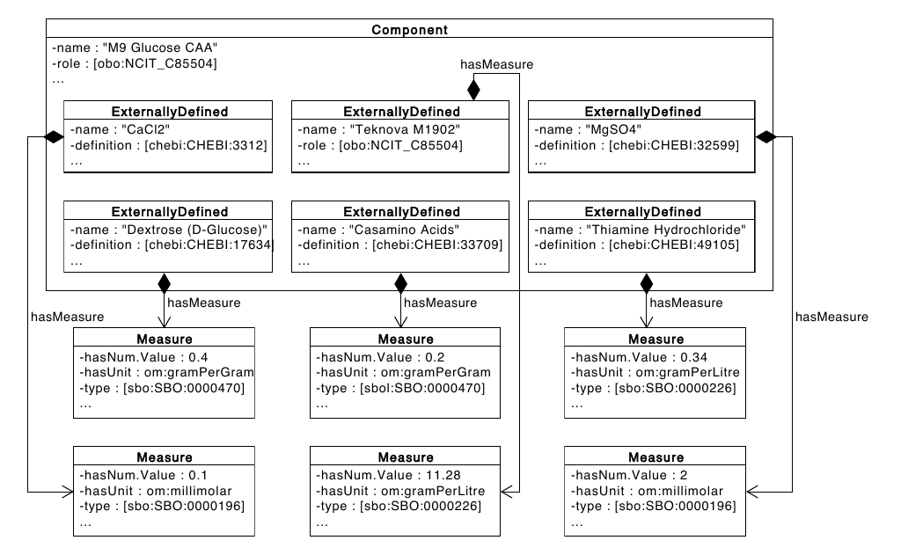

***Figure 30:*** *Growth media recipe represented using instances of the om:Measure and om:Unit classes from the OM.*

## B. Validation Rules

This section summarizes all the conditions that either MUST be or are RECOMMENDED to be true of an
SBOL Version 3.0 document. There are different degrees of rule strictness. Rules of the former kind
are strict SBOL validation rules—data encoded in SBOL MUST conform to all of them in order to be
considered valid. Rules of the latter kind are consistency rules that SBOL data are RECOMMENDED to
adhere to as a best practice. To help highlight these differences, we use the following symbols next
to the rule numbers:

| Symbol | Meaning |
| --- | --- |
| ☑ | A checked box indicates a strong REQUIRED condition for SBOL conformance. If a SBOL document does not follow this rule, it does not conform to the SBOL specification. |
| ○ | A circle indicates a weak REQUIRED condition for SBOL conformance. While this rule MUST be followed, there are conditions under which it can only be partially checked by a machine (e.g., due to references to data that is not accessible or data with an ambiguous format). Rules of this type SHOULD be checked insofar as is possible given the information available in a SBOL document. |
| ⋆ | A star indicates a RECOMMENDED condition for following best practices. This rule is not strictly a matter of SBOL conformance, but its recommendation comes from logical reasoning. If an SBOL document does not follow this rule, it is still valid SBOL, but it might have degraded functionality in some tools. |
| ▲ | A triangle indicates a weak REQUIRED condition for SBOL conformance. While this rule MUST be followed, it is not possible in practice for a machine to automatically check whether the rule has been followed. |

We also include a fourth type of rule that represents a required condition for SBOL-compliance that
cannot be checked by a machine. Therefore, violations of these rules are not expected to be reported
as errors by any of the software libraries implementing SBOL 3.0. It is the user’s responsibility to
make sure that these validation rules are followed.

The validation rules listed in the following subsections are all believed to be stated or implied in
the rest of this specification document. They are enumerated here for convenience and to provide a
“master checklist” for SBOL validation. In case of a conflict between this section and other
portions of the specification (though there are believed to be none), this section is considered
authoritative for the purpose of determining the validity of an SBOL document.

> ☞ Not all classes have validation rules specific to that class. For classes whose validation is
> covered by the rules for all SBOL objects, the type is not explicitly listed below. A range in the
> validation rule numbers has been reserved in case of future need.

### Rules for SBOL Objects

| Rule | Symbol | Requirement | Reference |
| --- | --- | --- | --- |
| sbol3-10101 | ○ | The IRI of an Identified object MUST be globally unique. | Section 5.1 on page 12 |
| sbol3-10102 | ☑ | A TopLevel URL MUST use the following pattern: `[namespace]/[local]/[displayId]`, where `namespace` and displayId are required fragments, and the `local` fragment is an optional relative path. | Section 5.1 on page 12 |
| sbol3-10103 | ☑ | A TopLevel object's URL MUST NOT be included as prefix for any other TopLevel object. | Section 5.1 on page 12 |
| sbol3-10104 | ☑ | The URL of any child or nested object MUST use the following pattern:`[parent]/[displayId]`, where `parent` is the URL of its parent object. Multiple layers of child objects are allowed, using the same `[parent]/[displayId]` pattern recursively. | Section 5.1 on page 12 |
| sbol3-10105 | ☑ | The SBOL namespace MUST NOT be used for any entities or properties not defined in this specification. | Section 5.2 on page 12 |
| sbol3-10106 | ☑ | An object MUST NOT have rdfType properties in the http://sbols.org/v3# namespace that refer to disjoint classes. | Section 5.4 on page 13 |
| sbol3-10107 | ⋆ | An object SHOULD have no more than one rdfType property in the http://sbols.org/v3# namespace. | Section 5.4 on page 13 |
| sbol3-10108 | ⋆ | If an object has a property in the http://sbols.org/v3# namespace (e.g., `sbol:displayId`, then it SHOULD also have an rdfType property in that namespace. | Section 5.4 on page 13 |
| sbol3-10109 | ☑ | An object MUST NOT have properties in the http://sbols.org/v3# namespace other than those listed for its type or parent types in Table 22. | Section 5.2 on page 12 |
| sbol3-10110 | ☑ | An object MUST have a number of instances of a property that matches the cardinality restrictions listed for that object type and property in Table 23. | Section 4.2 on page 10 |
| sbol3-10111 | ☑ | An object's property values MUST have the type listed for the object type and property in Table 23. | Section 5.3 on page 12 |
| sbol3-10112 | ☑ | Each property of type IRI that is listed with a reference type in Table 23 MUST refer to an object of the type listed (child objects). | Section 5.3 on page 12 |
| sbol3-10113 | ○ | Each property of type IRI that is listed with a reference type in Table 23 MUST refer to an object of the type listed. | Section 5.3 on page 12 |
| sbol3-10114 | ⋆ | Each property of type IRI that is listed with a TopLevel reference type in Table 23 SHOULD be able to be dereferenced to obtain an SBOL object. | Section 5.3 on page 12 |

| Class | Parent | SBOL Properties | Reference |
| --- | --- | --- | --- |
| Attachment | TopLevel | source, format, size, hash, hashAlgorithm | Section 6.10 on page 39 |
| Collection | TopLevel | member | Section 6.9 on page 38 |
| CombinatorialDerivation | TopLevel | template, strategy, hasVariableFeature | Section 6.5 on page 33 |
| ComponentReference | Feature | inChildOf, refersTo | Section 6.4.1.2 on page 24 |
| Component | TopLevel | type, role, hasSequence, hasFeature, hasInteraction, hasConstraint, hasModel, hasInterface | Section 6.4 on page 18 |
| Constraint | Identified | subject, object, restriction | Section 6.4.3 on page 27 |
| Cut | Location | at | Section 6.4.2.2 on page 27 |
| EntireSequence | Location | — | Section 6.4.2.3 on page 27 |
| ExperimentalData | TopLevel | — | Section 6.7 on page 37 |
| Experiment | Collection | — | Section 6.9.1 on page 39 |
| ExternallyDefined | Feature | type, definition | Section 6.4.1.4 on page 25 |
| Feature | Identified | role, orientation | Section 6.4.1 on page 22 |
| Identified | none | displayId, name, description, hasMeasure | Section 6.1 on page 15 |
| Implementation | TopLevel | built | Section 6.6 on page 36 |
| Interaction | Identified | type, hasParticipation | Section 6.4.4 on page 28 |
| Interface | Identified | input, output, nondirectional | Section 6.4.5 on page 32 |
| LocalSubComponent | Feature | type, hasLocation | Section 6.4.1.3 on page 25 |
| Location | Identified | orientation, order, hasSequence | Section 6.4.2 on page 26 |
| Model | TopLevel | source, language, framework | Section 6.8 on page 37 |
| Participation | Identified | role, participant, higherOrderParticipant | Section 6.4.4.1 on page 31 |
| Range | Location | start, end | Section 6.4.2.1 on page 27 |
| SequenceFeature | Feature | hasLocation | Section 6.4.1.5 on page 25 |
| Sequence | TopLevel | elements, encoding | Section 6.3 on page 16 |
| SubComponent | Feature | roleIntegration, instanceOf, sourceLocation, hasLocation | Section 6.4.1.1 on page 23 |
| TopLevel | Identified | hasNamespace, hasAttachment | Section 6.2 on page 16 |
| VariableFeature | Identified | cardinality, variable, variant, variantCollection, variantDerivation, variantMeasure | Section 6.5.1 on page 34 |
| prov:Activity | TopLevel | type | Section A.1.1 on page 57 |
| prov:Agent | TopLevel | — | Section A.1.5 on page 59 |
| prov:Association | Identified | — | Section A.1.3 on page 58 |
| prov:Plan | TopLevel | — | Section A.1.4 on page 59 |
| prov:Usage | Identified | — | Section A.1.2 on page 58 |
| om:BinaryPrefix | om:Prefix | — | Section A.2.11 on page 65 |
| om:CompoundUnit | om:Unit | — | Section A.2.4 on page 63 |
| om:Measure | Identified | type | Section A.2.1 on page 61 |
| om:PrefixedUnit | om:Unit | — | Section A.2.8 on page 64 |
| om:Prefix | TopLevel | — | Section A.2.9 on page 64 |
| om:SIPrefix | om:Prefix | — | Section A.2.10 on page 65 |
| om:SingularUnit | om:Unit | — | Section A.2.3 on page 63 |
| om:UnitDivision | om:CompoundUnit | — | Section A.2.6 on page 64 |
| om:UnitExponentiation | om:CompoundUnit | — | Section A.2.7 on page 64 |
| om:UnitMultiplication | om:CompoundUnit | — | Section A.2.5 on page 63 |
| om:Unit | TopLevel | — | Section A.2.2 on page 62 |

***Table 22:*** *Allowed object properties in the http://sbols.org/v3# namespace.*

| Class | Property | Cardinality | Type | Referred Type | Reference |
| --- | --- | --- | --- | --- | --- |
| Attachment | source | EXACTLY ONE | IRI | — | Section 6.10 on page 39 |
| Attachment | format | ZERO OR ONE | IRI | — | Section 6.10 on page 39 |
| Attachment | hashAlgorithm | ZERO OR ONE | String | — | Section 6.10 on page 39 |
| Attachment | hash | ZERO OR ONE | String | — | Section 6.10 on page 39 |
| Attachment | size | ZERO OR ONE | Long | — | Section 6.10 on page 39 |
| Collection | member | ZERO OR MORE | IRI | TopLevel | Section 6.9 on page 38 |
| CombinatorialDerivation | hasVariableFeature | ZERO OR MORE | IRI | VariableFeature | Section 6.5 on page 33 |
| CombinatorialDerivation | strategy | ZERO OR ONE | IRI | — | Section 6.5 on page 33 |
| CombinatorialDerivation | template | EXACTLY ONE | IRI | Component | Section 6.5 on page 33 |
| ComponentReference | refersTo | EXACTLY ONE | IRI | Feature | Section 6.4.1.2 on page 24 |
| ComponentReference | inChildOf | EXACTLY ONE | IRI | SubComponent | Section 6.4.1.2 on page 24 |
| Component | hasSequence | ZERO OR MORE | IRI | Sequence | Section 6.4 on page 18 |
| Component | role | ZERO OR MORE | IRI | — | Section 6.4 on page 18 |
| Component | type | ONE OR MORE | IRI | — | Section 6.4 on page 18 |
| Component | hasConstraint | ZERO OR MORE | IRI | Constraint | Section 6.4 on page 18 |
| Component | hasFeature | ZERO OR MORE | IRI | Feature | Section 6.4 on page 18 |
| Component | hasInteraction | ZERO OR MORE | IRI | Interaction | Section 6.4 on page 18 |
| Component | hasInterface | ZERO OR MORE | IRI | Interface | Section 6.4 on page 18 |
| Component | hasModel | ZERO OR MORE | IRI | Model | Section 6.4 on page 18 |
| Constraint | object | EXACTLY ONE | IRI | Feature | Section 6.4.3 on page 27 |
| Constraint | restriction | EXACTLY ONE | IRI | — | Section 6.4.3 on page 27 |
| Constraint | subject | EXACTLY ONE | IRI | Feature | Section 6.4.3 on page 27 |
| Cut | at | EXACTLY ONE | Integer | — | Section 6.4.2.2 on page 27 |
| Experiment | member | ZERO OR MORE | IRI | ExperimentalData | Section 6.9 on page 38 |
| ExternallyDefined | definition | EXACTLY ONE | IRI | — | Section 6.4.1.4 on page 25 |
| ExternallyDefined | type | ONE OR MORE | IRI | — | Section 6.4.1.4 on page 25 |
| Feature | orientation | ZERO OR ONE | IRI | — | Section 6.4.1 on page 22 |
| Feature | role | ZERO OR MORE | IRI | — | Section 6.4.1 on page 22 |
| Identified | prov:wasDerivedFrom | ZERO OR MORE | IRI | — | Section 6.1 on page 15 |
| Identified | prov:wasGeneratedBy | ZERO OR MORE | IRI | prov:Activity | Section 6.1 on page 15 |
| Identified | description | ZERO OR ONE | String | — | Section 6.1 on page 15 |
| Identified | displayId | ZERO OR ONE | String | — | Section 6.1 on page 15 |
| Identified | hasMeasure | ZERO OR MORE | IRI | om:Measure | Section 6.1 on page 15 |
| Identified | name | ZERO OR ONE | String | — | Section 6.1 on page 15 |
| Implementation | built | ZERO OR ONE | IRI | Component | Section 6.6 on page 36 |
| Interaction | type | ONE OR MORE | IRI | — | Section 6.4.4 on page 28 |
| Interaction | hasParticipation | ZERO OR MORE | IRI | Participation | Section 6.4.4 on page 28 |
| Interface | input | ZERO OR MORE | IRI | Feature | Section 6.4.5 on page 32 |
| Interface | nondirectional | ZERO OR MORE | IRI | Feature | Section 6.4.5 on page 32 |
| Interface | output | ZERO OR MORE | IRI | Feature | Section 6.4.5 on page 32 |
| LocalSubComponent | hasLocation | ZERO OR MORE | IRI | Location | Section 6.4.1.3 on page 25 |
| LocalSubComponent | type | ONE OR MORE | IRI | — | Section 6.4.1.3 on page 25 |
| Location | orientation | ZERO OR ONE | IRI | — | Section 6.4.2 on page 26 |
| Location | order | ZERO OR ONE | Integer | — | Section 6.4.2 on page 26 |
| Location | hasSequence | EXACTLY ONE | IRI | Sequence | Section 6.4.2 on page 26 |
| Model | source | EXACTLY ONE | IRI | — | Section 6.8 on page 37 |
| Model | framework | EXACTLY ONE | IRI | — | Section 6.8 on page 37 |
| Model | language | EXACTLY ONE | IRI | — | Section 6.8 on page 37 |
| Participation | participant | ZERO OR ONE | IRI | Feature | Section 6.4.4.1 on page 31 |
| Participation | higherOrderParticipant | ZERO OR ONE | IRI | Interaction | Section 6.4.4.1 on page 31 |
| Participation | role | ONE OR MORE | IRI | — | Section 6.4.4.1 on page 31 |
| Range | end | EXACTLY ONE | Integer | — | Section 6.4.2.1 on page 27 |
| Range | start | EXACTLY ONE | Integer | — | Section 6.4.2.1 on page 27 |
| SequenceFeature | hasLocation | ONE OR MORE | IRI | Location | Section 6.4.1.5 on page 25 |
| Sequence | elements | ZERO OR ONE | String | — | Section 6.3 on page 16 |
| Sequence | encoding | ZERO OR ONE | IRI | — | Section 6.3 on page 16 |
| SubComponent | instanceOf | EXACTLY ONE | IRI | Component | Section 6.4.1.1 on page 23 |
| SubComponent | roleIntegration | ZERO OR ONE | IRI | — | Section 6.4.1.1 on page 23 |
| SubComponent | sourceLocation | ZERO OR MORE | IRI | Location | Section 6.4.1.1 on page 23 |
| SubComponent | hasLocation | ZERO OR MORE | IRI | Location | Section 6.4.1.1 on page 23 |
| TopLevel | hasAttachment | ZERO OR MORE | IRI | Attachment | Section 6.2 on page 16 |
| TopLevel | hasNamespace | EXACTLY ONE | URL | — | Section 6.2 on page 16 |
| VariableFeature | cardinality | EXACTLY ONE | IRI | — | Section 6.5.1 on page 34 |
| VariableFeature | variable | EXACTLY ONE | IRI | Feature | Section 6.5.1 on page 34 |
| VariableFeature | variantCollection | ZERO OR MORE | IRI | Collection | Section 6.5.1 on page 34 |
| VariableFeature | variantDerivation | ZERO OR MORE | IRI | CombinatorialDerivation | Section 6.5.1 on page 34 |
| VariableFeature | variantMeasure | ZERO OR MORE | IRI | om:Measure | Section 6.5.1 on page 34 |
| VariableFeature | variant | ZERO OR MORE | IRI | Component | Section 6.5.1 on page 34 |
| prov:Activity | prov:endedAtTime | ZERO OR ONE | DateTime | — | Section A.1.1 on page 57 |
| prov:Activity | prov:qualifiedUsage | ZERO OR MORE | IRI | prov:Usage | Section A.1.1 on page 57 |
| prov:Activity | prov:startedAtTime | ZERO OR ONE | DateTime | — | Section A.1.1 on page 57 |
| prov:Activity | prov:wasInformedBy | ZERO OR MORE | IRI | prov:Activity | Section A.1.1 on page 57 |
| prov:Activity | type | ZERO OR MORE | IRI | — | Section A.1.1 on page 57 |
| prov:Activity | prov:qualifiedAssociation | ZERO OR MORE | IRI | prov:Association | Section A.1.1 on page 57 |
| prov:Association | prov:agent | EXACTLY ONE | IRI | prov:Agent | Section A.1.3 on page 58 |
| prov:Association | prov:hadRole | ZERO OR MORE | IRI | — | Section A.1.3 on page 58 |
| prov:Association | prov:hadPlan | ZERO OR ONE | IRI | prov:Plan | Section A.1.3 on page 58 |
| prov:Usage | prov:entity | EXACTLY ONE | IRI | — | Section A.1.2 on page 58 |
| prov:Usage | prov:hadRole | ZERO OR MORE | IRI | — | Section A.1.2 on page 58 |
| om:Measure | type | ZERO OR MORE | IRI | — | Section A.2.1 on page 61 |
| om:Measure | om:hasUnit | EXACTLY ONE | IRI | om:Unit | Section A.2.1 on page 61 |
| om:Measure | om:hasNumericalValue | EXACTLY ONE | xsd:float | — | Section A.2.1 on page 61 |
| om:PrefixedUnit | om:hasUnit | EXACTLY ONE | IRI | om:Unit | Section A.2.8 on page 64 |
| om:PrefixedUnit | om:hasPrefix | EXACTLY ONE | IRI | om:Prefix | Section A.2.8 on page 64 |
| om:Prefix | om:alternativeLabels | ZERO OR MORE | String | — | Section A.2.9 on page 64 |
| om:Prefix | om:comment | ZERO OR ONE | String | — | Section A.2.9 on page 64 |
| om:Prefix | om:hasFactor | EXACTLY ONE | xsd:float | — | Section A.2.9 on page 64 |
| om:Prefix | om:label | EXACTLY ONE | String | — | Section A.2.9 on page 64 |
| om:Prefix | om:longcomment | ZERO OR ONE | String | — | Section A.2.9 on page 64 |
| om:Prefix | om:alternativeSymbol | ZERO OR MORE | String | — | Section A.2.9 on page 64 |
| om:Prefix | om:symbol | EXACTLY ONE | String | — | Section A.2.9 on page 64 |
| om:SingularUnit | om:hasUnit | ZERO OR ONE | IRI | om:Unit | Section A.2.3 on page 63 |
| om:SingularUnit | om:hasFactor | ZERO OR ONE | xsd:float | — | Section A.2.3 on page 63 |
| om:UnitDivision | om:hasDenominator | EXACTLY ONE | IRI | om:Unit | Section A.2.6 on page 64 |
| om:UnitDivision | om:hasNumerator | EXACTLY ONE | IRI | om:Unit | Section A.2.6 on page 64 |
| om:UnitExponentiation | om:hasBase | EXACTLY ONE | IRI | om:Unit | Section A.2.7 on page 64 |
| om:UnitExponentiation | om:hasExponent | EXACTLY ONE | xsd:integer | — | Section A.2.7 on page 64 |
| om:UnitMultiplication | om:hasTerm1 | EXACTLY ONE | IRI | om:Unit | Section A.2.5 on page 63 |
| om:UnitMultiplication | om:hasTerm2 | EXACTLY ONE | IRI | om:Unit | Section A.2.5 on page 63 |
| om:Unit | om:alternativeLabels | ZERO OR MORE | String | — | Section A.2.2 on page 62 |
| om:Unit | om:label | EXACTLY ONE | String | — | Section A.2.2 on page 62 |
| om:Unit | om:longcomment | ZERO OR ONE | String | — | Section A.2.2 on page 62 |
| om:Unit | om:symbol | EXACTLY ONE | String | — | Section A.2.2 on page 62 |
| om:Unit | om:alternativeSymbols | ZERO OR MORE | String | — | Section A.2.2 on page 62 |
| om:Unit | om:comment | ZERO OR ONE | String | — | Section A.2.2 on page 62 |

***Table 23:*** *Cardinality constraints on object properties, their types, and types of referred objects.*

### Rules for the Identified class

| Rule | Symbol | Requirement | Reference |
| --- | --- | --- | --- |
| sbol3-10201 | ☑ | The displayId property, if specified, MUST be composed of only alphanumeric or underscore characters and MUST NOT begin with a digit. | Section 6.1 on page 15 |
| sbol3-10202 | ☑ | An Identified object MUST NOT refer to itself via its own prov:wasDerivedFrom property. | Section 6.1 on page 15 |
| sbol3-10203 | ○ | An Identified object MUST NOT form a cyclical chain of references via its prov:wasDerivedFrom property and those of other Identified objects. | Section 6.1 on page 15 |
| sbol3-10204 | ○ | Provenance history formed by prov:wasGeneratedBy properties of Identified objects and prov:entity references in prov:Usage objects MUST NOT form circular reference chains. | Section 6.1 on page 15 |
| sbol3-10205 | ⋆ | An Identified object with a prov:wasGeneratedBy property referring to an prov:Activity with a child prov:Association that has a prov:hadRole property with a value from Table 20 should be of the corresponding type in Table 21. | Section A.1 on page 55 |

### Rules for the TopLevel class

| Rule | Symbol | Requirement | Reference |
| --- | --- | --- | --- |
| sbol3-10301 | ☑ | If the IRI for the TopLevel object is a URL, then the URL of the hasNamespace property MUST prefix match that URL. | Section 6.2 on page 16 |

### Rules for the Sequence class

| Rule | Symbol | Requirement | Reference |
| --- | --- | --- | --- |
| sbol3-10501 | ☑ | If the elements property is set, then the encoding property of Sequence MUST be provided. | Section 6.3 on page 16 |
| sbol3-10502 | ▲ | The encoding property of a Sequence MUST indicate how the elements property of the Sequence is to be formed and interpreted. | Section 6.3 on page 16 |
| sbol3-10503 | ○ | The elements property of a Sequence MUST be consistent with its encoding property. | Section 6.3 on page 16 |
| sbol3-10504 | ▲ | The encoding property of a Sequence MUST contain a URL from Table 1 if it is well-described by this URL. | Section 6.3 on page 16 |
| sbol3-10505 | ⋆ | The encoding property of a Sequence SHOULD contain a URL from the textual format (https://identifiers.org/edam:format_2330) branch of the EDAM ontology. | Section 6.3 on page 16 |

### Rules for the Component class

| Rule | Symbol | Requirement | Reference |
| --- | --- | --- | --- |
| sbol3-10601 | ☑ | The set of type properties of a Component MUST NOT have more than one URL from Table 2. | Section 6.4 on page 18 |
| sbol3-10602 | ▲ | Each type property of a Component MUST refer to an ontology term that describes the category of biochemical or physical entity that is represented by the Component. | Section 6.4 on page 18 |
| sbol3-10603 | ▲ | A Component MUST have a type property from Table 2 if it is well-described by this URL. | Section 6.4 on page 18 |
| sbol3-10604 | ⋆ | A Component SHOULD have a type property that uses the physical entity representation branch of the Systems Biology Ontology. | Section 6.4 on page 18 |
| sbol3-10605 | ▲ | All type properties of a Component MUST refer to non-conflicting ontology terms. | Section 6.4 on page 18 |
| sbol3-10606 | ▲ | If the type property of a Component contains the DNA or RNA type URL listed in Table 2, then its type property MUST contain a URL that refers to a term from the topology attribute branch of the SO, if the topology is known. | Section 6.4 on page 18 |
| sbol3-10607 | ⋆ | If the type property of a Component contains the DNA or RNA type URL listed in Table 2, then its type property SHOULD also contain at most one URL that refers to a term from the topology attribute branch of the SO. | Section 6.4 on page 18 |
| sbol3-10608 | ⋆ | A Component SHOULD NOT have a type property that refers to a term from the topology attribute or strand attribute branches of the SO unless it also has a type property with the DNA or RNA type URL listed in Table 2. | Section 6.4 on page 18 |
| sbol3-10609 | ▲ | Each role property of a Component MUST refer to an ontology term that is consistent with its type property. | Section 6.4 on page 18 |
| sbol3-10610 | ▲ | Each role property of a Component MUST refer to an ontology term that clarifies the potential function of the Component in a biochemical or physical context. | Section 6.4 on page 18 |
| sbol3-10611 | ▲ | A role property of a Component MUST contain a URL from Table 4 if it is well-described by this URL. | Section 6.4 on page 18 |
| sbol3-10612 | ⋆ | A role property of a Component SHOULD NOT contain a URL that refers to a term from the sequence feature branch of the SO unless its type property contains the DNA or RNA type URL listed in Table 2. | Section 6.4 on page 18 |
| sbol3-10613 | ⋆ | If a type property of a Component contains the DNA or RNA type URL, then its role property SHOULD contain exactly one URL that refers to a term from the sequence feature branch of the SO. | Section 6.4 on page 18 |
| sbol3-10614 | ▲ | The Sequence objects referred to by the hasSequence properties of a Component MUST be consistent with each other, such that well-defined mappings exist between their elements properties in accordance with their encoding properties. | Section 6.4 on page 18 |
| sbol3-10615 | ▲ | A hasSequence property of a Component MUST NOT refer to Sequence objects with conflicting encoding properties. | Section 6.4 on page 18 |
| sbol3-10616 | ○ | If a hasSequence property of a Component refers to a Sequence object, and one of the type properties of this Component comes from Table 2, then one of the Sequence objects MUST have the encoding that is cross-listed with this type in Table 1. | Section 6.4 on page 18 |
| sbol3-10617 | ⋆ | If a Component has more than one hasSequence property that refer to Sequence objects with the same encoding, then the elements of these Sequence objects SHOULD have equal lengths. | Section 6.4 on page 18 |

### Rules for the Feature class

| Rule | Symbol | Requirement | Reference |
| --- | --- | --- | --- |
| sbol3-10701 | ▲ | Each role property of a Feature MUST refer to a resource that clarifies the intended function of the Feature. | Section 6.4.1 on page 22 |
| sbol3-10702 | ☑ | If a Feature has an orientation property, its URL MUST be drawn from Table 5 or Table 6. | Section 6.4.1 on page 22 |

### Rules for the SubComponent class

| Rule | Symbol | Requirement | Reference |
| --- | --- | --- | --- |
| sbol3-10801 | ☑ | If a SubComponent has an roleIntegration property, its URL MUST be drawn from Table 7. | Section 6.4.1.1 on page 23 |
| sbol3-10802 | ☑ | The roleIntegration property of a SubComponent is REQUIRED if the SubComponent has one or more role properties. | Section 6.4.1.1 on page 23 |
| sbol3-10803 | ☑ | The instanceOf property of a SubComponent MUST NOT refer to the same Component as the one that contains the SubComponent. | Section 6.4.1.1 on page 23 |
| sbol3-10804 | ○ | SubComponent objects MUST NOT form circular reference chains via their instanceOf properties and the Component objects that contain them. | Section 6.4.1.1 on page 23 |
| sbol3-10805 | ☑ | The set of Location objects referred to by the hasLocation properties of a single SubComponent MUST NOT specify overlapping regions. | Section 6.4.1.1 on page 23 |
| sbol3-10806 | ☑ | If a SubComponent object has at least one hasLocation and sourceLocation properties, then the sum of the lengths of the Location objects referred to by the hasLocation properties MUST equal the sum of the lengths of the Location objects referred to by the sourceLocation properties. | Section 6.4.1.1 on page 23 |
| sbol3-10807 | ○ | If a SubComponent object has at least one hasLocation and zero sourceLocation properties, and the Component linked by its instanceOf has precisely one hasSequence property whose Sequence has a value for its elements property, then the sum of the lengths of the Location objects referred to by the hasLocation properties MUST equal the length of the elements value of the Sequence. | Section 6.4.1.1 on page 23 |

### Rules for the ComponentReference class

| Rule | Symbol | Requirement | Reference |
| --- | --- | --- | --- |
| sbol3-10901 | ☑ | If a ComponentReference object is a child of a Component, then its inChildOf property MUST be a SubComponent of its parent. | Section 6.4.1.2 on page 24 |
| sbol3-10902 | ☑ | If a ComponentReference object is a child of another ComponentReference, via the refersTo property, then its inChildOf property MUST be a SubComponent of the Component referred to by the instanceOf property of the SubComponent referred to by the parent's inChildOf property. | Section 6.4.1.2 on page 24 |
| sbol3-10903 | ☑ | If the refersTo property of a ComponentReference refers to another ComponentReference, then the second ComponentReference MUST be either a child of the first ComponentReference or a child of the Component referred to by the instanceOf property of the SubComponent referred to by the inChildOf property of the first ComponentReference. | Section 6.4.1.2 on page 24 |
| sbol3-10904 | ☑ | If the refersTo property of a ComponentReference refers to a Feature of any other type besides ComponentReference, then that Feature MUST be a child of the Component referred to by the instanceOf property of the SubComponent referred to by the inChildOf property of the first ComponentReference. | Section 6.4.1.2 on page 24 |

### Rules for the LocalSubComponent class

| Rule | Symbol | Requirement | Reference |
| --- | --- | --- | --- |
| sbol3-11001 | ☑ | A LocalSubComponent MUST NOT have more than one URL from Table 2. | Section 6.4.1.3 on page 25 |
| sbol3-11002 | ▲ | Each type property of a LocalSubComponent MUST refer to an ontology term that describes the category of biochemical or physical entity that is represented by the LocalSubComponent. | Section 6.4.1.3 on page 25 |
| sbol3-11003 | ▲ | A LocalSubComponent MUST have a type property from Table 2 if it is well-described by this URL. | Section 6.4.1.3 on page 25 |
| sbol3-11004 | ⋆ | A LocalSubComponent SHOULD have a type property from Table 2. | Section 6.4.1.3 on page 25 |
| sbol3-11005 | ▲ | All type properties of a LocalSubComponent MUST refer to non-conflicting ontology terms. | Section 6.4.1.3 on page 25 |
| sbol3-11006 | ▲ | If the type property of a LocalSubComponent contains the DNA or RNA type URL listed in Table 2, then its type property MUST contain a URL that refers to a term from the topology attribute branch of the SO, if the topology is known. | Section 6.4.1.3 on page 25 |
| sbol3-11007 | ⋆ | If the type property of a LocalSubComponent contains the DNA or RNA type URL listed in Table 2, then its type property SHOULD also contain at most one URL that refers to a term from the topology attribute branch of the SO. | Section 6.4.1.3 on page 25 |
| sbol3-11008 | ⋆ | A LocalSubComponent SHOULD NOT have a type property that refers to a term from the topology attribute or strand attribute branches of the SO unless it also has a type property with the DNA or RNA type URL listed in Table 2. | Section 6.4.1.3 on page 25 |
| sbol3-11009 | ▲ | Each role property of a LocalSubComponent MUST refer to an ontology term that is consistent with its type property. | Section 6.4 on page 18 |
| sbol3-11010 | ▲ | A role property of a LocalSubComponent MUST contain a URL from Table 4 if it is well-described by this URL. | Section 6.4 on page 18 |
| sbol3-11011 | ⋆ | A role property of a LocalSubComponent SHOULD NOT contain a URL that refers to a term from the sequence feature branch of the SO unless its type property contains the DNA or RNA type URL listed in Table 2. | Section 6.4 on page 18 |
| sbol3-11012 | ⋆ | If a type property of a LocalSubComponent contains the DNA or RNA type URL, then its role property SHOULD contain exactly one URL that refers to a term from the sequence feature branch of the SO. | Section 6.4 on page 18 |
| sbol3-11013 | ☑ | The set of Location objects referred to by the hasLocation properties of a single LocalSubComponent MUST NOT specify overlapping regions. | Section 6.4.1.3 on page 25 |

### Rules for the ExternallyDefined class

| Rule | Symbol | Requirement | Reference |
| --- | --- | --- | --- |
| sbol3-11101 | ☑ | A ExternallyDefined MUST NOT have more than one URL from Table 2. | Section 6.4.1.4 on page 25 |
| sbol3-11102 | ▲ | Each type property of a ExternallyDefined MUST refer to an ontology term that describes the category of biochemical or physical entity that is represented by the Component. | Section 6.4.1.4 on page 25 |
| sbol3-11103 | ▲ | A ExternallyDefined MUST have a type property from Table 2 if it is well-described by this URL. | Section 6.4.1.4 on page 25 |
| sbol3-11104 | ⋆ | A ExternallyDefined SHOULD have a type property from Table 2. | Section 6.4.1.4 on page 25 |
| sbol3-11105 | ▲ | All type properties of a ExternallyDefined MUST refer to non-conflicting ontology terms. | Section 6.4.1.4 on page 25 |
| sbol3-11106 | ▲ | If the type property of a ExternallyDefined contains the DNA or RNA type URL listed in Table 2, then its type property MUST contain a URL that refers to a term from the topology attribute branch of the SO, if the topology is known. | Section 6.4.1.4 on page 25 |
| sbol3-11107 | ⋆ | If the type property of a ExternallyDefined contains the DNA or RNA type URL listed in Table 2, then its type property SHOULD also contain at most one URL that refers to a term from the topology attribute branch of the SO. | Section 6.4.1.4 on page 25 |
| sbol3-11108 | ⋆ | A ExternallyDefined SHOULD NOT have a type property that refers to a term from the topology attribute or strand attribute branches of the SO unless it also has a type property with the DNA or RNA type URL listed in Table 2. | Section 6.4.1.4 on page 25 |
| sbol3-11109 | ▲ | The URL contained by the definition property of a ExternallyDefined SHOULD refer to an external resource in Section sec:recomm_ontologies when the object is defined in one of these resources. | Section 6.4.1.4 on page 25 |

### Rules for the SequenceFeature class

| Rule | Symbol | Requirement | Reference |
| --- | --- | --- | --- |
| sbol3-11201 | ☑ | The set of Location objects referred to by the hasLocation properties of a single SequenceFeature MUST NOT specify overlapping regions. | Section 6.4.1.5 on page 25 |

### Rules for the Location class

| Rule | Symbol | Requirement | Reference |
| --- | --- | --- | --- |
| sbol3-11301 | ☑ | If a Location has an orientation property, its URL MUST be drawn from Table 5 or Table 6. | Section 6.4.2 on page 26 |
| sbol3-11302 | ☑ | For every Location that is not an EntireSequence and that is the value of a hasLocation property of a Feature, the value of its hasSequence property MUST also either be a value of the hasSequence property of the parent Component or else be the value of some hasSequence property of an EntireSequence that is also a child of the same Component. | Section 6.4.2 on page 26 |
| sbol3-11303 | ○ | For every Location that is not an EntireSequence and that is the value of a sourceLocation property of a SubComponent, the value of its hasSequence property MUST also either be a value of the hasSequence property of the Component linked by its parent's instanceOf property or else be the value of some hasSequence property of an EntireSequence that is also a child of the same Component linked by instanceOf. | Section 6.4.2 on page 26 |

### Rules for the Range class

| Rule | Symbol | Requirement | Reference |
| --- | --- | --- | --- |
| sbol3-11401 | ☑ | The value of the start property of a Range MUST be greater than zero and less than or equal to the length of the elements value of the Sequence referred to by its hasSequence property. | Section 6.4.2.1 on page 27 |
| sbol3-11402 | ☑ | The value of the end property of a Range MUST be greater than zero and less than or equal to the length of the elements value of theSequence referred to by its hasSequence property. | Section 6.4.2.1 on page 27 |
| sbol3-11403 | ☑ | The value of the end property of a Range MUST be greater than or equal to the value of its start property. | Section 6.4.2.1 on page 27 |

### Rules for the Cut class

| Rule | Symbol | Requirement | Reference |
| --- | --- | --- | --- |
| sbol3-11501 | ☑ | The value of the at property of a Cut MUST be greater than or equal to zero and less than or equal to the length of the elements value of the Sequence referred to by its hasSequence property. | Section 6.4.2.2 on page 27 |

### Rules for the Constraint class

| Rule | Symbol | Requirement | Reference |
| --- | --- | --- | --- |
| sbol3-11701 | ☑ | The Feature referenced by the subject property of a Constraint MUST be contained by the Component that contains the Constraint. | Section 6.4.3 on page 27 |
| sbol3-11702 | ☑ | The Feature referenced by the object property of a Constraint MUST be contained by the Component that contains the Constraint. | Section 6.4.3 on page 27 |
| sbol3-11703 | ☑ | The object property of a Constraint MUST NOT refer to the same SubComponent as the subject property of the Constraint. | Section 6.4.3 on page 27 |
| sbol3-11704 | ⋆ | The value of the restriction property of a Constraint SHOULD be drawn from Table 8, Table 9, or Table 10. | Section 6.4.3 on page 27 |
| sbol3-11705 | ○ | If the restriction property of a Constraint is drawn from Table 8, then the Feature objects referred to by the subject and object properties MUST comply with the relation specified in Table 8. | — |
| sbol3-11706 | ○ | If the restriction property of a Constraint is drawn from Table 10 and if the Feature objects referred to by the subject and object properties both have hasLocation properties with Location objects whose hasSequence property refers to the same Sequence, then the positions of the referred Location objects MUST comply with the relation specified in Table 10. | — |

### Rules for the Interaction class

| Rule | Symbol | Requirement | Reference |
| --- | --- | --- | --- |
| sbol3-11801 | ▲ | Each type property of an Interaction MUST refer to an ontology term that describes the behavior represented by the Interaction. | Section 6.4.4 on page 28 |
| sbol3-11802 | ▲ | All type properties of an Interaction MUST refer to non-conflicting ontology terms. | Section 6.4.4 on page 28 |
| sbol3-11803 | ⋆ | Exactly one type property of an Interaction SHOULD refer to a term from the occurring entity relationship branch of the SBO. | Section 6.4.4 on page 28 |
| sbol3-11804 | ⋆ | If the hasParticipation properties of an Interaction refer to one or more Participation objects, and one of the type properties of this Interaction comes from Table 11, then the Participation objects SHOULD have a role from the set of role properties that is cross-listed with this type in Table 12. | Section 6.4.4 on page 28 |

### Rules for the Participation class

| Rule | Symbol | Requirement | Reference |
| --- | --- | --- | --- |
| sbol3-11901 | ☑ | A Participation MUST contain precisely one participant or higherOrderParticipant property. | Section 6.4.4.1 on page 31 |
| sbol3-11902 | ☑ | The Feature referenced by the participant property of a Participation MUST be contained by the Component that contains the Interaction that contains the Participation. | Section 6.4.4.1 on page 31 |
| sbol3-11903 | ☑ | The Interaction referenced by the higherOrderParticipant property of a Participation MUST be contained by the Component that contains the Interaction that contains the Participation. | Section 6.4.4.1 on page 31 |
| sbol3-11904 | ▲ | Each role property of a Participation MUST refer to an ontology term that describes the behavior represented by the Participation. | Section 6.4.4.1 on page 31 |
| sbol3-11905 | ▲ | All role properties of a Participation MUST refer to non-conflicting ontology terms. | Section 6.4.4.1 on page 31 |
| sbol3-11906 | ⋆ | Exactly one role in the set of role properties SHOULD be a URL from the participant role branch of the SBO (see Table 12). | Section 6.4.4.1 on page 31 |

### Rules for the Interface class

| Rule | Symbol | Requirement | Reference |
| --- | --- | --- | --- |
| sbol3-12001 | ☑ | The Feature referenced by the input property of an Interface MUST be contained by the Component that contains the Interface. | Section 6.4.5 on page 32 |
| sbol3-12002 | ☑ | The Feature referenced by the output property of an Interface MUST be contained by the Component that contains the Interface. | Section 6.4.5 on page 32 |
| sbol3-12003 | ☑ | The Feature referenced by the nondirectional property of an Interface MUST be contained by the Component that contains the Interface. | Section 6.4.5 on page 32 |

### Rules for the CombinatorialDerivation class

| Rule | Symbol | Requirement | Reference |
| --- | --- | --- | --- |
| sbol3-12101 | ☑ | The strategy property of a CombinatorialDerivation, if specified, MUST contain a URL from Table 13. | Section 6.5 on page 33 |
| sbol3-12102 | ☑ | If the strategy property of a CombinatorialDerivation contains the URL http://sbols.org/v3#enumerate, then its hasVariableFeature property MUST NOT contain a VariableFeature with an cardinality property that contains the URL http://sbols.org/v3#zeroOrMore or the URL http://sbols.org/v3#oneOrMore. | Section 6.5 on page 33 |
| sbol3-12103 | ☑ | A CombinatorialDerivation MUST NOT contain two or more hasVariableFeature properties that refer to VariableFeature objects with a variable property that contain the same IRI. | Section 6.5 on page 33 |
| sbol3-12104 | ⋆ | A CombinatorialDerivation's template Component SHOULD contain one or more hasFeature properties. | Section 6.5 on page 33 |
| sbol3-12105 | ⋆ | If the prov:wasDerivedFrom property of a Component refers to a CombinatorialDerivation, then the prov:wasDerivedFrom properties of each child Feature of the Component should refer to a Feature in the template Component of the CombinatorialDerivation. | Section 6.5 on page 33 |
| sbol3-12106 | ⋆ | If the prov:wasDerivedFrom property of a Collection refers to a CombinatorialDerivation, then the prov:wasDerivedFrom properties of the objects that are referred to by its member properties SHOULD also refer to the CombinatorialDerivation. | Section 6.5 on page 33 |
| sbol3-12107 | ⋆ | If the prov:wasDerivedFrom property of a Component refers to a CombinatorialDerivation, then the type properties of this Component SHOULD contain all IRIs contained by the type properties of the template Component of the CombinatorialDerivation. | Section 6.5 on page 33 |
| sbol3-12108 | ⋆ | If the prov:wasDerivedFrom property of a Component refers to a CombinatorialDerivation, then the role properties of this Component SHOULD contain all IRIs contained by the role properties of the template Component of the CombinatorialDerivation. | Section 6.5 on page 33 |
| sbol3-12109 | ○ | If the prov:wasDerivedFrom property of a Component refers to a CombinatorialDerivation, then for any Feature in the Component with a prov:wasDerivedFrom property referring to a static Feature in the template Component of the CombinatorialDerivation, that derived Feature MUST have properties identical to those of the static Feature. | Section 6.5 on page 33 |
| sbol3-12110 | ⋆ | If the prov:wasDerivedFrom property of a Component refers to a CombinatorialDerivation, then each static Feature in the template Component SHOULD be referred to by a prov:wasDerivedFrom property from exactly one Feature in the derived Component. | Section 6.5 on page 33 |
| sbol3-12111 | ⋆ | If the prov:wasDerivedFrom property of a Component refers to a CombinatorialDerivation, then each variable Feature in the template Component SHOULD be referred to by a prov:wasDerivedFrom property from a number of Feature objects in the derived Component that is compatible with the cardinality property of the corresponding VariableFeature. | Section 6.5 on page 33 |
| sbol3-12112 | ○ | If the prov:wasDerivedFrom property of a Component refers to a CombinatorialDerivation, then for any SubComponent in the Component with a prov:wasDerivedFrom property referring to a variable Feature in the template Component of the CombinatorialDerivation, that derived SubComponent MUST have an instanceOf property that refers to a Component specified by the corresponding VariableFeature. In particular, that Component must be a value of the variant property, a member or recursive member of a Collection that is a value of the variantCollection property, or a Component with a prov:wasDerivedFrom property that refers to a CombinatorialDerivation specified by a variantDerivation property of the VariableFeature. | Section 6.5 on page 33 |
| sbol3-12113 | ○ | If the prov:wasDerivedFrom property of a Component refers to a CombinatorialDerivation and the template Component of the CombinatorialDerivation contains Constraint objects, then for any Feature contained by the Component that has a prov:wasDerivedFrom property that refers to the subject or object Feature of any of the template Constraint objects, that feature MUST adhere to the restriction properties of the template Constraint objects. | Section 6.5 on page 33 |
| sbol3-12114 | ⋆ | If the prov:wasDerivedFrom property of a Component refers to a CombinatorialDerivation, then for any Feature in the Component with a prov:wasDerivedFrom property referring to a variable Feature in the template Component of the CombinatorialDerivation, then the role properties of that Feature SHOULD contain all IRIs contained by the role properties of the template Feature. | Section 6.5 on page 33 |
| sbol3-12115 | ⋆ | Let the type-determining referent of a Feature be the Feature itself for a LocalSubComponent or ExternallyDefined, the Component referred by the instanceOf property of a SubComponent and the type-determining referent of the Feature referred to be a ComponentReference. If the prov:wasDerivedFrom property of a Component refers to a CombinatorialDerivation, then for any Feature in the Component with a prov:wasDerivedFrom property referring to a variable Feature in the template Component of the CombinatorialDerivation, then the type properties of the Feature's type-determining referent SHOULD contain all IRIs contained by the type properties of the template Feature's type-determining referent. | Section 6.5 on page 33 |

### Rules for the VariableFeature class

| Rule | Symbol | Requirement | Reference |
| --- | --- | --- | --- |
| sbol3-12201 | ☑ | The IRI contained by the cardinality property of a VariableFeature MUST come from Table 14. | Section 6.5.1 on page 34 |
| sbol3-12202 | ○ | The Feature referenced by the variable property of a VariableFeature MUST be contained by the template Component of the CombinatorialDerivation that contains the VariableFeature. | Section 6.5.1 on page 34 |
| sbol3-12203 | ○ | The member properties of a Collection that is referred to by the variantCollection property of a VariableFeature MUST refer only to Component objects or to Collection objects that themselves contain only Component or Collection objects, recursively. | Section 6.5.1 on page 34 |
| sbol3-12204 | ○ | VariableFeature objects MUST NOT form circular reference chains via their variantDerivation properties and parent CombinatorialDerivation objects. | Section 6.5.1 on page 34 |

### Rules for the Implementation class

| Rule | Symbol | Requirement | Reference |
| --- | --- | --- | --- |
| sbol3-12301 | ▲ | Each prov:wasDerivedFrom property of an Implementation MUST refer to a Component that contains a description of the intended nature of the actual object indicated by the Implementation. | Section 6.6 on page 36 |
| sbol3-12302 | ▲ | All prov:wasDerivedFrom properties of an Implementation MUST refer to non-conflicting Component descriptions. | Section 6.6 on page 36 |
| sbol3-12303 | ▲ | If the built property of an Implementation is set, then the Component it refers to MUST be a faithful description of the actual object indicated by the Implementation. | Section 6.6 on page 36 |

### Rules for the Model class

| Rule | Symbol | Requirement | Reference |
| --- | --- | --- | --- |
| sbol3-12501 | ▲ | The IRI contained by the source property of a Model MUST specify the location of the model's source file. | Section 6.8 on page 37 |
| sbol3-12502 | ▲ | The IRI contained by the language property of a Model MUST specify the language in which the model is encoded. | Section 6.8 on page 37 |
| sbol3-12503 | ▲ | The language property of a Model MUST contain a URL from Table 15 if it is well-described by this URL. | Section 6.8 on page 37 |
| sbol3-12504 | ⋆ | The language property of a Model SHOULD contain a URL that refers to a term from the EDAM ontology. | Section 6.8 on page 37 |
| sbol3-12505 | ▲ | The IRI contained by the framework property of a Model MUST specify the modeling framework of the model. | Section 6.8 on page 37 |
| sbol3-12506 | ▲ | The framework property of a Model MUST contain a URL from Table 16 if it is well-described by this URL. | Section 6.8 on page 37 |
| sbol3-12507 | ⋆ | The framework property SHOULD contain a URL that refers to a term from the modeling framework branch of the SBO. | Section 6.8 on page 37 |

### Rules for the Attachment class

| Rule | Symbol | Requirement | Reference |
| --- | --- | --- | --- |
| sbol3-12801 | ▲ | The source property of an Attachment MUST specify the location of the model's source file. | Section 6.10 on page 39 |
| sbol3-12802 | ▲ | The IRI contained by the format property of an Attachment MUST specify the file type of the attachment. | Section 6.10 on page 39 |
| sbol3-12803 | ⋆ | The format property of an Attachment SHOULD contain a URL that refers to a term from the EDAM ontology. | Section 6.10 on page 39 |
| sbol3-12804 | ▲ | The size property, if specified, MUST indicate file size in bytes. | Section 6.10 on page 39 |
| sbol3-12805 | ▲ | The hash property, if specified, MUST be a hash value for the file contents represented as a hexadecimal digest. | Section 6.10 on page 39 |
| sbol3-12806 | ▲ | The hashAlgorithm, if specified, MUST be the name of a hash algorithm used to generate the value of the hash property. | Section 6.10 on page 39 |
| sbol3-12807 | ⋆ | The hashAlgorithm property of an Attachment SHOULD be a hash name String from the https://www.iana.org/assignments/named-information/named-information.xhtmlIANA Named Information Hash Algorithm Registry, of which `sha3-256` is currently RECOMMENDED. | Section 6.10 on page 39 |
| sbol3-12808 | ☑ | If the hash property is set, then the hashAlgorithm MUST be set as well. | Section 6.10 on page 39 |

### Rules for the prov:Activity class

| Rule | Symbol | Requirement | Reference |
| --- | --- | --- | --- |
| sbol3-12901 | ⋆ | An prov:Activity with a type from Table 20 SHOULD NOT have child prov:Usage objects that have prov:hadRole properties from Table 20 other than the same URL or the URL of the preceding stage given in Table 21. | Section A.1.1 on page 57 |
| sbol3-12902 | ⋆ | If an prov:Activity has a type property with a value from Table 20, then every child prov:Association SHOULD have a prov:hadRole property with the same value. | Section A.1.1 on page 57 |

### Rules for the prov:Usage class

| Rule | Symbol | Requirement | Reference |
| --- | --- | --- | --- |
| sbol3-13001 | ⋆ | If a prov:Usage has a prov:hadRole property with a value from Table 20, then its prov:entity property SHOULD refer to an object of the corresponding type in Table 21. | Section A.1.2 on page 58 |

### Rules for the om:Measure class

| Rule | Symbol | Requirement | Reference |
| --- | --- | --- | --- |
| sbol3-13401 | ⋆ | If a om:Measure includes a type property, then exactly one of the IRIs that this property contains SHOULD refer to a term from the systems description parameter branch of the SBO. | Section A.2.1 on page 61 |

### Rules for the om:Unit class

| Rule | Symbol | Requirement | Reference |
| --- | --- | --- | --- |
| sbol3-13501 | ⋆ | If both of the name property and om:label properties of a om:Unit are non-empty, then they SHOULD contain identical Strings. | Section A.2.2 on page 62 |
| sbol3-13502 | ⋆ | If both of the description property and om:comment properties of a om:Unit are non-empty, then they SHOULD contain identical Strings. | Section A.2.2 on page 62 |

### Rules for the om:Prefix class

| Rule | Symbol | Requirement | Reference |
| --- | --- | --- | --- |
| sbol3-14201 | ⋆ | If both of the name property and om:label properties of a om:Prefix are non-empty, then they SHOULD contain identical Strings. | Section A.2.9 on page 64 |
| sbol3-14202 | ⋆ | If both of the description property and om:comment properties of a om:Prefix are non-empty, then they SHOULD contain identical Strings. | Section A.2.9 on page 64 |
